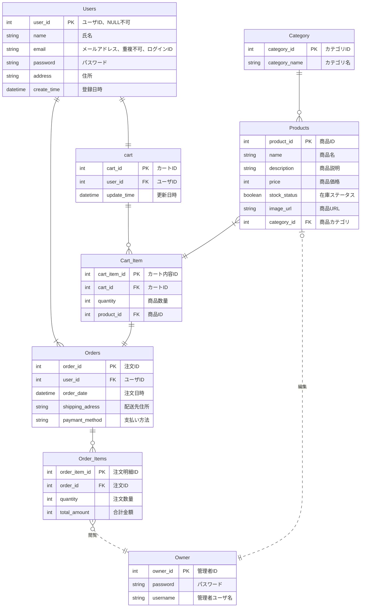

```mermaid

erDiagram
  Users {
    int user_id PK "ユーザID、NULL不可"
    string name "氏名"
    string email "メールアドレス、重複不可、ログインID"
    string password "パスワード"
    string address "住所"
    datetime create_time "登録日時"
  }
  Products {
    int product_id PK "商品ID"
    string name "商品名"
    string description  "商品説明"
    int price "商品価格"
    boolean stock_status "在庫ステータス"
    string image_url "商品URL"
    int category_id  FK"商品カテゴリ"
  }
  Orders {
    int order_id PK "注文ID"
    int user_id FK "ユーザID"
    datetime order_date  "注文日時"
    string shipping_adress "配送先住所"
    string paymant_method "支払い方法"
  }
  Order_Items {
    int order_item_id PK "注文明細ID"
    int order_id FK "注文ID"
    int quantity "注文数量"
    int total_amount "合計金額"
  }
  Owner {
    int owner_id PK "管理者ID"
    string password "パスワード"
    string username "管理者ユーザ名"
  }
  cart {
    int cart_id PK "カートID"
    int user_id FK "ユーザID"
    datetime update_time "更新日時"
  }
  Cart_Item {
    int cart_item_id PK "カート内容ID"
    int cart_id FK "カートID"
    int quantity "商品数量"
    int product_id FK "商品ID"
  }
  Category {
    int category_id PK "カテゴリID"
    string category_name "カテゴリ名"
  }
  Orders ||--o{ Order_Items : ""
  Users ||--|{ Orders : ""
  Order_Items }o..|| Owner : "閲覧"
  Users ||--|| cart : ""
  Products }|--|| Cart_Item : ""
  Category ||--o{ Products : ""
  cart ||--o{ Cart_Item : ""
  Products |o..|| Owner : "編集"
  Cart_Item ||--|| Orders : ""

```