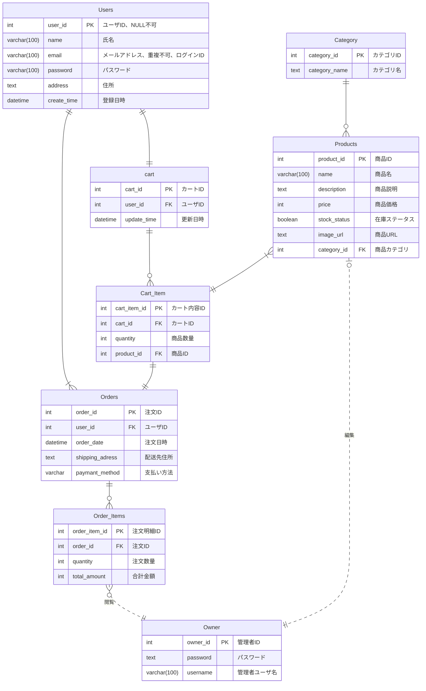

# 備品管理システム 基本設計書

| ドキュメントバージョン | 1.0                                    |
| :------------------- | :------------------------------------- |
| 作成日               | 2025年O月O日                           |
| 作成チーム           | neko(Dチーム)                               |
| 承認者               | 井上真美様                              |
| 更新履歴             | 2025/O/O: Ver.1.0 初版作成 (neko) |

---

## 1. はじめに

### 1.1. 本書の目的

### 1.2. プロジェクト概要

### 1.3. 前提知識

## 2. システム概要

### 2.1. システムの目的

### 2.2. 対象ユーザー

### 2.3. システム構成図

### 2.4. 外部インターフェース概要

## 3. 機能設計

### 3.1. 機能一覧

### 3.2. 機能構成図

### 3.3. 主要機能フロー

#### 3.3.1. 在庫不足フロー

#### 3.3.2. 廃棄処理フロー

## 4. 画面設計

### 4.1. 画面一覧

### 4.2. 画面遷移図

### 4.3. UI/UX基本方針

### 4.4. 主要画面のワイヤーフレーム

#### 4.4.1. 備品一覧画面ワイヤーフレーム

#### 4.4.2. 入庫・出庫画面ワイヤーフレーム

### 4.5. 主要画面項目定義（例：備品一覧画面）

## 5. データ設計

### 5.1. 概念データモデル（ER図）

### 5.2. 主要テーブル概要
- **USERS (ユーザーテーブル)**
    - 会員登録したユーザーの情報を管理。
    - ログインID・パスワード、氏名・メールアドレスなどを保持。
    - パスワードはハッシュ化し保存。
    - 複数の住所情報を ADDRESSES として持つ。

- **ROLES (ロールマスタ)**
    - 「一般会員」「管理者」など、ユーザー権限を定義。
    - システムのアクセス制御に使用。

- **PRODUCTS（商品マスタ）**
    - 商品情報（名前、説明、価格、カテゴリ、画像など）を管理。
    - 商品の表示／非表示を active_flag で制御。
    - 一商品につき複数の注文明細（ORDER_ITEMS）に紐づく。

- **CATEGORIES（カテゴリマスタ）**
    - 商品を分類するためのカテゴリ情報。
    - 商品検索やフィルタリングに利用。

- **ORDERS（注文テーブル）**
    - ユーザーが購入した注文情報。
    - 誰が、いつ、どこへ、何を購入したかを記録。
    - 支払方法やステータス、合計金額も保持。

- **ORDER_ITEMS（注文明細テーブル）**
    - 注文の中に含まれる商品ごとの明細情報。
    - 商品ID・数量・単価・小計などを記録。

- **ADDRESSES（住所テーブル）**
    - ユーザーが登録する配送先住所情報。
    - ユーザー1人に複数登録可。is_default により既定住所を設定。

### 5.3. データフロー概要
1.  **画面（注文確認）**
    - ユーザーがカート画面から配送先・支払方法を確認し「注文確定」ボタンを押下。

2.  **アプリケーション（Backend）**
    - ユーザーのカート情報（セッション管理）を取得。
    - 合計金額を計算。
    - ORDERS テーブルに注文を登録。
    - ORDER_ITEMS テーブルに商品ごとの明細を登録。
    - ADDRESSES テーブルに新しい配送先があれば登録。

3.  **データベース（DB）**
    - ORDERS に注文情報をINSERT。
    - ORDER_ITEMS に明細を一括INSERT。
    - 必要に応じて ADDRESSES にINSERT。
    - 注文完了メールをユーザーへ送信。

4.  **確認画面**
    - 注文完了画面に遷移。注文番号と完了メッセージを表示。

## 6. 非機能要件 対応方針

### 6.1. 性能

### 6.2. セキュリティ

### 6.3. 可用性

### 6.4. その他（保守性、運用性、拡張性など）

## 7. 運用・保守設計の概要

### 7.1. ログ設計方針

### 7.2. 監視設計方針

### 7.3. バックアップ・リカバリ方針

## 8. 制約事項・前提条件

### 8.1. 使用技術スタック

### 8.2. インフラ環境

### 8.3. 開発・運用ルール

### 8.4. スコープ外

### 8.5. その他前提条件

## 9. （付録）用語集・略語リスト

## 10. 承認

