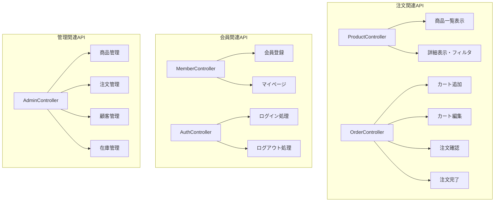
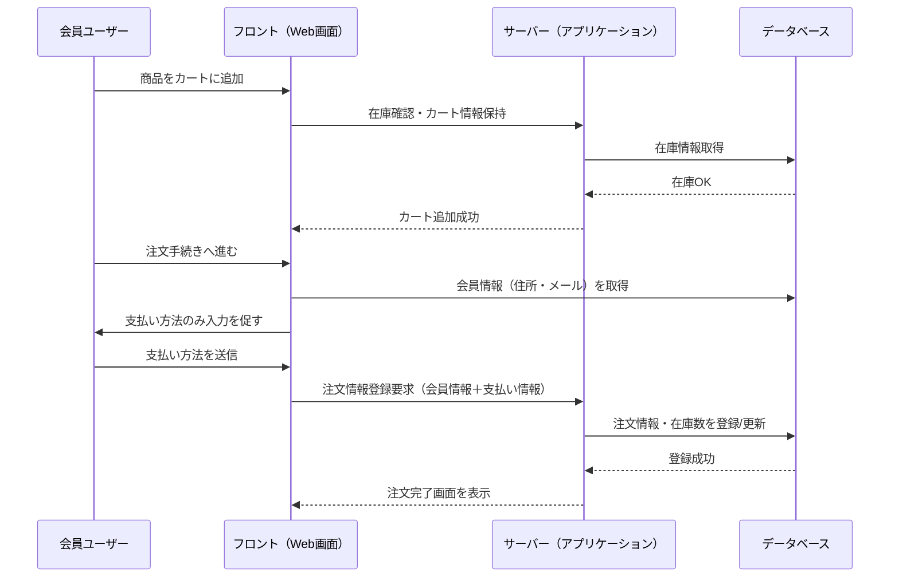
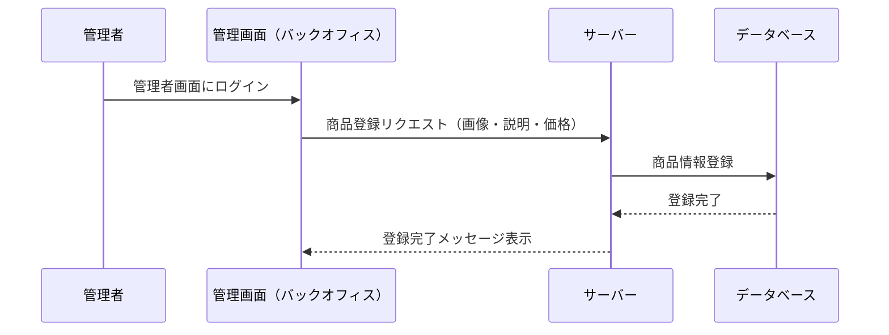
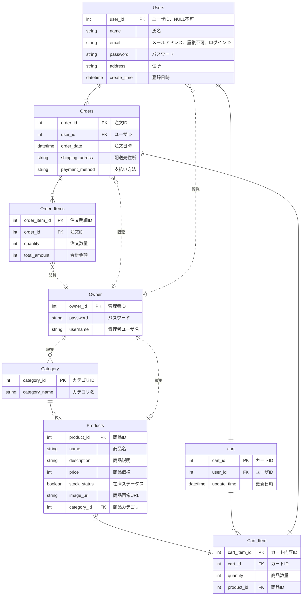
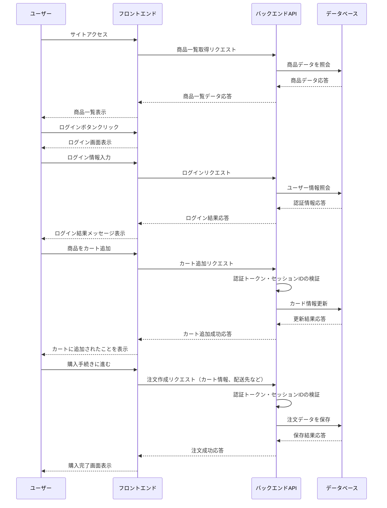

# ECサイト構築 基本設計書 
  
| ドキュメントバージョン | 1.0                                    | 
| :------------------- | :------------------------------------- | 
| 作成日               | 2025年7月2日                           | 
| 作成チーム           | neko(Dチーム)                               | 
| 承認者               | 井上真美様                              | 
| 更新履歴             | 2025/7/2: Ver.1.0 初版作成 (neko) | 
  
--- 
  
## 1. はじめに 
  
### 1.1. 本書の目的 
本書は、株式会社〇〇より受託した「ECサイト構築プロジェクト」における基本設計の内容を定義するものである。本プロジェクトの要件定義書で定められた要件に基づき、システムの全体構成、主要機能、画面、データ構造、非機能要件への対応方針を明確化し、弊社が実施する詳細設計、実装、テスト工程のインプットとすることを目的とする。 
  
### 1.2. プロジェクト概要 
本プロジェクトは、株式会社〇〇が販売する商品をオンラインでユーザーに販売可能とするECサイトを新規構築し、顧客の購買体験向上、販売機会の拡大、受注から出荷までの業務効率化を実現することを目的とする。スマートフォン、PCブラウザから商品検索、カート投入、注文、マイページでの購入履歴確認を可能とし、管理者が商品・注文・ユーザー情報を管理できる仕組みを提供する。 
  
### 1.3. 前提知識 
本書を読むにあたり、以下の知識を有していることを前提とする。 
-本プロジェクトの要件定義書の内容 
-Webアプリケーション開発の基本的な知識（HTTP, HTML, CSS, JavaScript） 
-ECサイト運営における基本的な業務知識（商品管理、受注管理、在庫管理） 
-REST API の基本的な概念 
-Java および Spring Boot フレームワークの基本的な知識 
-リレーショナルデータベースの基本的な知識 

## 2. システム概要
 
### 2.1. システムの目的
-オンラインでの商品販売において受注管理、在庫管理、決済処理、顧客対応などの業務負荷を軽減するとともに、
購入ユーザーがWebブラウザから商品検索、購入、決済を安全かつ簡便に行える環境を提供し、販売機会の拡大と管理業務の効率化を実現することを目的とする。
 
### 2.2. 対象ユーザー
-**一般顧客:** 商品を検索・購入する顧客
 
-**管理者:** 商品情報、在庫情報、受注情報、顧客情報の管理および売上管理を行う
 
### 2.3. システム構成図

 
 
 - 顧客
顧客が操作するWebブラウザ。HTML, CSS, JavaScriptで構成されるフロントエンドアプリケーションが動作し、バックエンドAPIと通信する。
 - 管理者
 管理者が操作するPCのWebブラウザ。HTML, CSS, JavaScriptで構成される管理用フロントエンドアプリケーションが動作し、バックエンドAPIと通信する。
 - APIサーバー（Spring Boot）
 バックエンドのAPIサーバー。ユーザー環境からのHTTPリクエストを受け取り、必要な処理を行いJSON形式でレスポンスを返す。
  - Controller
 ユーザー環境（顧客・管理者）からのAPIリクエストを受け取り、リクエスト内容をServiceに渡す。またServiceからの結果を受け取り、ユーザー環境へレスポンスを返す役割を担う。
  - Service
 Controllerから渡されたリクエスト情報に基づき、業務ロジックの実行やデータの加工処理を行う。必要に応じてRepositoryを介してデータベースへのアクセスを行う。
  - Repository
 Serviceからの指示を受け、データベースへのアクセスを担当する層。SQLの実行を行い、取得・更新したデータをServiceへ返す役割を担う。
 - DBサーバー（データベース：H2/PostgreSQL）
 RepositoryからのSQL実行要求を受け付け、データの取得・更新処理を行う。結果をRepositoryへ返す役割を担う。

## 3. 機能設計 

### 3.1. 機能一覧 

- **商品閲覧・検索機能（顧客向け）** 

    - F01:トップページ表示機能（特集・カテゴリなどの案内表示） 
    - F02:商品一覧表示機能（カテゴリ別・価格順表示） 
    - F03:商品詳細表示機能（画像、説明、価格、素材情報） 
    - F04:商品カテゴリフィルタ機能 
    - F05:キーワード検索機能（部分一致対応） 

- **カート・注文機能** 

    - F06:カート追加機能（在庫チェック・セッション保持） 
    - F07:カート内容編集機能（数量変更・削除対応） 
    - F08:カート内容確認機能（カート商品一覧表示） 
    - F09:注文確認機能（支払方法、ゲストは住所・メールアドレスの入力、確認表示） 
    - F10:注文確定機能（注文情報登録、サーバーサイドで受付完了メール送信） 
 
- **会員機能** 

    - F11:会員登録機能（氏名・住所・パスワード登録・メールアドレス） 
    - F12:ログイン機能（認証機能、ログインでマイページ表示、パスワード再発行） 
    - F13:マイページ機能（登録情報編集・購入履歴表示） 

- **管理者機能（バックオフィス、初回リリースは不要）** 

    - F14:商品管理機能（一覧表示・検索、登録・編集・削除、画像対応） 
    - F15:注文管理機能（注文内容・日付・顧客の確認、発送状況確認） 
    - F16:顧客管理機能（会員情報・履歴の検索・参照・編集） 
    - F17:在庫ステータス管理機能（在庫あり／なしの更新） 
    - F18:アクセス制限制御（一般ユーザー・管理者の機能分離） 

 
### 3.2. 機能構成図  

### 3.3. 主要機能フロー 

システムで行われる代表的な業務フローを示す。 

#### 3.3.1. 会員購入フロー 
 

- 会員は住所、メールアドレスを登録済み。 
- 注文時に支払い方法を入力し、購入手続きを完了させる。 
- システムは注文情報を記録し、完了メールを送信する。 

#### 3.3.2. 管理者の商品登録フロー 

- 管理者は管理画面から商品を新規登録できる。 
- 商品画像や説明、価格情報を含む情報がサーバーを経由してデータベースに登録される。 
- 登録成功後、管理画面に完了メッセージが表示される。

## 4.1. 画面一覧

| 機能ID | 機能名 | 関連画面ID | 関連画面名 | 概要 | 備考 | 
| :----- |  :----------------- | :--------- | :----------- | :------------------------------------------------------------------------- | :----------------------------------------- | 
| F001 | ログイン | SC0001 | ログイン画面 | メールアドレスとパスワードを入力し、システムにログインするための画面。 | 未ログイン時は配送先入力画面へ遷移する場合がある。 | 
| F002 | 商品一覧表示 | SC0101 | 商品一覧画面 | 商品カテゴリ別に一覧表示する画面。検索バー、カテゴリフィルター、ページネーション機能を備える。 | 商品詳細画面やマイページ、会員登録画面などへの遷移起点となる。 | 
| F003 | 商品詳細表示 | SC0102 | 商品詳細画面 | 選択した商品の詳細情報（複数画像、説明、価格など）を表示する画面。 | 「カートに追加」操作が可能。 | 
| F004 | カート操作 | SC0201 | カート画面 | カートに追加された商品の一覧を表示し、数量変更や削除、合計金額の確認が可能。 | 「購入手続きへ進む」ボタンで注文確認画面へ遷移。 | 
| F005 | 注文処理 | SC0301 | 注文確認画面 | 配送先情報や支払方法を入力し、注文内容を最終確認する画面。 | 「注文を確定する」操作により注文完了画面へ遷移。 | | F005 | 注文処理 | SC0302 | 注文完了画面 | 注文番号と完了メッセージを表示する画面。 | ユーザーに注文完了のフィードバックを提供。 | 
| F006 | 会員登録 | SC0401 | 会員登録画面 | 氏名・住所・ログイン情報などを登録する画面。 | 登録完了後、商品一覧画面またはマイページへ遷移。 |
 | F007 | マイページ閲覧・編集 | SC0403 | マイページ画面 | 登録情報の編集や購入履歴の確認が可能な画面。 | 会員情報の更新や過去の注文内容の確認ができる。 |
 
## 4.2.画面遷移図（Mermaid）
 
以下は、ECサイトにおける主要画面の遷移図です。
 
 
G01[トップページ]
G02[商品一覧画面]
G03[商品詳細画面]
G04[カート画面]
G05[注文確認画面]
G06[注文完了画面]
G07[会員登録画面]
G08[ログイン画面]
G09[マイページ]
G10[検索結果画面]

下記は、ECサイトにおける主要画面の遷移図です。
 
### ユーザー画面遷移
[G01: トップページ]
　├─ G02: 商品一覧画面（カテゴリ選択）
　├─ G10: 検索結果画面（キーワード検索）
　├─ G08: ログイン画面
　└─ G07: 会員登録画面
 
[G02: 商品一覧画面]
　├─ G01: トップページ
　└─ G03: 商品詳細画面（商品クリック）
 
[G10: 検索結果画面]
　├─ G01: トップページ
　└─ G03: 商品詳細画面（商品クリック）
 
[G03: 商品詳細画面]
　├─ G01: トップページ
　└─ G04: カート画面（カートに追加）
 
[G04: カート画面]
　├─ G01: トップページ
　├─ G02: 商品一覧画面（買い物を続ける）
　└─ G05: 注文確認画面（購入手続きへ）
 
[G05: 注文確認画面]
　├─ G01: トップページ
　├─ G07: 会員登録画面（未登録ユーザー）
　├─ G08: ログイン画面（未ログインユーザー）
　└─ G06: 注文完了画面（注文確定）
 
[G06: 注文完了画面]
　└─ G01: トップページ
 
[G08: ログイン画面]
　└─ G09: マイページ（ログイン成功）
　 
 
[G09: マイページ]
　├─ G05: 注文確認画面（購入履歴から再注文）
　└─ G01: トップページ
 
[G07: 会員登録画面]
　└─ G09: マイページ（登録完了後）
 

graph TD
  G01[トップページ] -->|カテゴリ選択| G02[商品一覧画面]
  G01 -->|キーワード検索| G10[検索結果画面]
  G01 -->|ログイン操作| G08[ログイン画面]
  G01 -->|新規登録| G07[会員登録画面]
 
  G02 -->|ホームに戻る| G01
  G02 -->|商品クリック| G03[商品詳細画面]
 
  G10 -->|ホームに戻る| G01
  G10 -->|商品クリック| G03
 
  G03 -->|ホームに戻る| G01
  G03 -->|カートに追加| G04[カート画面]
 
  G04 -->|ホームに戻る| G01
  G04 -->|買い物を続ける| G02
  G04 -->|購入手続きへ| G05[注文確認画面]
 
  G05 -->|ホームに戻る| G01
  G05 -->|未登録ユーザー| G07
  G05 -->|未ログインユーザー| G08
  G05 -->|注文確定| G06[注文完了画面]
 
  G06 -->|ホームに戻る| G01
 
  G08 -->|ログイン成功| G09[マイページ]
 
  G09 -->|再注文| G05
  G09 -->|ホームに戻る| G01
 
  G07 -->|登録完了| G09
 

 
 
 
 
 
 
### 管理者画面一覧
今回はオプション機能として設定し、顧客側の要望及びリソースを鑑みて実装か否かを判断する。
A01 管理者ログイン画面
A05 管理メニュー画面（管理トップ）
A02-01 商品一覧画面（管理）
A02-02 商品編集画面
A02-03 商品削除画面
A02-04 商品新規追加画面
A03-01 注文一覧画面
A03-02 注文詳細確認画面
A03-03 注文ステータス更新画面
A04-01 会員一覧画面
A04-02 会員詳細確認画面
A04-03 会員削除画面
A04-04 会員編集画面
### 管理者画面遷移
[A01: 管理者ログイン画面]
└─ A05: 管理メニュー画面（ログイン成功）
[A05: 管理メニュー画面]
├─ A02-01: 商品一覧画面
├─ A02-04: 商品新規追加画面
├─ A03-01: 注文一覧画面
├─ A04-01: 会員一覧画面
└─ A05: 管理メニュー画面（戻る）
[A02-01: 商品一覧画面]
├─ A02-02: 商品編集画面（商品選択 → 編集）
├─ A02-03: 商品削除画面（商品選択 → 削除確認）
└─ A05: 管理メニュー画面（戻る）
[A02-02: 商品編集画面]
└─ A02-01: 商品一覧画面（編集完了後戻る）
[A02-03: 商品削除画面]
└─ A02-01: 商品一覧画面（削除完了後戻る）
[A02-04: 商品新規追加画面]
└─ A02-01: 商品一覧画面（追加完了後戻る）
[A03-01: 注文一覧画面]
├─ A03-02: 注文詳細確認画面（注文選択 → 詳細）
├─ A03-03: 注文ステータス更新画面（注文選択 → ステータス更新）
└─ A05: 管理メニュー画面（戻る）
[A03-02: 注文詳細確認画面]
└─ A03-01: 注文一覧画面（戻る）
[A03-03: 注文ステータス更新画面]
└─ A03-01: 注文一覧画面（更新完了後戻る）
[A04-01: 会員一覧画面]
├─ A04-02: 会員詳細確認画面（会員選択 → 詳細）
├─ A04-04: 会員編集画面（会員選択 → 編集）
├─ A04-03: 会員削除画面（会員選択 → 削除確認）
└─ A05: 管理メニュー画面（戻る）
[A04-02: 会員詳細確認画面]
└─ A04-01: 会員一覧画面（戻る）
[A04-03: 会員削除画面]
└─ A04-01: 会員一覧画面（削除完了後戻る）
[A04-04: 会員編集画面]
└─ A04-01: 会員一覧画面（編集完了後戻る）
 

　graph TD
  G01[トップページ] -->|カテゴリ選択| G02[商品一覧画面]
  G01 -->|キーワード検索| G10[検索結果画面]
  G01 -->|ログイン操作| G08[ログイン画面]
  G01 -->|新規登録| G07[会員登録画面]
 
  G02 -->|トップページに戻る| G01
  G02 -->|商品をクリック| G03[商品詳細画面]
 
  G10 -->|トップページに戻る| G01
  G10 -->|商品をクリック| G03
 
  G03 -->|トップページに戻る| G01
  G03 -->|カートに追加| G04[カート画面]
 
  G04 -->|トップページに戻る| G01
  G04 -->|買い物を続ける| G02
  G04 -->|購入手続きへ| G05[注文確認画面]
 
  G05 -->|トップページに戻る| G01
  G05 -->|未登録ユーザーの場合、会員登録へ| G07
  G05 -->|未ログインユーザーの場合、ログインへ| G08
  G05 -->|注文確定| G06[注文完了画面]
 
  G06 -->|トップページに戻る| G01
 
　　G07 -->|登録完了| G09
 
  G08 -->|ログイン成功| G09[マイページ]
 
  G09 -->|購入履歴から再注文| G05
  G09 -->|トップページに戻る| G01
 
 

## 4.3. UI/UX基本方針
 
- **シンプルさ**: 初めて訪問した顧客でも直感的に操作できるよう、画面構成や操作手順はできる限りシンプルにする。不要な情報や操作を排除し、購入までの導線を明確にする。
- **一貫性**: ボタン配置、ラベル命名、エラーメッセージの表示形式などをシステム全体で統一する。ページ間でのデザインや操作感の統一により、ユーザーの混乱を防止する。
- **視認性**: 文字サイズや色使いに配慮し、情報が読みやすく、重要な情報が目立つようにする。商品写真が映えるよう、白を基調とした視認性の高いデザインを採用する。
- **効率性**: カート追加や注文確定など、頻繁に行う操作は少ないステップで完了できるようにする。
- **フィードバック**: 顧客の操作に対して、処理中であることや処理結果（成功、エラー）を明確に表示する。注文完了時には、メールを送信し、フィードバックを行う。
- **レスポンシブ**: 主な利用はPCを想定し、UI設計を行う。モバイルでも快適に操作できるよう、画面サイズに応じたレイアウト調整を行う。
## 4.4. 主要画面項目定義（例：商品一覧画面）
 
- **画面ID**: F02
- **画面名**: 商品一覧画面
- **表示項目・入力項目**:
  - **キーワード検索**
       - **要素**: テキスト入力ボックス
       - **入力形式**: 文字列（最大50文字）
       - **補足**: 商品名・説明文に対する部分一致検索を行う。
  - **カテゴリフィルター**
       - **要素**: プルダウンリスト
       - **選択肢**: カテゴリーマスタに登録された名称 + 「全カテゴリ」
       - **補足**: 選択カテゴリに属する商品のみ表示。「全カテゴリ」選択時は絞り込みなし。
  - **商品リストテーブル**
       - **列**: 商品画像, 商品名, 価格, 商品詳細リンク
       - **表示形式**: テーブル形式
       - **補足**: 登録日時の降順で表示。ページネーション対応。
  - **商品詳細リンク**
       - **要素**: リンク
       - **動作**: クリックで商品詳細画面（F03）へ遷移。
 
## 5. データ設計

### 5.1. 概念データモデル（ER図）

- **エンティティ**: 

- **エンティティ**: 
  - **USERS(ユーザー)**; 会員情報（ログインユーザー）,F06,F07,F08,F21,F23に関連。 
  - **PRODUCTS(商品)**; 商品情報。F02,F03,F04,F05,F19に関連。 
  - **CATEGORY(カテゴリー)**; 商品カテゴリー。F04,F19に関連。 
  - **CART(カート)**; カート情報。F09,F10,F14,F15に関連。 
  - **CART_ITEMS**(カート内商品);カート内商品情報。F09,F10,F14,F15に関連。 
  - **ORDERS(注文)**; 注文情報。F11,F12,F13,F16,F17,F18に関連。 
  - **ORDERS_ITEMS(注文商品)**; 注文商品情報。 F11,F12,F13,F16,F17,F18に関連。 
  - **OWNER(管理者)**;管理者情報。F19,F20,F21,F22,F24に関連。 

 

- **リレーション**:
    - ユーザーは一つのカートを持つ  (1対1、USERS -> CART)
    - 管理者としてログインしたものだけが商品編集を行う (1対多、OWNER -> PRODUCTS)
    - 商品はカテゴリに属する (1対多、PRODUCT -> CATEGORIES)

### 5.2. 主要テーブル概要
### テーブル定義一覧

| テーブル名 | 概要| カラム | 備考 |
| :----------------- | :------------------------------------------- | :--------------------------------------------- | :------------------------------------------------------------- |
| **USERS** | 会員登録したユーザーの情報を管理 | ユーザーID、氏名、メールアドレス、パスワード（ハッシュ化）、住所、登録日時 | パスワードはハッシュ化して保存 |
| **PRODUCTS** | 商品情報（商品名、説明、価格、カテゴリ、画像など）を管理 |商品ID、 商品名、商品説明、商品価格、在庫ステータス、商品画像URL、商品カテゴリ| 商品につき複数の注文明細`ORDER_ITEMS`に紐づく |
| **CATEGORY** | 商品を分類するためのカテゴリ情報 | カテゴリID、カテゴリ名 | 商品検索やフィルタリングに利用 |
| **ORDERS** | ユーザーが購入した注文情報 | 注文ID、ユーザーID、注文日時、配送先住所、支払方法| 誰が、いつ、どこへ、何を購入したかを記録 |
| **ORDER_ITEMS** | 注文の中に含まれる商品ごとの明細情報 | 注文明細ID、注文ID注文数量、合計金額 | 特定の注文（`ORDERS`）内の個々の商品詳細を記録するテーブル |

### 5.3. データフロー概要

## 6. 非機能要件 対応方針

### 6.1. 性能

#### レスポンス速度 
 - 各画面の表示は3秒以内を目標とする。商品一覧ページ（画像あり）でも5秒以内を厳守。

#### 同時アクセス数 
 - 同時接続ユーザー数は通常時で最大50人、セール・キャンペーン時には200人程度を想定。

#### データベース応答性 
 - 一般的な検索・登録・更新処理は1秒以内で完了することを目指す。

#### 対応策
  - 1画面の表示件数を最大20件に制限
  - 大きな画面は適宜縮小し読み込み負荷を軽減
  - 商品・ユーザーにインデックスを付与

---

### 6.2. セキュリティ

#### 通信の暗号化  
  - 本番確認や外部アクセスを行う場合は必ず「HTTPS」（SSL/TLS）を利用

#### パスワード管理 
  - パスワードのハッシュ化は今回見送り

#### CSRF / XSS / SQLインジェクション対策 
　-　上記対策は今回見送り

#### 管理画面のアクセス制限
  - IP制限、ID・パスワード認証の二重チェックを導入予定
  - URLを直接入力しても403エラーを返す

#### 不正アクセス（URL直接入力）対策
  - 権限を持たないユーザーが他ユーザー用画面に直接URLを入力してアクセスすることを禁止する。 

---

### 6.3. 可用性

#### 稼働時間 
  - 稼働率99.5%以上を目標とする。

#### バックアップ
  - 今回は見送り

#### 障害対応
  - エラーログを確認し、問題が起きた時原因を特定しやすいようにする

#### フェールオーバー  
  - 高度な自動切り替えは行わず、単一サーバ構成

---

### 6.4. システム環境

#### 利用環境
 
- **クライアント:**
 
  - 顧客：PC・スマートフォン・タブレット端末のWebブラウザ（Google Chrome、の最新バージョン）
 
　- 管理者：PC（Windows 10/11）＋Google Chromeを想定
 
- **サーバー:** クラウド環境（AWSを想定）
 
- **ネットワーク:**

　- 公開インターネットを介したHTTPS接続（SSL証明書適用）

本システムの開発にあたり、以下の技術を使用することを前提とする。

-   **言語**: (JAVA)
-   **フレームワーク**: (Spring Boot)
-   **データベース**: (クラウド環境のマネージドサービス利用)
-   **フロントエンド**: HTML5, CSS3, JavaScript(ES6)
-   **Webサーバー**: (AWS)
-   **その他ライブラリ**: (必要に応じて協議の上、決定)

### 6.5. その他（保守性、運用性、拡張性など）

#### 保守性
  - ソースコードはGitHubでバージョン管理し、mainブランチは常に安定状態を保つ。
  - コードはコメント・ドキュメント含めて可読性を重視した実装とする。

#### 運用性
  - 管理画面から主要情報の登録・編集が可能（商品、カテゴリ、会員情報など）
  - エラーログは管理者がダウンロード・閲覧できる仕組みを用意（検討中のためスコープ外）

#### 拡張性
  - 今後の機能追加（決済機能、レビュー機能など）を想定し、モジュール分割を最低限行う
  - 商品カテゴリ・属性の柔軟な追加を可能にするデータ設計。

---

## 7. 運用・保守設計の概要

### 7.1. ログ設計方針
- **ログの目的**
本システムにおけるログは、以下の目的で記録・管理する。
 - 障害発生時の原因調査および復旧対応の迅速化
 - 不正アクセスや不正操作の検知および監査対応
 - 利用状況の把握によるサービス改善のための分析基盤
 - 運用保守時の変更・操作履歴の追跡

- **ログの種類**
  - **アクセスログ**：ユーザーアクセス、ページ遷移などの記録（例：Nginx/Apacheログ）
  - **アプリケーションログ**：エラー、例外、重要な処理結果（例：ログイン成功/失敗、注文処理）
  - **管理操作ログ**：商品登録・削除、在庫更新、会員情報更新などの管理者操作を記録
  - **セキュリティログ**：認証失敗

- **出力形式**（保留）
  - テキスト形式
- **保存期間**
  - アプリケーションログ・アクセスログ：90日間保管（バックアップ含む）
  - 操作ログ：1年間保管（必要に応じて期間延長）

- **閲覧・出力方法**（保留）
  - 管理画面からテキストをダウンロードし確認可能にする予定

- **ログフォーマット**: タイムスタンプ、ログレベル、メッセージなどの最低限の情報を含める。

---

### 7.2. 監視設計方針

- **監視対象**
  - Webアプリケーション：死活監視（HTTP 200応答）、レスポンス時間監視
  - インフラ（クラウドサーバ）：CPU、メモリ、ディスク使用率
  - データベース：接続数、クエリエラー、ストレージ容量
  - バックアップの実行成否
  - ログイン試行の異常増加（セキュリティ監視）

- **監視ツール**
  - 今後、AWS CloudWatch、または外部SaaS監視サービス（例：UptimeRobot、Datadog、Sentry等）を活用することを予定しているが今回の開発では見送る。

- **通知方法**
  - 異常検知時にメール／Slack等に自動通知
  - 死活監視の失敗は5分以内にアラート通知

- **対応方針**
  - 監視アラートのレベル分け（Info / Warning / Critical）
  - 重大障害（Critical）については、即時対応・影響調査・復旧報告を実施

## 8. 制約事項・前提条件
 
### 8.1. 使用技術スタック
 
本システムの開発にあたり、以下の技術を使用することを前提とする。
 
-   **言語**: (JAVA)
-   **フレームワーク**: (Spring Boot)
-   **データベース**: (クラウド環境のマネージドサービス利用)
-   **フロントエンド**: HTML5, CSS3, JavaScript(ES6)
-   **Webサーバー**: (AWS)
-   **その他ライブラリ**: (必要に応じて協議の上、決定)
 
### 8.2. インフラ環境
 
-   **サーバーOS**: (windows10/11)
-   **実行環境**: (Google Crome)
-   **稼働場所**: AWS (EC2/RDSなどのマネージドサービスを想定)
-   **ネットワーク**: 公開インターネットを介したHTTPS接続（SSL証明書適用）。管理画面はログイン制限付き。
 
### 8.3. 開発・運用ルール
 
-   **バージョン管理**: Gitを使用し、プロジェクト標準のリポジトリで管理する。
-   **コーディング規約**: プロジェクト標準のコーディング規約を定め、必要に応じて静的解析ツールを導入する。
-   **テスト**: 単体テスト、結合テスト、システムテストを実施する。
-   **デプロイ**: デプロイ手順を確立する。
-   **商品情報の登録・更新**: 社内管理者が管理画面から実施。初期登録は一部支援。
-   **注文受付・確認**: 管理画面での確認と手動での発送準備。注文通知はメール受信。
-   **在庫表示**: 簡易的な「在庫あり／なし」表示とし、詳細な在庫数管理は行わない。更新は手動。
-   **ユーザー教育**: サイト運用開始前に、社内担当者（田中氏中心）向けに操作説明会を実施。
 
### 8.4. スコープ外
 
-   実際のAPI仕様の細部（例：RESTエンドポイントやリクエスト/レスポンスのJSON構造詳細）
-   単体テスト、結合テストの項目一覧やテストケース詳細
-   詳細な運用保守手順書、障害対応手順書
-   クレジットカード決済機能
-   レビュー投稿機能
-   複雑な在庫管理機能（詳細な在庫数管理、自動引き落としなど）
-   売上管理機能
-   問い合わせフォーム機能（運用体制整備後に検討）
-   監視ツールの導入
- 　IP制限違反
- 　不正アクセスの試行記録
-　 バックアップ機能
- 　不正アクセス対策（SQLインジェクション等）
 
### 8.5. その他前提条件
 
-   システムはWebアプリケーションとして開発し、主に公開インターネットを介して利用される。
-   クライアントのWebブラウザは、Google Chromeの最新安定版を対象とする。
-   スマートフォンからの閲覧・購入が円滑に行えるよう、レスポンシブデザインを採用する。
-   初期商品データ移行用のCSVファイルは、指定されたフォーマットで提供されるものとする。
 
---
 
### 9. （付録）用語集・略語リスト
 
(プロジェクト内で使用される専門用語や略語があれば定義します。)
 
-   **ECサイト**: Electronic Commerce Site (電子商取引サイト)
-   **AWS**: Amazon Web Services
-   **HTTPS**: Hypertext Transfer Protocol Secure
-   **SSL/TLS**: Secure Sockets Layer / Transport Layer Security (HTTPS通信で使用される暗号化プロトコル)
-   **UI**: User Interface
-   **UX**: User Experience
-   **CSV**: Comma Separated Values
-   **DB**: Database
-   **CSRF**: Cross-Site Request Forgery (クロスサイトリクエストフォージェリ)
-   **XSS**: Cross-Site Scripting (クロスサイトスクリプティング)
-   **SKU**: Stock Keeping Unit (最小管理単位)
-   **MoSCoW分析**: Must have, Should have, Could have, Won't have (要件の優先順位付け手法)

