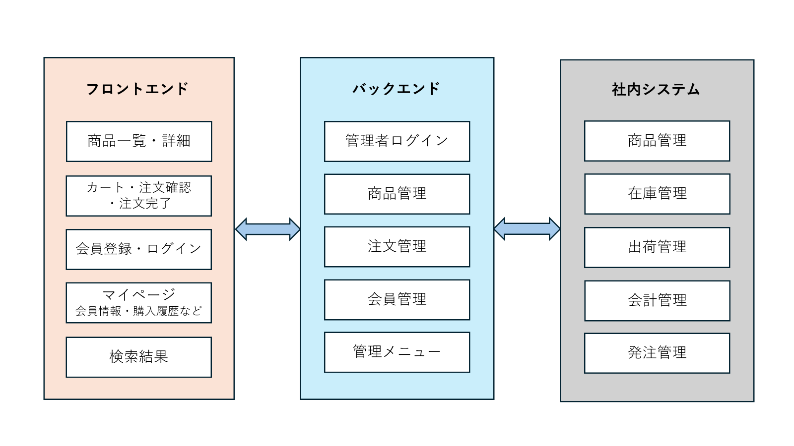

## 2. システム概要

### 2.1. システムの目的
-オンラインでの商品販売において受注管理、在庫管理、決済処理、顧客対応などの業務負荷を軽減するとともに、
購入ユーザーがWebブラウザから商品検索、購入、決済を安全かつ簡便に行える環境を提供し、販売機会の拡大と管理業務の効率化を実現することを目的とする。

### 2.2. 対象ユーザー
-**一般顧客:** 商品を検索・購入・決済する顧客

-**店舗管理者:** 商品情報、在庫情報、受注情報、顧客情報の管理および売上管理を行う

### 2.3. システム構成図

-クライアント: 購入ユーザーおよび管理者が利用するPC/スマートフォンのブラウザ（Chrome）

-サーバー: クラウド環境に構築し、Web/APサーバーおよびDBサーバーで構成

-メールサービス: 注文受付・出荷完了通知等の自動メール送信を実施

-ネットワーク: インターネット経由でHTTPS通信を行う

### 2.4. 外部インターフェース概要
**メール送信サービス:**
-メールサービスと連携し、注文受付通知、発送通知、パスワード再設定通知などの自動送信を行う。

**CSVファイル（オプション）:**
-商品情報の一括登録、在庫情報の一括更新等でCSVファイルのアップロード・取込機能を提供する場合がある。

-（将来的に他システム（会計ソフト等）とのAPI連携が必要な場合は別途定義する）

