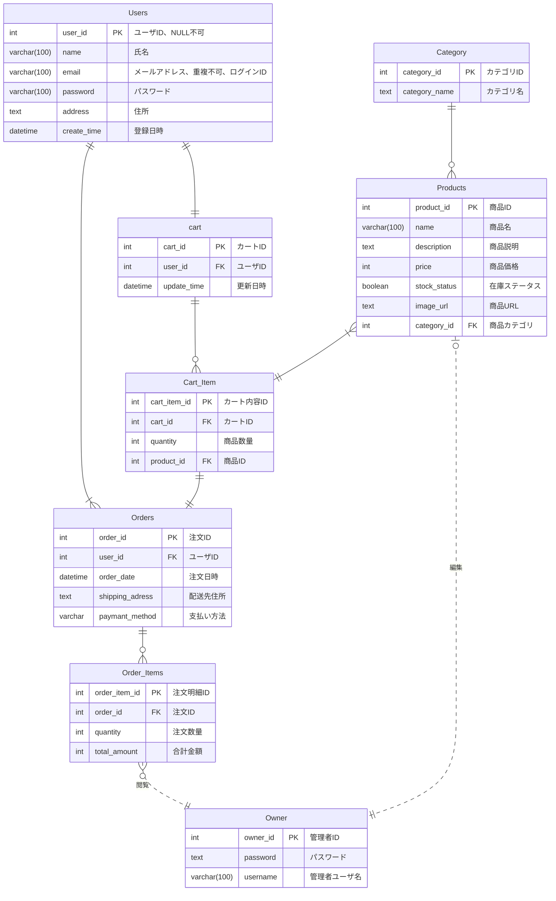

# 備品管理システム 基本設計書
 
| ドキュメントバージョン | 1.0                                    |
| :------------------- | :------------------------------------- |
| 作成日               | 2025年7月2日                           |
| 作成チーム           | neko(Dチーム)                               |
| 承認者               | 井上真美様                              |
| 更新履歴             | 2025/7/2: Ver.1.0 初版作成 (neko) |
 
---
 
## 1. はじめに
 
### 1.1. 本書の目的
本書は、株式会社〇〇より受託した「ECサイト構築プロジェクト」における基本設計の内容を定義するものである。本プロジェクトの要件定義書で定められた要件に基づき、システムの全体構成、主要機能、画面、データ構造、非機能要件への対応方針を明確化し、弊社が実施する詳細設計、実装、テスト工程のインプットとすることを目的とする。
 
### 1.2. プロジェクト概要
本プロジェクトは、株式会社〇〇が販売する商品をオンラインでユーザーに販売可能とするECサイトを新規構築し、顧客の購買体験向上、販売機会の拡大、受注から出荷までの業務効率化を実現することを目的とする。スマートフォン、PCブラウザから商品検索、カート投入、注文、マイページでの購入履歴確認を可能とし、管理者が商品・注文・ユーザー情報を管理できる仕組みを提供する。
 
### 1.3. 前提知識
本書を読むにあたり、以下の知識を有していることを前提とする。
 
-本プロジェクトの要件定義書の内容
 
-Webアプリケーション開発の基本的な知識（HTTP, HTML, CSS, JavaScript）
 
-ECサイト運営における基本的な業務知識（商品管理、受注管理、在庫管理）
 
-REST API の基本的な概念
 
-Java および Spring Boot フレームワークの基本的な知識
 
-リレーショナルデータベースの基本的な知識
 
## 2. システム概要
 
### 2.1. システムの目的
-オンラインでの商品販売において受注管理、在庫管理、決済処理、顧客対応などの業務負荷を軽減するとともに、
購入ユーザーがWebブラウザから商品検索、購入、決済を安全かつ簡便に行える環境を提供し、販売機会の拡大と管理業務の効率化を実現することを目的とする。
 
### 2.2. 対象ユーザー
-**一般顧客:** 商品を検索・購入・決済する顧客
 
-**店舗管理者:** 商品情報、在庫情報、受注情報、顧客情報の管理および売上管理を行う
 
### 2.3. システム構成図
 

 
graph LR
    subgraph ユーザー環境
        A[PC/スマートフォン （ブラウザ: Chrome/Edge/Safari）]
    end
 
    subgraph インターネット
    end
 
    subgraph クラウド環境
        subgraph Web/APサーバー
           B[ECサイトシステム （Web/APサーバー）]
        end
        subgraph DBサーバー
            C[データベースサーバー]
        end
        subgraph メールサービス
            D[メール送信サービス]
        end
 
        B --> C
        B --> D
    end
 
    A -- HTTPS --> B
 

 
-クライアント: 購入ユーザーおよび管理者が利用するPC/スマートフォンのブラウザ（Chrome）
 
-サーバー: クラウド環境に構築し、Web/APサーバーおよびDBサーバーで構成
 
-メールサービス: 注文受付・出荷完了通知等の自動メール送信を実施
 
-ネットワーク: インターネット経由でHTTPS通信を行う
 
### 2.4. 外部インターフェース概要
**メール送信サービス:**
-メールサービスと連携し、注文受付通知、発送通知、パスワード再設定通知などの自動送信を行う。
 
**CSVファイル（オプション）:**
-商品情報の一括登録、在庫情報の一括更新等でCSVファイルのアップロード・取込機能を提供する場合がある。
 
-（将来的に他システム（会計ソフト等）とのAPI連携が必要な場合は別途定義する）
 

## 3. 機能設計

### 3.1. 機能一覧

- **認証・会員機能**
    - ログイン/ログアウト機能（セッション管理含む）
    - 会員登録機能（氏名・住所・ID・パスワード登録）
    - マイページ機能（登録情報編集・購入履歴表示）
    - パスワード再発行機能（メール送信）

- **商品閲覧・検索機能（顧客向け）**
    - トップページ表示機能（特集・カテゴリなどの案内表示）
    - 商品一覧表示機能（カテゴリ別・登録順表示）
    - 商品詳細表示機能（画像、説明、価格、仕様など）
    - 商品カテゴリフィルタ機能
    - キーワード検索機能（部分一致対応）

- **カート・注文機能**
    - カート追加機能（在庫チェック・セッション保持）
    - カート内容表示・編集機能（数量変更・削除対応）
    - 注文確認機能（配送先・支払方法の入力、確認表示）
    - 注文確定機能（注文情報登録、受付完了メール送信）
    - 注文受付メール送信機能（サーバーサイド処理）

- **管理者機能（バックオフィス）**
    - 商品管理機能（一覧表示・検索、登録・編集・削除、画像対応）
    - 注文管理機能（注文内容・日付・顧客の確認、発送状況確認）
    - 顧客管理機能（会員情報・履歴の検索・参照・編集）
    - 在庫ステータス管理機能（在庫あり／なしの更新）

- **セキュリティ・管理機能（バックオフィス）**
    - アクセス制限制御（一般ユーザー・管理者の機能分離）
    - セッションタイムアウト処理
    - URL直打ち制限

- **共通・システム機能**
    - 通知機能の拡充（発送完了メール、パスワード変更通知などの重要通知）
    - エラーハンドリング機能（入力エラー・システムエラー時のユーザーフレンドリーな表示）
    - データバックアップ・リカバリ機能（定期バックアップ、自動復旧計画）

### 3.2. 機能構成図

graph TD
    A[ECサイト] --> B(商品閲覧・検索機能)
    A --> C(会員機能)
    A --> D(カート・注文機能)
    A --> E(ゲスト購入機能)
    A --> F(管理者機能)
    A --> G(セキュリティ・管理機能)
    A --> H(ユーザー認証機能)
    A --> I(管理者認証機能)

    subgraph B[商品閲覧・検索機能]
        B1[トップページ表示]
        B2[商品一覧表示]
        B3[商品詳細表示]
        B4[商品カテゴリフィルタ]
        B5[キーワード検索]
    end

    subgraph C[会員機能]
        C1[会員登録]
        C2[マイページ]
        C3[パスワード再発行]
    end

    subgraph D[カート・注文機能]
        D1[カート追加]
        D2[カート内容表示・編集]
        D3[注文確認]
        D4[注文確定]
        D5[注文受付メール送信]
    end

    subgraph E[ゲスト購入機能]
        E1[カート追加・注文処理]
        E2[配送先・決済情報入力]
        E3[注文確認・確定]
        E4[注文受付メール送信]
    end

    subgraph F[管理者機能]
        F1[商品管理]
        F2[注文管理]
        F3[顧客管理]
        F4[在庫ステータス管理]
    end

    subgraph G[セキュリティ・管理機能]
        G1[アクセス制限制御]
        G2[セッションタイムアウト]
        G3[URL直打ち制限]
    end

    H -- ログイン後 --> D
    B -- ログイン --> H
    H -- ログイン後 --> G
    B -- ゲスト利用 --> E
    I -- 管理者ログイン後 --> F
    H -- ログイン後 --> C

    style A fill:#f9f,stroke:#333,stroke-width:2px

### 3.3. 主要機能フロー

システムで行われる代表的な業務フローを示す。

#### 3.3.1. ゲスト購入フロー

 
sequenceDiagram
    顧客 ->> フロント: 商品一覧・詳細を閲覧
    顧客 ->> フロント: 商品をカートに追加
    フロント ->> サーバー: 在庫確認・カート情報保持
    サーバー ->> DB: 在庫情報取得
    DB -->> サーバー: 在庫OK
    サーバー -->> フロント: カート追加成功

    顧客 ->> フロント: 注文手続きへ進む
    フロント ->> 顧客: 住所・支払い方法を入力
    顧客 ->> フロント: 情報送信
    フロント ->> サーバー: 注文情報登録要求
    サーバー ->> DB: 注文情報・在庫数を登録/更新
    DB -->> サーバー: 登録成功
    サーバー -->> フロント: 注文完了画面表示
    サーバー ->> メール: 注文完了メール送信
    メール ->> 顧客: 注文完了メール受信

- ゲストユーザーは会員登録をせずに商品をカートに追加・注文できる。

- 注文時に配送先・支払い方法を入力し、購入手続きを完了させる。

- システムは注文情報を記録し、完了メールを送信する。

#### 3.3.2. 管理者の商品登録フロー

 
sequenceDiagram 
管理者 ->> 管理画面: 商品登録画面にアクセス
管理画面 ->> サーバー: 商品登録リクエスト（画像・説明・価格）
サーバー ->> DB: 商品情報登録
DB -->> サーバー: 登録完了
サーバー -->> 管理画面: 登録完了メッセージ表示

- 管理者は管理画面から商品を新規登録できる。

- 商品画像や説明、価格情報を含む情報がサーバーを経由してデータベースに登録される。

- 登録成功後、管理画面に完了メッセージが表示される。

## 4.1. 画面一覧

- **SC0001: ログイン画面**  
  - ユーザーIDとパスワードを入力し、システムにログインするための画面。  
  - 未ログイン時は配送先入力画面へ遷移する場合がある。

- **SC0101: 商品一覧画面**  
  - 商品カテゴリ別に一覧表示する画面。検索バー、カテゴリフィルター、ページネーション機能を備える。  
  - 商品詳細画面やマイページ、会員登録画面などへの遷移起点となる。

- **SC0102: 商品詳細画面**  
  - 選択した商品の詳細情報（複数画像、説明、価格など）を表示する画面。  
  - 「カートに追加」操作が可能。

- **SC0201: カート画面**  
  - カートに追加された商品の一覧を表示し、数量変更や削除、合計金額の確認が可能。  
  - 「購入手続きへ進む」ボタンで注文確認画面へ遷移。

- **SC0301: 注文確認画面**  
  - 配送先情報や支払方法を入力し、注文内容を最終確認する画面。  
  - 「注文を確定する」操作により注文完了画面へ遷移。

- **SC0302: 注文完了画面**  
  - 注文番号と完了メッセージを表示する画面。  
  - ユーザーに注文完了のフィードバックを提供。

- **SC0401: 会員登録画面**  
  - 氏名・住所・ログイン情報などを登録する画面。  
  - 登録完了後、商品一覧画面またはマイページへ遷移。

- **SC0402: ログイン画面**  
  - ログインIDとパスワードで認証する画面。  
  - 認証成功後、商品一覧画面またはマイページへ遷移。

- **SC0403: マイページ画面**  
  - 登録情報の編集や購入履歴の確認が可能な画面。  
  - 会員情報の更新や過去の注文内容の確認ができる。

## 4.2.画面遷移図（Mermaid）

以下は、ECサイトにおける主要画面の遷移図です。

　　G01[トップページ]
G02[商品一覧画面]
G03[商品詳細画面]
G04[カート画面]
G05[注文確認画面]
G06[注文完了画面]
G07[会員登録画面]
G08[ログイン画面]
G09[マイページ]
G10[検索結果画面]

### ユーザー画面遷移
[G01: トップページ]
　├─ G02: 商品一覧画面（カテゴリ選択）
　├─ G10: 検索結果画面（キーワード検索）
　├─ G08: ログイン画面
　└─ G07: 会員登録画面
 
[G02: 商品一覧画面]
　├─ G01: トップページ
　└─ G03: 商品詳細画面（商品クリック）
 
[G10: 検索結果画面]
　├─ G01: トップページ
　└─ G03: 商品詳細画面（商品クリック）
 
[G03: 商品詳細画面]
　├─ G01: トップページ
　└─ G04: カート画面（カートに追加）
 
[G04: カート画面]
　├─ G01: トップページ
　├─ G02: 商品一覧画面（買い物を続ける）
　└─ G05: 注文確認画面（購入手続きへ）
 
[G05: 注文確認画面]
　├─ G01: トップページ
　├─ G07: 会員登録画面（未登録ユーザー）
　├─ G08: ログイン画面（未ログインユーザー）
　└─ G06: 注文完了画面（注文確定）
 
[G06: 注文完了画面]
　└─ G01: トップページ
 
[G08: ログイン画面]
　└─ G09: マイページ（ログイン成功）
　 
 
[G09: マイページ]
　├─ G05: 注文確認画面（購入履歴から再注文）
　└─ G01: トップページ
 
[G07: 会員登録画面]
　└─ G09: マイページ（登録完了後）

graph TD
    G01[トップページ] -->|カテゴリ選択| G02[商品一覧画面]
    G01 -->|キーワード検索| G10[検索結果画面]
    G01 -->|ログイン操作| G08[ログイン画面]
    G01 -->|新規登録| G07[会員登録画面]

    G02 -->|ホームに戻る| G01
    G02 -->|商品クリック| G03[商品詳細画面]

    G10 -->|ホームに戻る| G01
    G10 -->|商品クリック| G03

    G03 -->|ホームに戻る| G01
    G03 -->|カートに追加| G04[カート画面]

    G04 -->|ホームに戻る| G01
    G04 -->|買い物を続ける| G02
    G04 -->|購入手続きへ| G05[注文確認画面]

    G05 -->|ホームに戻る| G01
    G05 -->|未登録ユーザー| G07
    G05 -->|未ログインユーザー| G08
    G05 -->|注文確定| G06[注文完了画面]

    G06 -->|ホームに戻る| G01

    G08 -->|ログイン成功| G09[マイページ]

    G09 -->|再注文| G05
    G09 -->|ホームに戻る| G01

    G07 -->|登録完了| G09

### 管理者画面一覧

- A01 管理者ログイン画面
- A02 商品管理画面（商品一覧・編集・削除・新規追加）
- A03 注文管理画面（注文一覧・詳細確認・ステータス更新）
- A04 会員管理画面（会員一覧・詳細確認・編集・削除）
- A05 管理メニュー画面（管理トップ）
### 管理者画面遷移
[A01: 管理者ログイン画面]
　└─ A05: 管理メニュー画面（ログイン成功）

[A05: 管理メニュー画面]
　├─ A02: 商品管理画面（商品一覧、編集、削除、新規追加へ遷移）
　├─ A03: 注文管理画面（注文一覧、詳細確認、ステータス更新へ遷移）
　└─ A04: 会員管理画面（会員一覧、詳細確認、編集、削除へ遷移）

[A02: 商品管理画面]
　├─ 商品詳細編集・削除
　└─ 商品新規追加

[A03: 注文管理画面]
　└─ 注文詳細確認・ステータス更新

[A04: 会員管理画面]
　└─ 会員詳細確認・編集・削除

graph TD
    A01[管理者ログイン画面] -->|ログイン成功| A05[管理メニュー画面]

    A05 -->|商品一覧・編集・削除・新規追加へ遷移| A02[商品管理画面]
    A05 -->|注文一覧・詳細確認・ステータス更新へ遷移| A03[注文管理画面]
    A05 -->|会員一覧・詳細確認・編集・削除へ遷移| A04[会員管理画面]

    A02 -->|商品詳細編集・削除| A02_1[商品詳細編集・削除]
    A02 -->|商品新規追加| A02_2[商品新規追加]

    A03 -->|注文詳細確認・ステータス更新| A03_1[注文詳細確認・ステータス更新]

    A04 -->|会員詳細確認・編集・削除| A04_1[会員詳細確認・編集・削除]

## 4.3. UI/UX基本方針

- **シンプルさ**: 初めて訪問したユーザーでも直感的に操作できるよう、画面構成や操作手順はできる限りシンプルにする。不要な情報や操作を排除し、購入までの導線を明確にする。
- **一貫性**: ボタン配置、ラベル命名、エラーメッセージの表示形式などをシステム全体で統一する。ページ間でのデザインや操作感の統一により、ユーザーの混乱を防止する。
- **視認性**: 文字サイズや色使いに配慮し、情報が読みやすく、重要な情報が目立つようにする。商品写真が映えるよう、白を基調とした視認性の高いデザインを採用する。
- **効率性**: カート追加や注文確定など、頻繁に行う操作は少ないステップで完了できるようにする。入力支援機能（例：郵便番号から住所補完）を導入し、ユーザーの負担を軽減する。
- **フィードバック**: ユーザーの操作に対して、処理中であることや処理結果（成功、エラー）を明確に表示する。カート追加や注文完了時には、確認メッセージや画面遷移でフィードバックを行う。
- **レスポンシブ**: 主な利用はPCを想定し、UI設計を行う。モバイルでも快適に操作できるよう、画面サイズに応じたレイアウト調整を行う。

## 4.4. 主要画面のワイヤーフレーム

ここでは主要画面のワイヤーフレーム（骨組み）を簡易的に示す。最終的なUIデザイン（色味やフォント等）は別途デザインフェーズで検討・作成する。
 商品一覧画面
### 4.4.3. 商品一覧画面ワイヤーフレーム

+--------------------------------------------------------------------------+
| ヘッダー（ロゴ、検索バー、カート、ログイン）                             |
+--------------------------------------------------------------------------+
| フィルターエリア                                                         |
|   カテゴリ: [ プルダウンリスト（カテゴリ選択） ]                         |
|   並び替え: [ プルダウンリスト（新着順など） ]                           |
+--------------------------------------------------------------------------+
| 商品カード一覧（3列グリッド）                                            |
| +----------------+  +----------------+  +----------------+               |
| | [画像]         |  | [画像]         |  | [画像]         |               |
| | 商品名         |  | 商品名         |  | 商品名         |               |
| | ￥価格         |  | ￥価格         |  | ￥価格         |               |
| | [詳細を見る]   |  | [詳細を見る]   |  | [詳細を見る]   |               |
| +----------------+  +----------------+  +----------------+               |
+--------------------------------------------------------------------------+
| フッター（ナビゲーション、著作権など）                                   |
+--------------------------------------------------------------------------+

**カテゴリフィルター**: カテゴリを選択して商品を絞り込み。 - **並び替え**: 新着順や価格順などで並び替え。 - **商品カード**: 画像、商品名、価格、詳細ボタンを表示。  - **詳細ボタン**: 商品詳細画面へ遷移。

### 4.4.4. 商品詳細画面ワイヤーフレーム

+--------------------------------------------------------------------------+
| ヘッダー（ロゴ、検索バー、カート、ログイン）                             |
+--------------------------------------------------------------------------+
| 商品詳細エリア                                                           |
|   商品画像（スライダー）                                                 |
|   商品名                                                                 |
|   ￥価格                                                                 |
|   商品説明                                                               |
|   素材・サイズ情報                                                       |
|   数量: [ - ][1][ + ]                                                   |
|   [カートに入れる]                                                       |
+--------------------------------------------------------------------------+
| 関連商品一覧（オプション）                                              |
+--------------------------------------------------------------------------+
| フッター                                                                 |
+--------------------------------------------------------------------------+

**スライダー**:複数画像を切り替え表示。 - **数量選択**: 購入数を指定。 - **カートに入れる**: カート画面へ遷移。

### 4.4.5. カート画面ワイヤーフレーム

+--------------------------------------------------------------------------+
| ヘッダー（ロゴ、検索バー、カート、ログイン）                             |
+--------------------------------------------------------------------------+
| カート内容エリア                                                         |
| +----------------+----------------+--------+--------+--------+           |
| | 商品画像       | 商品名         | 単価   | 数量   | 小計   |           |
| +----------------+----------------+--------+--------+--------+           |
| | [画像]         | ペンA          | ￥500  | [ 2 ]  | ￥1000 |           |
| | [削除]         |                |        |        |        |           |
+--------------------------------------------------------------------------+
| 合計金額：￥xxxx                                                        |
| [購入手続きへ進む]                                                      |
+--------------------------------------------------------------------------+
| フッター                                                                 |
+--------------------------------------------------------------------------+

**数量変更・削除**:カート内商品の編集が可能。 - **合計金額表示**: 小計の合計を表示。- **購入手続きへ進む**: 注文確認画面へ遷移。

###　4.4.6. 注文確認画面ワイヤーフレーム

+--------------------------------------------------------------------------+
| ヘッダー                                                                 |
+--------------------------------------------------------------------------+
| 配送先情報入力エリア                                                    |
|   氏名：[__________]                                                    |
|   住所：[__________]                                                    |
|   電話番号：[__________]                                                |
|   支払方法：[クレジットカード ▼]                                        |
+--------------------------------------------------------------------------+
| 注文内容確認エリア                                                      |
|   商品名   | 単価 | 数量 | 小計                                         |
|   ペンA    | ￥500| 2    | ￥1000                                       |
|   合計金額：￥1000                                                     |
+--------------------------------------------------------------------------+
| [注文を確定する]                                                        |
+--------------------------------------------------------------------------+
| フッター                                                                 |
+--------------------------------------------------------------------------+

**配送先情報**:ユーザーが入力。 - **注文内容確認**: カート内容の最終確認。- **注文確定ボタン**: 注文完了画面へ遷移。

### 4.5. 主要画面項目定義（例：商品一覧画面）

- **画面ID**: F02
- **画面名**: 商品一覧画面
- **表示項目・入力項目**:
    - **キーワード検索**
        - **要素**: テキスト入力ボックス
        - **入力形式**: 文字列（最大50文字）
        - **補足**: 商品名・説明文に対する部分一致検索を行う。
    - **カテゴリフィルター**
        - **要素**: プルダウンリスト
        - **選択肢**: カテゴリーマスタに登録された名称 + 「全カテゴリ」
        - **補足**: 選択カテゴリに属する商品のみ表示。「全カテゴリ」選択時は絞り込みなし。
    - **商品リストテーブル**
        - **列**: 商品画像, 商品名, 価格, 商品詳細リンク
        - **表示形式**: テーブル形式
        - **補足**: 登録日時の降順で表示。ページネーション対応。
    - **商品詳細リンク**
        - **要素**: リンク
        - **動作**: クリックで商品詳細画面（F03）へ遷移。

## 5. データ設計

### 5.1. 概念データモデル（ER図）

### 5.2. 主要テーブル概要
- **USERS (ユーザーテーブル)**
    - 会員登録したユーザーの情報を管理。
    - ログインID・パスワード、氏名・メールアドレスなどを保持。
    - パスワードはハッシュ化し保存。
    - 複数の住所情報を ADDRESSES として持つ。

- **ROLES (ロールマスタ)**
    - 「一般会員」「管理者」など、ユーザー権限を定義。
    - システムのアクセス制御に使用。

- **PRODUCTS（商品マスタ）**
    - 商品情報（名前、説明、価格、カテゴリ、画像など）を管理。
    - 商品の表示／非表示を active_flag で制御。
    - 一商品につき複数の注文明細（ORDER_ITEMS）に紐づく。

- **CATEGORIES（カテゴリマスタ）**
    - 商品を分類するためのカテゴリ情報。
    - 商品検索やフィルタリングに利用。

- **ORDERS（注文テーブル）**
    - ユーザーが購入した注文情報。
    - 誰が、いつ、どこへ、何を購入したかを記録。
    - 支払方法やステータス、合計金額も保持。

- **ORDER_ITEMS（注文明細テーブル）**
    - 注文の中に含まれる商品ごとの明細情報。
    - 商品ID・数量・単価・小計などを記録。

- **ADDRESSES（住所テーブル）**
    - ユーザーが登録する配送先住所情報。
    - ユーザー1人に複数登録可。is_default により既定住所を設定。

### 5.3. データフロー概要
1.  **画面（注文確認）**
    - ユーザーがカート画面から配送先・支払方法を確認し「注文確定」ボタンを押下。

2.  **アプリケーション（Backend）**
    - ユーザーのカート情報（セッション管理）を取得。
    - 合計金額を計算。
    - ORDERS テーブルに注文を登録。
    - ORDER_ITEMS テーブルに商品ごとの明細を登録。
    - ADDRESSES テーブルに新しい配送先があれば登録。

3.  **データベース（DB）**
    - ORDERS に注文情報をINSERT。
    - ORDER_ITEMS に明細を一括INSERT。
    - 必要に応じて ADDRESSES にINSERT。
    - 注文完了メールをユーザーへ送信。

4.  **確認画面**
    - 注文完了画面に遷移。注文番号と完了メッセージを表示。

## 6. 非機能要件 対応方針

### 6.1. 性能

- **レスポンス速度**  
  各画面の表示は3秒以内を目標とする。商品一覧ページ（画像あり）でも5秒以内を厳守。

- **同時アクセス数**  
  同時接続ユーザー数は通常時で最大50人、セール・キャンペーン時には200人程度を想定。

- **データベース応答性**  
  一般的な検索・登録・更新処理は1秒以内で完了することを目指す。

- **バッチ処理・集計処理**  
  夜間バッチ（例：売上集計）は業務開始前（午前6時）までに終了するよう設計する。

---

### 6.2. セキュリティ

- **通信の暗号化**  
  全ページHTTPS対応。SSL証明書を導入し、通信をTLS1.2以上で暗号化。

- **パスワード管理**  
  パスワードはハッシュ化（bcryptを推奨）して保存。復号不可能な形式とする。

- **CSRF / XSS / SQLインジェクション対策**  
  - CSRFトークンを全フォームに付与  
  - 出力時のHTMLエスケープ処理を徹底  
  - SQLはプリペアドステートメントを利用

- **管理画面のアクセス制限**  
  IP制限、ID・パスワード認証の二重チェックを導入予定。

- **不正ログイン試行の制限**  
  ログイン失敗回数に応じて一時的にアカウントをロック、またはreCAPTCHAを導入。

---

### 6.3. 可用性

- **稼働時間**  
  稼働率99.5%以上を目標とする。

- **バックアップ**  
  データベースは1日1回の自動バックアップを実施。リテンション期間は7日間。

- **障害対応**  
  アプリケーションおよびサーバの死活監視を導入（例：CloudWatch、UptimeRobot等）。  
  障害検知時にはメールおよびSlackに自動通知。

- **フェールオーバー**  
  AWSのマルチAZ構成を利用することで冗長化を実現。急なトラフィック増にも対応可能な構成とする。

---

### 6.4. その他（保守性、運用性、拡張性など）

#### 保守性

- ソースコードはGitHubでバージョン管理し、mainブランチは常に安定状態を保つ。
- コードはコメント・ドキュメント含めて可読性を重視した実装とする。

#### 運用性

- 管理画面から主要情報の登録・編集が可能（商品、カテゴリ、会員情報など）。
- 定期的なログローテーションと監視（例：CloudWatch Logs）。
- エラー発生時の通知フローを事前に整備。

#### 拡張性

- 今後の機能追加（決済機能、レビュー機能、クーポンなど）を見越し、疎結合な設計を採用。
- APIベースの設計を取り入れ、他システムとの連携も視野に入れる。
- 商品カテゴリ・属性の柔軟な追加を可能にするデータ設計。

## 7. 運用・保守設計の概要

### 7.1. ログ設計方針

### 7.2. 監視設計方針

### 7.3. バックアップ・リカバリ方針

## 8. 制約事項・前提条件

### 8.1. 使用技術スタック

### 8.2. インフラ環境

### 8.3. 開発・運用ルール

### 8.4. スコープ外

### 8.5. その他前提条件

## 9. （付録）用語集・略語リスト

## 10. 承認

