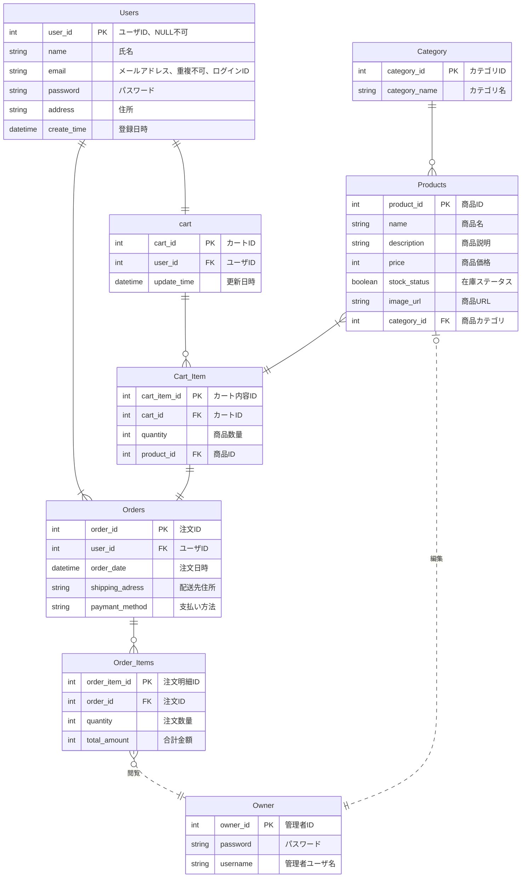

# ECサイト構築 基本設計書
 
| ドキュメントバージョン | 1.0                                    |
| :------------------- | :------------------------------------- |
| 作成日               | 2025年7月2日                           |
| 作成チーム           | neko(Dチーム)                               |
| 承認者               | 井上真美様                              |
| 更新履歴             | 2025/7/2: Ver.1.0 初版作成 (neko) |
 
---
 
## 1. はじめに
 
### 1.1. 本書の目的
本書は、株式会社〇〇より受託した「ECサイト構築プロジェクト」における基本設計の内容を定義するものである。本プロジェクトの要件定義書で定められた要件に基づき、システムの全体構成、主要機能、画面、データ構造、非機能要件への対応方針を明確化し、弊社が実施する詳細設計、実装、テスト工程のインプットとすることを目的とする。
 
### 1.2. プロジェクト概要
本プロジェクトは、株式会社〇〇が販売する商品をオンラインで一般顧客に販売可能とするECサイトを新規構築し、顧客の購買体験向上、販売機会の拡大、受注から出荷までの業務効率化を実現することを目的とする。スマートフォン、PCブラウザから商品検索、カート投入、注文、マイページでの購入履歴確認を可能とし、管理者が商品・注文・顧客情報を管理できる仕組みを提供する。
 
### 1.3. 前提知識
本書を読むにあたり、以下の知識を有していることを前提とする。
 
 - 本プロジェクトの要件定義書の内容
 
 - Webアプリケーション開発の基本的な知識（HTTP, HTML, CSS, JavaScript）
 
 - ECサイト運営における基本的な業務知識（商品管理、受注管理、在庫管理）
 
 - REST API の基本的な概念
 
 - Java および Spring Boot フレームワークの基本的な知識
 
- リレーショナルデータベースの基本的な知識
 

## 2. システム概要
 
### 2.1. システムの目的
 - オンラインでの商品販売において受注管理、在庫管理、顧客対応などの業務負荷を軽減するとともに、
購入ユーザーがWebブラウザから商品検索、購入を安全かつ簡便に行える環境を提供し、販売機会の拡大と管理業務の効率化を実現することを目的とする。
 
### 2.2. 対象ユーザー
- **一般顧客:** 商品を検索・購入する顧客
 
 - **管理者:** 商品情報、在庫情報、受注情報、顧客情報の管理を行う
 
### 2.3. システム構成図
 

 
 - クライアント: 購入ユーザーおよび管理者が利用するPC/スマートフォンのブラウザ（Chrome）
 
 - サーバー: クラウド環境に構築し、Web/APサーバーおよびDBサーバーで構成
 
 - メールサービス: 注文受付・出荷完了通知等の自動メール送信を実施
 
 - ネットワーク: インターネット経由でHTTPS通信を行う
 
### 2.4. 外部インターフェース概要
**メール送信サービス:**
 - メールサービスと連携し、注文受付通知、発送通知、パスワード再設定通知などの自動送信を行う。
 
**CSVファイル（オプション）:**
 - 商品情報の一括登録、在庫情報の一括更新等でCSVファイルのアップロード・取込機能を提供する場合がある。
 
 - （将来的に他システム（会計ソフト等）とのAPI連携が必要な場合は別途定義する）
 

## 3. 機能設計

### 3.1. 機能一覧

- **商品閲覧・検索機能（顧客向け）**
    - トップページ表示機能（特集・カテゴリなどの案内表示）
    - 商品一覧表示機能（カテゴリ別・登録順表示）
    - 商品詳細表示機能（画像、説明、価格、素材情報）
    - 商品カテゴリフィルタ機能
    - キーワード検索機能（部分一致対応）

- **会員機能**
    - 会員登録機能（氏名・住所・メールアドレス・パスワード登録）
    - マイページ機能（登録情報編集・購入履歴表示）
    - パスワード再発行機能（メール送信）

- **カート・注文機能**
    - カート追加機能（在庫チェック・セッション保持）
    - カート内容表示・編集機能（数量変更・削除対応）
    - 注文確認機能（支払方法の入力、確認表示）
    - 注文確定機能（注文情報登録、受付完了メール送信）
    - 注文受付メール送信機能（サーバーサイド処理）

- **ゲスト購入機能**
    - カート追加機能（在庫チェック・セッション保持）
    - カート内容表示・編集機能（数量変更・削除対応）
    - 注文確認機能（配送先・支払方法・メールアドレスの入力、確認表示）
    - 注文確定機能（注文情報登録、受付完了メール送信）
    - 注文受付メール送信機能（サーバーサイド処理）

- **管理者機能（バックオフィス）**
    - 商品管理機能（一覧表示・検索、登録・編集・削除、画像対応）
    - 注文管理機能（注文内容・日付・顧客の確認、発送状況確認）
    - 顧客管理機能（会員情報・履歴の検索・参照・編集）
    - 在庫ステータス管理機能（在庫あり／なしの更新）

- **ユーザー認証機能**
    - ログイン/ログアウト機能

- **管理者認証機能**
    - ログイン/ログアウト機能（/admin/loginのような専用URL）

- **セキュリティ・管理機能（バックオフィス）**
    - アクセス制限制御（一般ユーザー・管理者の機能分離）
    - URL直打ち制限

### 3.2. 機能構成図

graph TD
    A[ECサイト] --> B(商品閲覧・検索機能)
    A --> C(会員機能)
    A --> D(カート・注文機能)
    A --> E(ゲスト購入機能)
    A --> F(管理者機能)
    A --> G(ユーザー認証機能)
    A --> H(管理者認証機能)
    A --> I(セキュリティ・管理機能)

    subgraph B[商品閲覧・検索機能]
        B1[トップページ表示]
        B2[商品一覧表示]
        B3[商品詳細表示]
        B4[商品カテゴリフィルタ]
        B5[キーワード検索]
    end

    subgraph C[会員機能]
        C1[会員登録]
        C2[マイページ]
        C3[パスワード再発行]
    end

    subgraph D[カート・注文機能]
        D1[カート追加]
        D2[カート内容表示・編集]
        D3[注文確認・確定]
        D4[注文受付メール送信]
    end

    subgraph E[ゲスト購入機能]
        E1[カート追加・注文処理]
        E2[配送先・決済情報入力]
        E3[注文確認・確定]
        E4[注文受付メール送信]
    end

    subgraph F[管理者機能]
        F1[商品管理]
        F2[注文管理]
        F3[顧客管理]
        F4[在庫ステータス管理]
    end

    subgraph I[セキュリティ・管理機能]
        G1[アクセス制限制御]
        G2[URL直打ち制限]
    end

    B -- ゲスト利用 --> E
    B -- ログイン --> G
    G -- ログイン後 --> C
    G -- ログイン後 --> D
    H -- 管理者ログイン後 --> F

    style A fill:#f9f,stroke:#333,stroke-width:2px

### 3.3. 主要機能フロー

システムで行われる代表的な業務フローを示す。

#### 3.3.1. ゲスト購入フロー

 
sequenceDiagram
    顧客 ->> フロント: 商品一覧・詳細を閲覧
    顧客 ->> フロント: 商品をカートに追加
    フロント ->> サーバー: 在庫確認・カート情報保持
    サーバー ->> DB: 在庫情報取得
    DB -->> サーバー: 在庫OK
    サーバー -->> フロント: カート追加成功

    顧客 ->> フロント: 注文手続きへ進む
    フロント ->> 顧客: 住所・支払い方法を入力
    顧客 ->> フロント: 情報送信
    フロント ->> サーバー: 注文情報登録要求
    サーバー ->> DB: 注文情報・在庫数を登録/更新
    DB -->> サーバー: 登録成功
    サーバー -->> フロント: 注文完了画面表示
    サーバー ->> メール: 注文完了メール送信
    メール ->> 顧客: 注文完了メール受信

- ゲストユーザーは会員登録をせずに商品をカートに追加・注文できる。

- 注文時に配送先・支払い方法を入力し、購入手続きを完了させる。

- システムは注文情報を記録し、完了メールを送信する。

#### 3.3.2. 管理者の商品登録フロー

 
sequenceDiagram 
管理者 ->> 管理画面: 管理者画面にログイン
管理画面 ->> サーバー: 商品登録リクエスト（画像・説明・価格）
サーバー ->> DB: 商品情報登録
DB -->> サーバー: 登録完了
サーバー -->> 管理画面: 登録完了メッセージ表示

- 管理者は管理画面から商品を新規登録できる。

- 商品画像や説明、価格情報を含む情報がサーバーを経由してデータベースに登録される。

- 登録成功後、管理画面に完了メッセージが表示される。

## 4.1. 画面一覧

- **SC0001: ログイン画面**  
  - ユーザーID(メールアドレス)とパスワードを入力し、システムにログインするための画面。  
  - 未ログイン時は配送先入力画面へ遷移する場合がある。

- **SC0101: 商品一覧画面**  
  - 商品カテゴリ別に一覧表示する画面。検索バー、カテゴリフィルター、ページネーション機能を備える。  
  - 商品詳細画面やマイページ、会員登録画面などへの遷移起点となる。

- **SC0102: 商品詳細画面**  
  - 選択した商品の詳細情報（複数画像、説明、価格など）を表示する画面。  
  - 「カートに追加」操作が可能。

- **SC0201: カート画面**  
  - カートに追加された商品の一覧を表示し、数量変更や削除、合計金額の確認が可能。  
  - 「購入手続きへ進む」ボタンで注文確認画面へ遷移。

- **SC0301: 注文確認画面**  
  - 配送先情報や支払方法を入力し、注文内容を最終確認する画面。  
  - 「注文を確定する」操作により注文完了画面へ遷移。

- **SC0302: 注文完了画面**  
  - 注文番号と完了メッセージを表示する画面。  
  - ユーザーに注文完了のフィードバックを提供。

- **SC0401: 会員登録画面**  
  - 氏名・住所・ログイン情報などを登録する画面。  
  - 登録完了後、商品一覧画面またはマイページへ遷移。

- **SC0402: ログイン画面**  
  - メールアドレスとパスワードで認証する画面。  
  - 認証成功後、商品一覧画面またはマイページへ遷移。

- **SC0403: マイページ画面**  
  - 登録情報の編集や購入履歴の確認が可能な画面。  
  - 会員情報の更新や過去の注文内容の確認ができる。

## 4.2.画面遷移図（Mermaid）

以下は、ECサイトにおける主要画面の遷移図です。

G01[トップページ]
G02[商品一覧画面]
G03[商品詳細画面]
G04[カート画面]
G05[注文確認画面]
G06[注文完了画面]
G07[会員登録画面]
G08[ログイン画面]
G09[マイページ]
G10[検索結果画面]

### ユーザー画面遷移
[G01: トップページ]
　├─ G02: 商品一覧画面（カテゴリ選択）
　├─ G10: 検索結果画面（キーワード検索）
　├─ G08: ログイン画面
　└─ G07: 会員登録画面
 
[G02: 商品一覧画面]
　├─ G01: トップページ
　└─ G03: 商品詳細画面（商品クリック）
 
[G10: 検索結果画面]
　├─ G01: トップページ
　└─ G03: 商品詳細画面（商品クリック）
 
[G03: 商品詳細画面]
　├─ G01: トップページ
　└─ G04: カート画面（カートに追加）
 
[G04: カート画面]
　├─ G01: トップページ
　├─ G02: 商品一覧画面（買い物を続ける）
　└─ G05: 注文確認画面（購入手続きへ）
 
[G05: 注文確認画面]
　├─ G01: トップページ
　├─ G07: 会員登録画面（未登録ユーザー）
　├─ G08: ログイン画面（未ログインユーザー）
　└─ G06: 注文完了画面（注文確定）
 
[G06: 注文完了画面]
　└─ G01: トップページ

[G07: 会員登録画面]
　└─ G09: マイページ（登録完了後）
 
[G08: ログイン画面]
　└─ G09: マイページ（ログイン成功）
 
[G09: マイページ]
　├─ G05: 注文確認画面（購入履歴から再注文）
　└─ G01: トップページ
 

graph TD
    G01[トップページ] -->|カテゴリ選択| G02[商品一覧画面]
    G01 -->|キーワード検索| G10[検索結果画面]
    G01 -->|ログイン操作| G08[ログイン画面]
    G01 -->|新規登録| G07[会員登録画面]

    G02 -->|ホームに戻る| G01
    G02 -->|商品クリック| G03[商品詳細画面]

    G10 -->|ホームに戻る| G01
    G10 -->|商品クリック| G03

    G03 -->|ホームに戻る| G01
    G03 -->|カートに追加| G04[カート画面]

    G04 -->|ホームに戻る| G01
    G04 -->|買い物を続ける| G02
    G04 -->|購入手続きへ| G05[注文確認画面]

    G05 -->|ホームに戻る| G01
    G05 -->|未登録ユーザー| G07
    G05 -->|未ログインユーザー| G08
    G05 -->|注文確定| G06[注文完了画面]

    G06 -->|ホームに戻る| G01

    G08 -->|ログイン成功| G09[マイページ]

    G09 -->|再注文| G05
    G09 -->|ホームに戻る| G01

    G07 -->|登録完了| G09

### 管理者画面一覧

A01 管理者ログイン画面
A05 管理メニュー画面（管理トップ）
A02-01 商品一覧画面（管理）
A02-02 商品編集画面
A02-03 商品削除画面
A02-04 商品新規追加画面
A03-01 注文一覧画面
A03-02 注文詳細確認画面
A03-03 注文ステータス更新画面
A04-01 会員一覧画面
A04-02 会員詳細確認画面
A04-03 会員削除画面
A04-04 会員編集画面

### 管理者画面遷移
[A01: 管理者ログイン画面]
 └─ A05: 管理メニュー画面（ログイン成功）

[A05: 管理メニュー画面]
 ├─ A02-01: 商品一覧画面
 ├─ A02-04: 商品新規追加画面
 ├─ A03-01: 注文一覧画面
 ├─ A04-01: 会員一覧画面
 └─ A05: 管理メニュー画面（戻る）

[A02-01: 商品一覧画面]
 ├─ A02-02: 商品編集画面（商品選択 → 編集）
 ├─ A02-03: 商品削除画面（商品選択 → 削除確認）
 └─ A05: 管理メニュー画面（戻る）

[A02-02: 商品編集画面]
 └─ A02-01: 商品一覧画面（編集完了後戻る）

[A02-03: 商品削除画面]
 └─ A02-01: 商品一覧画面（削除完了後戻る）

[A02-04: 商品新規追加画面]
 └─ A02-01: 商品一覧画面（追加完了後戻る）

[A03-01: 注文一覧画面]
 ├─ A03-02: 注文詳細確認画面（注文選択 → 詳細）
 ├─ A03-03: 注文ステータス更新画面（注文選択 → ステータス更新）
 └─ A05: 管理メニュー画面（戻る）

[A03-02: 注文詳細確認画面]
 └─ A03-01: 注文一覧画面（戻る）

[A03-03: 注文ステータス更新画面]
 └─ A03-01: 注文一覧画面（更新完了後戻る）

[A04-01: 会員一覧画面]
 ├─ A04-02: 会員詳細確認画面（会員選択 → 詳細）
 ├─ A04-04: 会員編集画面（会員選択 → 編集）
 ├─ A04-03: 会員削除画面（会員選択 → 削除確認）
 └─ A05: 管理メニュー画面（戻る）

[A04-02: 会員詳細確認画面]
 └─ A04-01: 会員一覧画面（戻る）

[A04-03: 会員削除画面]
 └─ A04-01: 会員一覧画面（削除完了後戻る）

[A04-04: 会員編集画面]
 └─ A04-01: 会員一覧画面（編集完了後戻る）

　graph TD
    G01[トップページ] -->|カテゴリ選択| G02[商品一覧画面]
    G01 -->|キーワード検索| G10[検索結果画面]
    G01 -->|ログイン操作| G08[ログイン画面]
    G01 -->|新規登録| G07[会員登録画面]

    G02 -->|トップページに戻る| G01
    G02 -->|商品をクリック| G03[商品詳細画面]

    G10 -->|トップページに戻る| G01
    G10 -->|商品をクリック| G03

    G03 -->|トップページに戻る| G01
    G03 -->|カートに追加| G04[カート画面]

    G04 -->|トップページに戻る| G01
    G04 -->|買い物を続ける| G02
    G04 -->|購入手続きへ| G05[注文確認画面]

    G05 -->|トップページに戻る| G01
    G05 -->|未登録ユーザーの場合、会員登録へ| G07
    G05 -->|未ログインユーザーの場合、ログインへ| G08
    G05 -->|注文確定| G06[注文完了画面]

    G06 -->|トップページに戻る| G01

    G08 -->|ログイン成功| G09[マイページ]

    G09 -->|購入履歴から再注文| G05
    G09 -->|トップページに戻る| G01

    G07 -->|登録完了| G09

## 4.3. UI/UX基本方針

- **シンプルさ**: 初めて訪問した顧客でも直感的に操作できるよう、画面構成や操作手順はできる限りシンプルにする。不要な情報や操作を排除し、購入までの導線を明確にする。
- **一貫性**: ボタン配置、ラベル命名、エラーメッセージの表示形式などをシステム全体で統一する。ページ間でのデザインや操作感の統一により、顧客の混乱を防止する。
- **視認性**: 文字サイズや色使いに配慮し、情報が読みやすく、重要な情報が目立つようにする。商品写真が映えるよう、白を基調とした視認性の高いデザインを採用する。
- **効率性**: カート追加や注文確定など、頻繁に行う操作は少ないステップで完了できるようにする。
- **フィードバック**: 顧客の操作に対して、処理中であることや処理結果（成功、エラー）を明確に表示する。注文完了時には、メールを送信しフィードバックを行う。
- **レスポンシブ**: 主な利用はPCを想定し、UI設計を行う。モバイルでも快適に操作できるよう、画面サイズに応じたレイアウト調整を行う。

## 4.4. 主要画面のワイヤーフレーム

ここでは主要画面のワイヤーフレーム（骨組み）を簡易的に示す。最終的なUIデザイン（色味やフォント等）は別途デザインフェーズで検討・作成する。
 
### 4.4.1. 商品一覧画面ワイヤーフレーム

+--------------------------------------------------------------------------+
| ヘッダー（ロゴ、検索バー、カート、ログイン）                             |
+--------------------------------------------------------------------------+
| フィルターエリア                                                         |
|   カテゴリ: [ プルダウンリスト（カテゴリ選択） ]                         |
|   並び替え: [ プルダウンリスト（新着順など） ]                           |
+--------------------------------------------------------------------------+
| 商品カード一覧（3列グリッド）                                            |
| +----------------+  +----------------+  +----------------+               |
| | [画像]         |  | [画像]         |  | [画像]         |               |
| | 商品名         |  | 商品名         |  | 商品名         |               |
| | ￥価格         |  | ￥価格         |  | ￥価格         |               |
| | [詳細を見る]   |  | [詳細を見る]   |  | [詳細を見る]   |               |
| +----------------+  +----------------+  +----------------+               |
+--------------------------------------------------------------------------+
| フッター（ナビゲーション、著作権など）                                   |
+--------------------------------------------------------------------------+

 - **カテゴリフィルター**: カテゴリを選択して商品を絞り込み。
 - **並び替え**: 新着順や価格順などで並び替え。
 - **商品カード**: 画像、商品名、価格、詳細ボタンを表示。
 - **詳細ボタン**: 商品詳細画面へ遷移。

### 4.4.2. 商品詳細画面ワイヤーフレーム

+--------------------------------------------------------------------------+
| ヘッダー（ロゴ、検索バー、カート、ログイン）                             |
+--------------------------------------------------------------------------+
| 商品詳細エリア                                                           |
|   商品画像（スライダー）                                                 |
|   商品名                                                                 |
|   ￥価格                                                                 |
|   商品説明                                                               |
|   素材・サイズ情報                                                       |
|   数量: [ - ][1][ + ]                                                   |
|   [カートに入れる]                                                       |
+--------------------------------------------------------------------------+
| 関連商品一覧（オプション）                                              |
+--------------------------------------------------------------------------+
| フッター                                                                 |
+--------------------------------------------------------------------------+

 - **スライダー**:複数画像を切り替え表示。
 - **数量選択**: 購入数を指定。
 - **カートに入れる**: カート画面へ遷移。

### 4.4.3. カート画面ワイヤーフレーム

+--------------------------------------------------------------------------+
| ヘッダー（ロゴ、検索バー、カート、ログイン）                             |
+--------------------------------------------------------------------------+
| カート内容エリア                                                         |
| +----------------+----------------+--------+--------+--------+           |
| | 商品画像       | 商品名         | 単価   | 数量   | 小計   |           |
| +----------------+----------------+--------+--------+--------+           |
| | [画像]         | ペンA          | ￥500  | [ 2 ]  | ￥1000 |           |
| | [削除]         |                |        |        |        |           |
+--------------------------------------------------------------------------+
| 合計金額：￥xxxx                                                        |
| [購入手続きへ進む]                                                      |
+--------------------------------------------------------------------------+
| フッター                                                                 |
+--------------------------------------------------------------------------+

 - **数量変更・削除**:カート内商品の編集が可能。 
 - **合計金額表示**: 小計の合計を表示。
 - **購入手続きへ進む**: 注文確認画面へ遷移。

###　4.4.4. 注文確認画面ワイヤーフレーム

+--------------------------------------------------------------------------+
| ヘッダー                                                                 |
+--------------------------------------------------------------------------+
| 配送先情報入力エリア                                                    |
|   氏名：[__________]                                                    |
|   住所：[__________]                                                    |
|   電話番号：[__________]                                                |
|   支払方法：[〇〇▼]                                        |
+--------------------------------------------------------------------------+
| 注文内容確認エリア                                                      |
|   商品名   | 単価 | 数量 | 小計                                         |
|   ペンA    | ￥500| 2    | ￥1000                                       |
|   合計金額：￥1000                                                     |
+--------------------------------------------------------------------------+
| [注文を確定する]                                                        |
+--------------------------------------------------------------------------+
| フッター                                                                 |
+--------------------------------------------------------------------------+

 - **配送先情報**:ユーザーが入力。 
 - **注文内容確認**: カート内容の最終確認。
 - **注文確定ボタン**: 注文完了画面へ遷移。

### 4.5. 主要画面項目定義（例：商品一覧画面）

- **画面ID**: F02
- **画面名**: 商品一覧画面
- **表示項目・入力項目**:
    - **キーワード検索**
        - **要素**: テキスト入力ボックス
        - **入力形式**: 文字列（最大50文字）
        - **補足**: 商品名・説明文に対する部分一致検索を行う。
    - **カテゴリフィルター**
        - **要素**: プルダウンリスト
        - **選択肢**: カテゴリーマスタに登録された名称 + 「全カテゴリ」
        - **補足**: 選択カテゴリに属する商品のみ表示。「全カテゴリ」選択時は絞り込みなし。
    - **商品リストテーブル**
        - **列**: 商品画像, 商品名, 価格, 商品詳細リンク
        - **表示形式**: テーブル形式
        - **補足**: 登録日時の降順で表示。ページネーション対応。
    - **商品詳細リンク**
        - **要素**: リンク
        - **動作**: クリックで商品詳細画面（F03）へ遷移。

## 5. データ設計

### 5.1. 概念データモデル（ER図）

- **エンティティ**: USERS(ユーザー),  PRODUCTS(商品), CATEGORY(カテゴリー), CART(カート),CART_ITEMS(カート内商品),ORDERS(注文),ORDERS_ITEMS(注文商品),OWNER(管理者)
- **リレーション**:
    - ユーザーは一つのカートを持つ  (1対1、USERS -> CART)
    - 管理者としてログインしたものだけが商品編集を行う (1対多、OWNER -> PRODUCTS)
    - 商品はカテゴリに属する (1対多、PRODUCT -> CATEGORIES)

### 5.2. 主要テーブル概要
- **USERS (ユーザーテーブル)**
    - 会員登録したユーザーの情報を管理。
    - ユーザーID・パスワード、氏名・メールアドレス、住所などを保持。
    - パスワードはハッシュ化し保存。
- **PRODUCTS（商品マスタ）**
    - 商品情報（商品名、説明、価格、カテゴリ、画像など）を管理。
    - 商品につき複数の注文明細`ORDER_ITEMS`に紐づく。
- **CATEGORY（カテゴリマスタ）**
    - 商品を分類するためのカテゴリ情報。
    - 商品検索やフィルタリングに利用。
- **ORDERS（注文テーブル）**
    - ユーザーが購入した注文情報。
    - 誰が、いつ、どこへ、何を購入したかを記録。
    - 支払方法やステータス、合計金額も保持。
- **ORDER_ITEMS（注文明細テーブル）**
    - 注文の中に含まれる商品ごとの明細情報。
    - 商品ID・数量・単価・小計などを記録。
### 5.3. データフロー概要
1.  **画面（注文確認）**
    - ユーザーがカート画面から配送先・支払方法を確認し「注文確定」ボタンを押下。
2.  **アプリケーション（Backend）**
    - ユーザーのカート情報（セッション管理）を取得。
    - 合計金額を計算。
    - `ORDERS` テーブルに注文を登録。
    - `ORDER_ITEMS` テーブルに商品ごとの明細を登録。
3.  **データベース（DB）**
    - `ORDERS` に注文情報をINSERT。
    - `ORDER_ITEMS` に明細を一括INSERT。
    - 必要に応じて ADDRESSES にINSERT。
    - 注文完了メールをユーザーへ送信。
4.  **確認画面**
    - 注文完了画面に遷移。注文番号と完了メッセージを表示。

## 6. 非機能要件 対応方針

### 6.1. 性能

- **レスポンス速度**  
  各画面の表示は3秒以内を目標とする。商品一覧ページ（画像あり）でも5秒以内を厳守。

- **同時アクセス数**  
  同時接続ユーザー数は通常時で最大50人、セール・キャンペーン時には200人程度を想定。

- **データベース応答性**  
  一般的な検索・登録・更新処理は1秒以内で完了することを目指す。

- **バッチ処理・集計処理**  
  夜間バッチ（例：売上集計）は業務開始前（午前6時）までに終了するよう設計する。

---

### 6.2. セキュリティ

- **通信の暗号化**  
  全ページHTTPS対応。SSL証明書を導入し、通信をTLS1.2以上で暗号化。

- **パスワード管理**  
  パスワードはハッシュ化（bcryptを推奨）して保存。復号不可能な形式とする。

- **CSRF / XSS / SQLインジェクション対策**  
  - CSRFトークンを全フォームに付与  
  - 出力時のHTMLエスケープ処理を徹底  
  - SQLはプリペアドステートメントを利用

- **管理画面のアクセス制限**  
  IP制限、ID・パスワード認証の二重チェックを導入予定。

---

### 6.3. 可用性

- **稼働時間**  
  稼働率99.5%以上を目標とする。

- **バックアップ**  
  データベースは1日1回の自動バックアップを実施。リテンション期間は7日間。

- **障害対応**  
  アプリケーションおよびサーバの死活監視を導入（例：CloudWatch、UptimeRobot等）。  
  障害検知時にはメールおよびSlackに自動通知。

- **フェールオーバー**  
  AWSのマルチAZ構成を利用することで冗長化を実現。急なトラフィック増にも対応可能な構成とする。

---

### 6.4. その他（保守性、運用性、拡張性など）

#### 保守性

- ソースコードはGitHubでバージョン管理し、mainブランチは常に安定状態を保つ。
- コードはコメント・ドキュメント含めて可読性を重視した実装とする。

#### 運用性

- 管理画面から主要情報の登録・編集が可能（商品、カテゴリ、会員情報など）。
- 定期的なログローテーションと監視（例：CloudWatch Logs）。
- エラー発生時の通知フローを事前に整備。

#### 拡張性

- 今後の機能追加（決済機能、レビュー機能、クーポンなど）を見越し、疎結合な設計を採用。
- APIベースの設計を取り入れ、他システムとの連携も視野に入れる。
- 商品カテゴリ・属性の柔軟な追加を可能にするデータ設計。

## 7. 運用・保守設計の概要

### 7.1. ログ設計方針

- **ログの種類**
  - **アクセスログ**：ユーザーアクセス、ページ遷移などの記録（例：Nginx/Apacheログ）
  - **アプリケーションログ**：エラー、例外、重要な処理結果（例：ログイン成功/失敗、注文処理）
  - **管理操作ログ**：商品登録・削除、在庫更新、会員情報更新などの管理者操作を記録
  - **セキュリティログ**：認証失敗、IP制限違反、不正アクセスの試行記録

- **出力形式**
  - JSONフォーマットまたはテキスト形式（ログ解析ツールとの連携を考慮）

- **保存期間**
  - アプリケーションログ・アクセスログ：90日間保管（バックアップ含む）
  - 操作ログ：1年間保管（必要に応じて期間延長）

- **閲覧・出力方法**
  - 管理画面からダウンロードまたはクラウドログストレージ（例：AWS CloudWatch Logs）経由で確認可能にする予定

- **ログフォーマット**: タイムスタンプ、ログレベル、メッセージ、(可能な範囲で)関連するユーザーIDやリクエストIDなど、解析に必要な情報を含める。

---

### 7.2. 監視設計方針

- **監視対象**
  - Webアプリケーション：死活監視（HTTP 200応答）、レスポンス時間監視
  - インフラ（クラウドサーバ）：CPU、メモリ、ディスク使用率
  - データベース：接続数、クエリエラー、ストレージ容量
  - バックアップの実行成否
  - ログイン試行の異常増加（セキュリティ監視）

- **監視ツール**
  - AWS CloudWatch、または外部SaaS監視サービス（例：UptimeRobot、Datadog、Sentry等）を活用

- **通知方法**
  - 異常検知時にメール／Slack等に自動通知
  - 死活監視の失敗は5分以内にアラート通知

- **対応方針**
  - 監視アラートのレベル分け（Info / Warning / Critical）
  - 重大障害（Critical）については、即時対応・影響調査・復旧報告を実施

---

### 7.3. バックアップ・リカバリ方針

- **バックアップ対象**
  - データベース（商品、会員、注文情報）
  - 商品画像ファイル・管理画面データなどの静的アセット
  - ログファイル（アプリ、Web、セキュリティ）

- **実施頻度**
  - データベース：1日1回の自動バックアップ（フルバックアップ）
  - 静的ファイル：1日1回の差分バックアップ
  - 必要に応じてリアルタイムのスナップショット対応も検討

- **保管期間**
  - フルバックアップデータは7日間以上保持（クラウドストレージに保管）

- **復旧手順**
  - 障害発生時には最新のバックアップからデータを復旧
  - 業務影響を最小限にするため、リカバリ作業は2〜4時間以内に完了することを目標とする
  - データ復元後、整合性確認・テストを行い、システムの再公開を判断

- **検証体制**
  - 月1回のリカバリ手順確認・テストを実施（手動または自動）

## 8. 制約事項・前提条件

### 8.1. 使用技術スタック

本システムの開発にあたり、以下の技術を使用することを前提とする。

-   **言語**: Java
-   **フレームワーク**: Spring Boot
-   **データベース**: クラウド環境のマネージドサービスを利用
-   **フロントエンド**: HTML5, CSS3, JavaScript(ES6)
-   **Webサーバー**: AWS
-   **その他ライブラリ**: (必要に応じて協議の上、決定)

### 8.2. インフラ環境

-   **サーバーOS**: Windows10/11
-   **実行環境**: Google Chrome
-   **稼働場所**: AWS (EC2/RDSなどのマネージドサービスを想定)
-   **ネットワーク**: 公開インターネットを介したHTTPS接続（SSL証明書適用）。管理画面はログイン制限付き。

### 8.3. 開発・運用ルール

-   **バージョン管理**: Gitを使用し、プロジェクト標準のリポジトリで管理する。
-   **コーディング規約**: プロジェクト標準のコーディング規約を定め、必要に応じて静的解析ツールを導入する。
-   **テスト**: 単体テスト、結合テスト、システムテストを実施する。
-   **デプロイ**: デプロイ手順を確立する。
-   **商品情報の登録・更新**: 社内管理者が管理画面から実施。初期登録は一部支援。
-   **注文受付・確認**: 管理画面での確認と手動での発送準備。注文通知はメール受信。
-   **在庫表示**: 簡易的な「在庫あり／なし」表示とし、詳細な在庫数管理は行わない。更新は手動。
-   **ユーザー教育**: サイト運用開始前に、社内管理者（田中氏中心）向けに操作説明会を実施。

### 8.4. スコープ外

-   実際のAPI仕様の細部（例：RESTエンドポイントやリクエスト/レスポンスのJSON構造詳細）
-   単体テスト、結合テストの項目一覧やテストケース詳細
-   詳細な運用保守手順書、障害対応手順書
-   クレジットカード決済機能
-   レビュー投稿機能
-   複雑な在庫管理機能（詳細な在庫数管理、自動引き落としなど）
-   売上管理機能
-   問い合わせフォーム機能（運用体制整備後に検討）

### 8.5. その他前提条件

-   システムはWebアプリケーションとして開発し、主に公開インターネットを介して利用される。
-   クライアントのWebブラウザは、Google Chromeの最新安定版を対象とする。
-   スマートフォンからの閲覧・購入が円滑に行えるよう、レスポンシブデザインを採用する。
-   初期商品データ移行用のCSVファイルは、指定されたフォーマットで提供されるものとする。

---

### 9. （付録）用語集・略語リスト

(プロジェクト内で使用される専門用語や略語があれば定義します。)

-   **ECサイト**: Electronic Commerce Site (電子商取引サイト)
-   **AWS**: Amazon Web Services
-   **HTTPS**: Hypertext Transfer Protocol Secure
-   **SSL/TLS**: Secure Sockets Layer / Transport Layer Security (HTTPS通信で使用される暗号化プロトコル)
-   **UI**: User Interface
-   **UX**: User Experience
-   **CSV**: Comma Separated Values
-   **DB**: Database
-   **CSRF**: Cross-Site Request Forgery (クロスサイトリクエストフォージェリ)
-   **XSS**: Cross-Site Scripting (クロスサイトスクリプティング)
-   **SKU**: Stock Keeping Unit (最小管理単位)
-   **MoSCoW分析**: Must have, Should have, Could have, Won't have (要件の優先順位付け手法)

