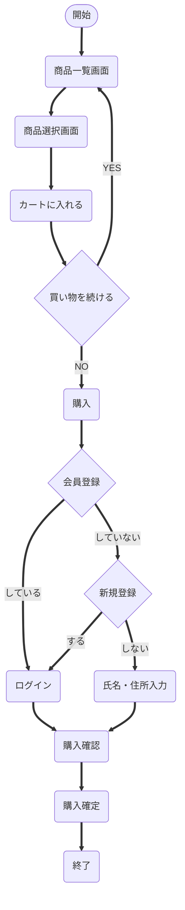

```mermaid
flowchart TB
  node_1(["開始"])
  node_2{"会員登録"}
  node_3("ログイン")
  node_4("購入確認")
  node_5("商品一覧画面")
  node_6("商品選択画面")
  node_7("カートに入れる")
  node_8{"買い物を続ける"}
  node_9("購入")
  node_10{"新規登録"}
  node_11("氏名・住所入力")
  node_12("購入確定")
  node_13("終了")
  node_2 =="している"==> node_3
  node_1 ==> node_5
  node_3 ==> node_4
  node_5 ==> node_6
  node_6 ==> node_7
  node_7 ==> node_8
  node_8 =="YES"==> node_5
  node_9 ==> node_2
  node_2 =="していない"==> node_10
  node_10 =="する"==> node_3
  node_10 =="しない"==> node_11
  node_11 ==> node_4
  node_4 ==> node_12
  node_12 ==> node_13
  node_8 =="NO"==> node_9
```

