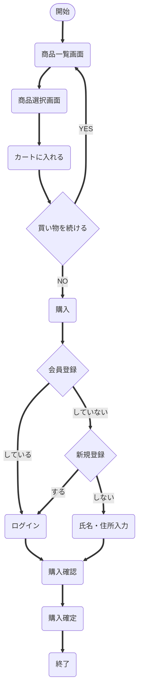

# ECサイト構築 要件定義書
 
- **ドキュメント名** ：ECサイト作成 要件定義書
 
- **作成日** ：2025年6月27日
 
- **作成者** ：Dチーム　neko
 
- **バージョン** ：1.0
 
## 1. 前提・背景（プロジェクト概要、ビジネス背景など）
 
### 1.1 プロジェクト概要
 
本プロジェクトは、株式会社〇〇における実店舗のみの販売体制から脱却し、新たにオンライン販売サイトを構築することを目的とする。主力商品であるデザインの凝った生活雑貨を、より広範な顧客層に届けるため、使いやすく視認性の高いECサイトを開発し、顧客の購入体験向上と販路の拡大を目指す。
 
### 1.2 ビジネス背景
 
現在、株式会社〇〇では、店舗での対面販売と個人SNSを通じた商品紹介が主な販売手段である。この運用では以下のような課題が顕在化している。
 
- **販売機会の喪失:** オンライン購入の導線がないため、SNSで興味を持った顧客がすぐに購入できず、販売機会を逃している。
 
- **対応の属人化:** 問い合わせ・注文への対応が個別のやり取りに依存しており、業務負担が大きく、業務効率が悪い。
 
- **顧客層の限定:** 実店舗の来店客に限定されるため、商品に関心のある他地域の潜在顧客にリーチできていない。
 
- **ブランド訴求力の不足:** 商品の魅力を十分に伝えられるWebサイトがなく、視覚的なブランドイメージが確立できていない。
 
これらの課題を解決するため、視認性に優れた商品表示、スマートフォン対応、カート機能などを備えたオンライン販売サイトの構築が急務となっている。サイトの開設により、販路拡大と顧客利便性の向上、将来的なEC売上の確立が期待される。
 
## 2. システム概要（システムの目的、対象ユーザー、利用環境）
 
### 2.1 システムの目的
 
本システムは、以下の目的を達成するために導入される。
 
- **販路の拡大:** 実店舗に来店できない顧客にもアクセスし、全国への販売を可能にすることで、顧客基盤の拡大を図る。
 
- **販売業務の効率化:** 個別対応に依存していた販売業務を、カート機能・注文機能のあるシステムへ移行し、効率化を実現する。
 
- **顧客の利便性向上:** スマートフォンにも対応した、直感的で使いやすいUIを提供し、購入までの導線をわかりやすく設計する。
 
### 2.2 対象ユーザー
 
本システムの主な利用者は以下の通り。
 
- **(1) 顧客（一般消費者）**
 
  - **役割:** 商品を閲覧し、カートに入れ、購入手続きを行う。
 
  - **利用シーン:** 通勤中のスマホからの買い物、自宅PCからの注文、SNSで見つけた商品への購入など。
 
- **(2) 管理者（株式会社○○の担当者、社員）**
 
  - **役割:** 商品の登録・在庫管理、注文管理、顧客情報の管理、問い合わせ対応、デザインやテキストの更新など。
 
  - **利用シーン:** 新商品の追加・写真掲載、受注確認と発送対応など。
 
### 2.3 利用環境
 
- **クライアント:**
 
  - 顧客：PC・スマートフォン・タブレット端末のWebブラウザ（Google Chrome、の最新バージョン）
 
　- 管理者：PC（Windows 10/11）＋Google Chromeを想定
 
- **サーバー:** クラウド環境（AWSを想定）
 
- **ネットワーク:**
 
　- 公開インターネットを介したHTTPS接続（SSL証明書適用）
 
　- 管理画面はログイン制限付きとする
 
## 3. 機能要件
### 3.1 商品表示
 
- **商品一覧画面**
 
  - 概要: 商カテゴリごとに商品を表示
 
  - 入力: カテゴリ選択
 
  - 出力: 商品サムネイル画像、商品名、価格、URL
 
- **商品詳細画面**
 
  - 概要: 商品個別ページで写真、説明、価格、仕様情報を表示
 
  - 入力: 商品ＩＤ
 
  - 出力: 画像、商品説明、価格、素材情報、カートボタン
 
  - 備考: 写真は複数枚対応
 
### 3.2 商品検索
 
- **商品カテゴリフィルタ**
 
  - 概要: 商品一覧をカテゴリごとに絞り込む
 
  - 入力: カテゴリ選択
 
  - 出力: 該当商品の一覧表示
 
  - 備考: カテゴリ分類はクライアント側で事前設定
 
- **キーワード検索**
 
  - 概要: 商品名・説明文から部分一致を検索
 
  - 入力: キーワード文字列
 
  - 出力: 該当商品の一覧表示
 
  - 備考: 検索結果ゼロ件時にメッセージ表示
 
### 3.3 カート管理
 
- **カート追加**
 
  - 概要: 商品詳細ページから商品をカートに入れる
 
  - 入力: 商品ＩＤ、数量
 
  - 出力: カートに追加完了メッセージ、カート内容更新
 
  - 備考: 同一商品を複数回追加した場合、数量を加算
 
- **カート編集**
 
  - 概要: カート内の商品数量変更や削除
 
  - 入力: 商品ID、数量変更値、削除指定
 
  - 出力: 更新後のカート内容、合計金額再計算
 
  - 備考: 数量をゼロにした場合は削除扱い 概要: 現在カートに入っている商品を一覧表示
 
- **カート確認**
 
  - 概要: 現在カートに入っている商品を一覧表示
 
  - 入力: セッション情報
 
  - 出力: 商品サムネイル、単価、数量、小計、合計金額
 
  - 備考: カートから直接数量変更・削除が可能
### 3.4 会員機能
 
- **会員登録:**
 
  - 概要: 会員登録をしてユーザの氏名・配送先・購入履歴を記憶
 
  - 入力: 氏名・配送先・登録ログインID・登録パスワード
 
  - 出力: 登録完了メッセージ
 
- **ログイン機能:**
 
  - 概要: ユーザがログインすることでマイページを表示
 
  - 入力: ログインID・パスワード
 
  - 出力: マイページ
 
 
- **マイページ機能:**
 
  - 概要: マイページで登録情報編集や購入履歴を確認
 
  - 入力: 更新する登録情報
 
  - 出力: 更新完了画面、購入履歴
 
## 4. 非機能要件
### 4.1 性能・拡張性
 
- **応答速度:**
 
  - 主要な画面（商品一覧・詳細、検索結果表示、カート表示、）の応答時間は、通常の利用状況において3秒以内を目標とする。
 
- **同時アクセス:**
 
  - 初期段階では最大100ユーザー程度の同時アクセスに耐えられる性能を確保し、今後のアクセス増加に備えるために拡張性のある構成とする。通常時は数十名程度の利用を想定。
 
- **データ量:**
 
  - 管理対象商品数は~100点程度と想定し、今後の点数増加に対応できるデータベース設計とする。
 
- **大量データ処理:**
 
  - 注文・アクセスレポート生成など、サーバーに負荷のかかる処理はバックグラウンドで実行し、ユーザーが他の操作を続けられるように非同期処理を検討する。処理中は進捗状況を表示する。顧客レポートに関しても、今後の会員登録機能追加に伴って対応できるようにする。
 
-  **機能拡張:**
 
  - 将来的に機能追加（決済機能、複雑な在庫管理機能、レビュー投稿機能）が行いやすいよう、モジュール化された設計とする。
 
- **データ項目追加:**
 
  - 商品の種類や管理項目が増えた場合に、比較的容易にデータベーススキーマや画面を変更できるよう考慮する。カテゴリマスタなどの柔軟な管理構造を採用する。
 
### 4.2 可用性・保守性
 
- **稼働時間:**
 
  - 原則として、24時間サイトを利用可能とする。目標稼働率は  99.9%（年8〜9時間以内の停止）以上とする。
 
- **メンテナンス:**
 
  - システムメンテナンスは、利用者影響の少ない深夜帯に実施する。緊急時には周知をすること。
 
- **バックアップ・リカバリ:**
 
  - データベースは最低1日1回、自動でバックアップを取得し、障害発生時には24時間以内に復旧（重大障害は2~4時間以内が理想）
 
  - 障害発生時には、バックアップデータを用いてシステムを復旧できる手順を確立する。バックアップデータは最低7日間以上保管する。
 
- **冗長化（検討事項）:**
 
  - サーバーやデータベースの冗長化（クラスタリング、クラウドのマルチAZ構成など）は、初期リリースでは必須としないが、将来的な安定稼働のために検討する。
 
- **保守性:**
 
  - コードの可読性を高め、標準的な技術やフレームワークを採用することで、将来の改修や保守作業を容易にする。
 
### 4.3 操作性（ユーザビリティ）
 
- **インターフェース:**
 
  - 直感的で分かりやすい画面デザインとし、初訪問ユーザーでも直感的に操作できる構成とする(参考サイトも参照)
 
  - 主要な操作（在庫検索、入出庫登録など）は、少ない手数で完了できるようにする。
 
  - 商品写真が映えるよう、白を基調とした視認性の高いデザインを採用する。
 
  - スマートフォンからの閲覧・購入が支障なく行えるよう、レスポンシブデザインを採用する。
 
- **入力支援:**
 
  - 必須入力項目を明確に示す。
 
- **エラーハンドリング:**
 
  - エラー発生時には、原因と対処方法をユーザーに分かりやすく表示する。
### 4.4 セキュリティ
 
- **通信の暗号化:**
 
  - クライアントとサーバー間のすべての通信はHTTPS（SSL/TLS）により暗号化し、個人情報や注文情報の漏洩を防止する。
 
- **脆弱性対策:**
 
  - SQLインジェクション、クロスサイトスクリプティング（XSS）・CSRF対策など、Webセキュリティの基本対策を実装する。
 
  - 使用するOS、ミドルウェア、ライブラリ等は、原則としてサポート期間内の安定バージョンを使用し、セキュリティパッチを適宜適用する。
 
- **アクセス制御:**
 
  - ユーザーロール（管理者、一般ユーザー）に基づき、利用可能な機能やデータアクセス範囲を制御する。
 
  - URL直接入力による不正アクセスを防止する。
 
- **データ保護:**
 
　-会員登録を導入する場合には、パスワードのハッシュ化保存、認証時のセキュリティ強化（例：ログイン試行制限）などを実装する。
 
  - 個人情報を含むデータの取り扱いについては、社内プライバシーポリシー及び関連法規を遵守する。
 
 
### 4.5 対応プラットフォーム
 
- **対応ブラウザ:**
 
  - 最新版のGoogle Chromeでの動作を保証する。
 
- **スマートフォン最適化対応:**
 
  - スマートフォンにおける表示・操作性を最重視し、モバイルファーストでUI設計を行う。
 
 
### 4.6　法令遵守
 
- **個人情報保護対応:**
 
  - 個人情報保護法に準拠し、プライバシーポリシーをサイト内に明示する。
 
- **法的表示:**
 
  -特定商取引法に基づく表記および利用規約ページを必ず設置する。
## 5. 制約事項（技術的制約、運用ルール、法規制 など）
 
### 5.1 技術的制約
 
- **開発言語・フレームワーク:** （開発ベンダーと協議の上、決定）
 
- **データベース:** （開発ベンダーと協議の上、決定。クラウド環境のマネージドサービス利用を推奨）
 
- **インフラ環境:** 原則としてクラウド環境（AWS）を利用する。
 
- **対応ブラウザ:** Google Chrome 最新版を公式サポート対象とする。Internet Explorerはサポート対象外。
 
- **認証連携:** Active Directory等との連携は、社内情報システム部門のポリシー及び技術仕様に従う。
 
### 5.2 運用ルール
 
- **商品情報の登録・更新:**  商品の写真、説明、価格などの情報は、社内担当者が管理画面から登録・更新を行う。初期登録時は、既存の資料をもとに弊社が一部支援する予定。
 
- **注文受付・確認:** オンライン注文が入った際は、管理画面上で注文内容を確認し、手動で発送準備を行う。注文通知はメールで受信する形式とする。
 
- **在庫表示:** 初期リリースでは簡易的な在庫表示（在庫あり／なし）にとどめ、在庫数の詳細管理は行わない。更新は手動で行う。
 
- **ユーザー教育:** サイト運用開始前に、商品登録・注文確認などの操作方法について、田中氏を中心とした社内担当者向けに操作説明会を実施する。
 
-
 
### 5.3 予算・期間
 
- **予算:** 開発および導入にかかる総予算の上限は ×××万円とする。
 
- **期間:** プロジェクト開始から 2ヶ月以内 のシステム稼働開始を目指す。
 
### 5.4 法規制・コンプライアンス
 
-   個人情報保護法、その他関連法規を遵守する。
 
-   ソフトウェアライセンスに関する規定を遵守する。
 
-   社内のセキュリティポリシー、情報管理規定を遵守する。
 
## 6. スコープと対象外事項
 
### 6.1 スコープ（開発対象範囲）
 
-   本要件定義書「3. 機能要件一覧」に記載された機能の開発・実装。
 
-   本要件定義書「4. 非機能要件」を満たすシステムの構築。
 
-   指定された利用環境での動作保証。
 
-   管理者および一般利用者向けのマニュアル作成。
 
-   受け入れテストの実施支援。
 
### 6.2 対象外事項（開発対象外範囲）
 
- **クレジットカード決済機能:** 決済代行サービスとの連携によるクレジットカード決済機能は、初期リリースでは対象外とする（将来的な導入を前提に検討を継続）。
 
- **レビュー機能:** ユーザーによる商品レビュー投稿・閲覧機能は、初期段階では実装対象外とする（運用体制やモデレーション方針の整備後に再検討）。
 
- **複雑な在庫管理機能:** 複数拠点・SKU単位でのリアルタイム在庫連携や自動補充ロジックなどの高度な在庫管理機能は、初期リリースでは対象外とする（簡易的な在庫表示や手動更新による対応を想定）。
 
- **売上管理機能:** 商品別・期間別の売上集計やCSV出力を含む売上管理機能は、初期リリースでは一切実装対象外とする。
## 7. 用語集や業務フロー
 
### 7.1 用語集
 
**ECサイト:** 電子商取引を行うWebサイト。商品をオンラインで販売するための仕組み。
- **カート機能:** 顧客が購入を検討している商品を一時的に保存する機能。
- **商品マスタ:** 商品の基本情報（名称、価格、説明、画像など）を管理するデータ。
- **カテゴリ:** 商品を分類するための区分（例：キッチン雑貨、文具など）。
- **商品詳細ページ:** 商品の写真、説明、価格などを表示する個別ページ。
- **会員登録:** 顧客が氏名・住所・ログイン情報などを登録する機能。
- **マイページ:** 会員が自身の情報や購入履歴を確認・編集できるページ。
- **レスポンシブデザイン:** 画面サイズに応じてレイアウトが最適化されるWebデザイン手法。
- **HTTPS:** Web通信を暗号化するプロトコル。
- **CSRF/XSS:** Webアプリケーションに対する代表的な脆弱性。
- **バックアップ:** システム障害時に備えてデータを定期的に保存する仕組み。
- **冗長化:** システムの停止を防ぐために、複数の構成要素を用意すること。
- **SKU:** 商品の最小管理単位。色・サイズなどのバリエーションを含む。
- **特定商取引法:** ECサイトにおける法的表示義務を定めた法律。
- **プライバシーポリシー:** 個人情報の取り扱いに関する方針を示す文書。
 
 
- **ユーザーフロー:**
  実際の購入フロー

 