# ECサイト構築プロジェクト詳細設計書（必須機能のみ）

※本バージョンは、基本設計の中から必須機能（商品閲覧、カート操作、非会員としての注文確定）の実装に絞った構成としている。

| ドキュメントバージョン | 1.0                                   |
| :------------------- | :------------------------------------ |
| 作成日               | 2025年7月8日                          |
| 作成チーム           | チームneko                            |
| 更新履歴             | 2025/7/8: Ver.1.0 初版作成 (チームneko) |

---

## 1. はじめに
### 1.1. 本書の目的
 - 本書は「ECサイト構築プロジェクト」の詳細設計書として、基本設計で定義した要件・方針に基づき、各機能の画面仕様、処理フロー、クラス・API仕様、DBアクセス仕様など具体的な実装に向けた詳細を定義することを目的とする。

### 1.2. 前提となる基本設計書
 - 本書は、以下の基本設計書の内容を前提としている。
   - ECサイト構築　基本設計書 Ver.1.0

### 1.3. 対象読者
- 本システムのバックエンド開発担当者
- 本システムのフロントエンド開発担当者
- 本システムのテスト担当者
- 本システムのレビュー担当者
- プロジェクト管理者

### 1.4. 参考文献
- ECサイト構築 基本設計書 Ver.1.0
- (チーム内で使用するコーディング規約などがあれば記載)

---

## 2. システム概要
 **システム構成（再掲）**


- **顧客**
顧客が操作するWebブラウザ。HTML, CSS, JavaScriptで構成されるフロントエンドアプリケーションが動作し、バックエンドAPIと通信する。
- **管理者**
 管理者が操作するPCのWebブラウザ。HTML, CSS, JavaScriptで構成される管理用フロントエンドアプリケーションが動作し、バックエンドAPIと通信する。
- **APIサーバー（Spring Boot）**
 バックエンドのAPIサーバー。ユーザー環境からのHTTPリクエストを受け取り、必要な処理を行いJSON形式でレスポンスを返す。
- **Controller**
 ユーザー環境（顧客・管理者）からのAPIリクエストを受け取り、リクエスト内容をServiceに渡す。またServiceからの結果を受け取り、ユーザー環境へレスポンスを返す役割を担う。
- **Service**
 Controllerから渡されたリクエスト情報に基づき、業務ロジックの実行やデータの加工処理を行う。必要に応じてRepositoryを介してデータベースへのアクセスを行う。
- **Repository**
 Serviceからの指示を受け、データベースへのアクセスを担当する層。SQLの実行を行い、取得・更新したデータをServiceへ返す役割を担う。
- **DBサーバー（データベース：H2/PostgreSQL**）
 RepositoryからのSQL実行要求を受け付け、データの取得・更新処理を行う。結果をRepositoryへ返す役割を担う。

---

## 3. 機能仕様

### 3.1. 機能一覧
- **商品閲覧・検索機能（顧客向け）** 

    - F01:トップページ表示機能（特集・カテゴリなどの案内表示） 
    - F02:商品一覧表示機能（カテゴリ別・価格順表示） 
    - F03:商品詳細表示機能（画像、説明、価格、素材情報） 
    - F04:商品カテゴリフィルタ機能 
    - F05:キーワード検索機能（部分一致対応） 

- **カート・注文機能** 

    - F06:カート追加機能（在庫チェック・セッション保持） 
    - F07:カート内容編集機能（数量変更・削除対応） 
    - F08:カート内容確認機能（カート商品一覧表示） 
    - F09:注文確認機能（支払方法、ゲストは住所・メールアドレスの入力、確認表示） 
    - F10:注文確定機能（注文情報登録、注文番号と完了メッセージを表示、サーバーサイドで受付完了メール送信） 
 
- **会員機能** 

    - F11:会員登録機能（氏名・住所・パスワード登録・メールアドレス） 
    - F12:ログイン機能（認証機能、ログインでマイページ表示、パスワード再発行） 
    - F13:マイページ機能（登録情報編集・購入履歴表示） 


- **管理者機能（バックオフィス、初回リリースは不要）** 

    - F14:商品管理機能（一覧表示・検索、登録・編集・削除、画像対応） 
    - F15:注文管理機能（注文内容・日付・顧客の確認、発送状況確認） 
    - F16:顧客管理機能（会員情報・履歴の検索・参照・編集） 
    - F17:在庫ステータス管理機能（在庫あり／なしの更新） 
    - F18:アクセス制限制御（一般ユーザー・管理者の機能分離） 

### 3.2. 機能詳細

#### 3.2.1. 商品一覧表示機能 (F02)
 
ユーザーが商品一覧ページにアクセスした際の処理フロー。
 
<div class="mermaid">
sequenceDiagram
    participant User as ユーザー (ブラウザ)
    participant FE as フロントエンド (JS)
    participant ProductController
    participant ProductService
    participant ProductRepository
    participant DB as データベース　　　
 
    User->>FE: 商品一覧ページへアクセス
    FE->>ProductController: GET /api/products
    ProductController->>ProductService: getAllProducts()
    ProductService->>ProductRepository: findAllproducts()
    ProductRepository->>DB: SELECT * FROM products
    DB-->>ProductRepository: 商品データリスト
    ProductRepository-->>ProductService: List<Product>
    ProductService->>ProductService: ProductエンティティからProductListItem DTOへ変換
    ProductService-->>ProductController: List<ProductListItem>
    ProductController-->>FE: 商品リスト (JSON)
    FE-->>User: 商品一覧画面を表示
</div>
 
**補足:**
 
- まずは全件取得・表示を目指す。ページネーションは本演習の範囲外。
 
#### 3.2.2. 商品詳細表示機能 (F03)
 
ユーザーが商品一覧から特定の商品を選択し、詳細ページを表示する際の処理フロー。
 
<div class="mermaid">
sequenceDiagram
    participant User as ユーザー (ブラウザ)
    participant FE as フロントエンド (JS)
    participant ProductController
    participant ProductService
    participant ProductRepository
    participant DB as データベース
 
    User->>FE: 商品一覧画面で特定の商品をクリック (商品ID)
    FE->>ProductController: GET /api/products/{productId}
    ProductController->>ProductService: getProductById(productId)
    ProductService->>ProductRepository: findProductById(productId)
    ProductRepository->>DB: SELECT * FROM products WHERE product_id = ?
    DB-->>ProductRepository: 商品データ (該当商品)
    ProductRepository-->>ProductService: Optional<Product>
    alt 商品が存在する場合
        ProductService->>ProductService: ProductエンティティからProductDetail DTOへ変換
        ProductService-->>ProductController: ProductDetail
        ProductController-->>FE: 商品詳細データ (JSON)
        FE-->>User: 商品詳細画面を表示
    else 商品が存在しない場合
        ProductService-->>ProductController: (エラー情報)
        ProductController-->>FE: 404 Not Found レスポンス
        FE-->>User: 商品が見つからない旨の表示
    end
</div>
 
#### 3.2.3. カート追加機能 (F04)
 
ユーザーが商品詳細ページで「カートに入れる」ボタンを押した際の処理フロー。カート情報はHTTPセッションで管理。
 
<div class="mermaid">
sequenceDiagram
    participant User as ユーザー (ブラウザ)
    participant FE as フロントエンド (JS)
    participant CartController
    participant CartService
    participant ProductRepository
    participant HttpSession as HTTPセッション
 
    User->>FE: 商品詳細画面で「カートに入れる」クリック (商品ID, 数量)
    FE->>CartController: POST /api/cart (リクエストボディ: { productId: ..., quantity: ... })
    CartController->>CartService: addItemToCart(productId, quantity, httpSession)
    CartService->>ProductRepository: findProductById(productId)  // 商品存在確認・価格取得
    ProductRepository-->>CartService: Optional<Product>
    alt 商品が存在する場合
        CartService->>HttpSession: getItem("cart") // 現在のカート情報をセッションから取得
        HttpSession-->>CartService: Cartオブジェクト (存在しない場合はnull)
        CartService->>CartService: カートオブジェクトに商品を追加/数量更新
        CartService->>HttpSession: addItem("cart", updatedCart) // 更新したカート情報をセッションに保存
        CartService-->>CartController: 更新後のカート情報 (Cart DTO)
        CartController-->>FE: カート追加成功レスポンス (JSON: 更新後のカート情報)
        FE-->>User: カート追加完了メッセージ表示 / カートアイコン更新
    else 商品が存在しない場合
        CartService-->>CartController: (商品が見つからないエラー情報)
        CartController-->>FE: 404 Not Found レスポンス
        FE-->>User: エラーメッセージ表示
    end
</div>
 
**補足:**
 
- カートオブジェクト (`Cart`) やカート内アイテム (`CartItem`) のクラス設計は「4. クラス設計」で定義。
- Spring Boot標準のHttpSession利用を基本とする。
 
#### 3.2.4. カート表示・編集機能 (F05)
 
ユーザーがカートの中身を確認、数量変更、削除する際の処理フロー。
 
**カート情報取得 (GET /api/cart)**
 
<div class="mermaid">
sequenceDiagram
    participant User as ユーザー (ブラウザ)
    participant FE as フロントエンド (JS)
    participant CartController
    participant CartService
    participant HttpSession as HTTPセッション
 
    User->>FE: カートアイコンクリックなどでカート画面へ遷移指示
    FE->>CartController: GET /api/cart
    CartController->>CartService: getCartfromSession(httpSession)
    CartService->>HttpSession: getItem("cart")
    HttpSession-->>CartService: Cartオブジェクト (or null、空カートオブジェクト)
    CartService->>CartService: カート情報からCart DTOへ変換
    CartService-->>CartController: Cart DTO (カート情報)
    CartController-->>FE: カート情報 (JSON)
    FE-->>User: カート画面を表示
</div>
 
**カート数量変更 (PUT /api/cart/items/{itemId})**
 
<div class="mermaid">
sequenceDiagram
    participant User as ユーザー (ブラウザ)
    participant FE as フロントエンド (JS)
    participant CartController
    participant CartService
    participant HttpSession as HTTPセッション
 
    User->>FE: カート画面で数量変更 (アイテムID, 新しい数量)
    FE->>CartController: PUT /api/cart/items/{itemId} (リクエストボディ: { quantity: ... })
    CartController->>CartService: updateItemQuantity(itemId, quantity, httpSession)
    CartService->>HttpSession: getItem("cart")
    HttpSession-->>CartService: Cartオブジェクト
    CartService->>CartService: 指定されたアイテムの数量を更新
    CartService->>HttpSession: updateQuantity("cart", updatedCart)
    CartService-->>CartController: 更新後のカート情報 (Cart DTO)
    CartController-->>FE: 更新成功レスポンス (JSON: 更新後のカート情報)
    FE-->>User: カート画面の表示更新
</div>
 
**カート商品削除 (DELETE /api/cart/items/{itemId})** (上記PUTと同様の流れ)
 
#### 3.2.5. 注文確定処理 (F08)
 
ユーザーが注文確認画面で「注文を確定する」ボタンを押した際の処理フロー。（非会員注文）
 
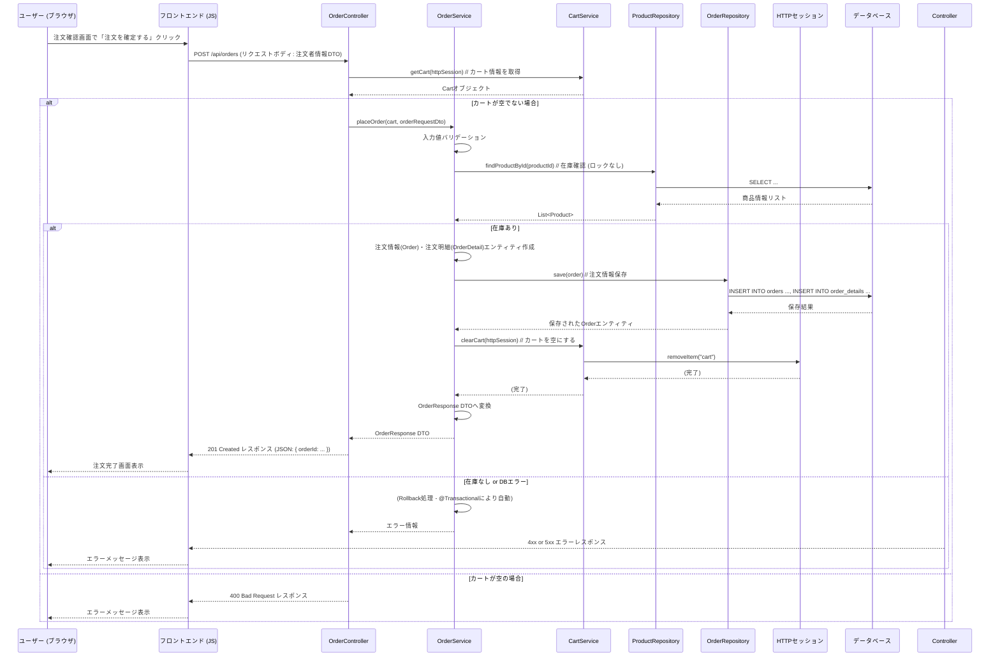
```mermaid
sequenceDiagram
    participant User as ユーザー (ブラウザ)
    participant FE as フロントエンド (JS)
    participant OrderController
    participant OrderService
    participant CartService
    participant ProductRepository
    participant OrderRepository
    participant HttpSession as HTTPセッション
    participant DB as データベース
 
    User->>FE: 注文確認画面で「注文を確定する」クリック
    FE->>OrderController: POST /api/orders (リクエストボディ: 注文者情報DTO)
    OrderController->>CartService: getCart(httpSession) // カート情報を取得
    CartService-->>OrderController: Cartオブジェクト
 
    alt カートが空でない場合
        OrderController->>OrderService: placeOrder(cart, orderRequestDto)
        OrderService->>OrderService: 入力値バリデーション
        OrderService->>ProductRepository: findProductById(productId) // 在庫確認 (ロックなし)
        ProductRepository->>DB: SELECT ...
        DB-->>ProductRepository: 商品情報リスト
        ProductRepository-->>OrderService: List<Product>
        alt 在庫あり
 
            OrderService->>OrderService: 注文情報(Order)・注文明細(OrderDetail)エンティティ作成
            OrderService->>OrderRepository: save(order) // 注文情報保存
            OrderRepository->>DB: INSERT INTO orders ..., INSERT INTO order_details ...
            DB-->>OrderRepository: 保存結果
            OrderRepository-->>OrderService: 保存されたOrderエンティティ
 
            OrderService->>CartService: clearCart(httpSession) // カートを空にする
            CartService->>HttpSession: removeItem("cart")
            HttpSession-->>CartService: (完了)
            CartService-->>OrderService: (完了)
 
            OrderService->>OrderService: OrderResponse DTOへ変換
            OrderService-->>OrderController: OrderResponse DTO
            OrderController-->>FE: 201 Created レスポンス (JSON: { orderId: ... })
            FE-->>User: 注文完了画面表示
        else 在庫なし or DBエラー
            OrderService->>OrderService: (Rollback処理 - @Transactionalにより自動)
            OrderService-->>OrderController: エラー情報
            Controller-->>FE: 4xx or 5xx エラーレスポンス
            FE-->>User: エラーメッセージ表示
        end
    else カートが空の場合
        OrderController-->>FE: 400 Bad Request レスポンス
        FE-->>User: エラーメッセージ表示
    end
```

#### 3.2.6. ログイン機能(F12)　　
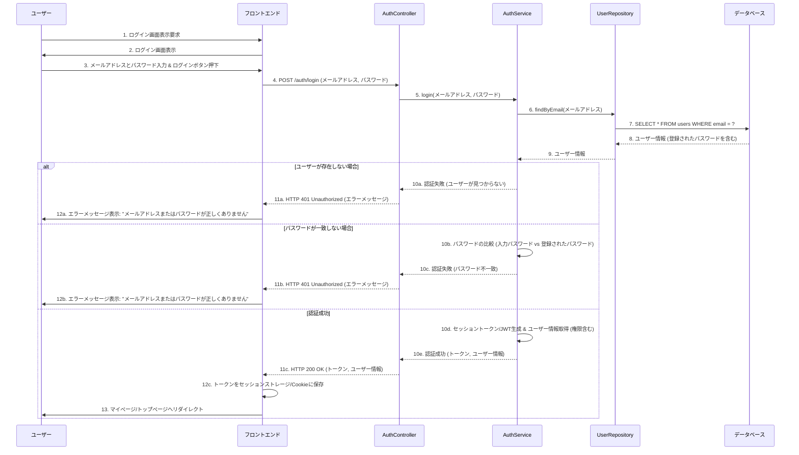
```mermaid
sequenceDiagram
    participant User as ユーザー
    participant FE as フロントエンド
    participant AuthC as AuthController
    participant AuthS as AuthService
    participant UserR as UserRepository
    participant DB as データベース
 
    User->>FE: 1. ログイン画面表示要求
    FE->>User: 2. ログイン画面表示
    User->>FE: 3. メールアドレスとパスワード入力 & ログインボタン押下
    FE->>AuthC: 4. POST /auth/login (メールアドレス, パスワード)
 
    AuthC->>AuthS: 5. login(メールアドレス, パスワード)
    AuthS->>UserR: 6. findByEmail(メールアドレス)
    UserR->>DB: 7. SELECT * FROM users WHERE email = ?
    DB-->>UserR: 8. ユーザー情報 (登録されたパスワードを含む)
    UserR-->>AuthS: 9. ユーザー情報
 
    alt ユーザーが存在しない場合
        AuthS-->>AuthC: 10a. 認証失敗 (ユーザーが見つからない)
        AuthC-->>FE: 11a. HTTP 401 Unauthorized (エラーメッセージ)
        FE->>User: 12a. エラーメッセージ表示: "メールアドレスまたはパスワードが正しくありません"
    else パスワードが一致しない場合
        AuthS->>AuthS: 10b. パスワードの比較 (入力パスワード vs 登録されたパスワード)
        AuthS-->>AuthC: 10c. 認証失敗 (パスワード不一致)
        AuthC-->>FE: 11b. HTTP 401 Unauthorized (エラーメッセージ)
        FE->>User: 12b. エラーメッセージ表示: "メールアドレスまたはパスワードが正しくありません"
    else 認証成功
        AuthS->>AuthS: 10d. セッショントークン/JWT生成 & ユーザー情報取得 (権限含む)
        AuthS-->>AuthC: 10e. 認証成功 (トークン, ユーザー情報)
        AuthC-->>FE: 11c. HTTP 200 OK (トークン, ユーザー情報)
        FE->>FE: 12c. トークンをセッションストレージ/Cookieに保存
        FE->>User: 13. マイページ/トップページへリダイレクト
    end
```
#### 3.2.7. 商品管理機能(F14)
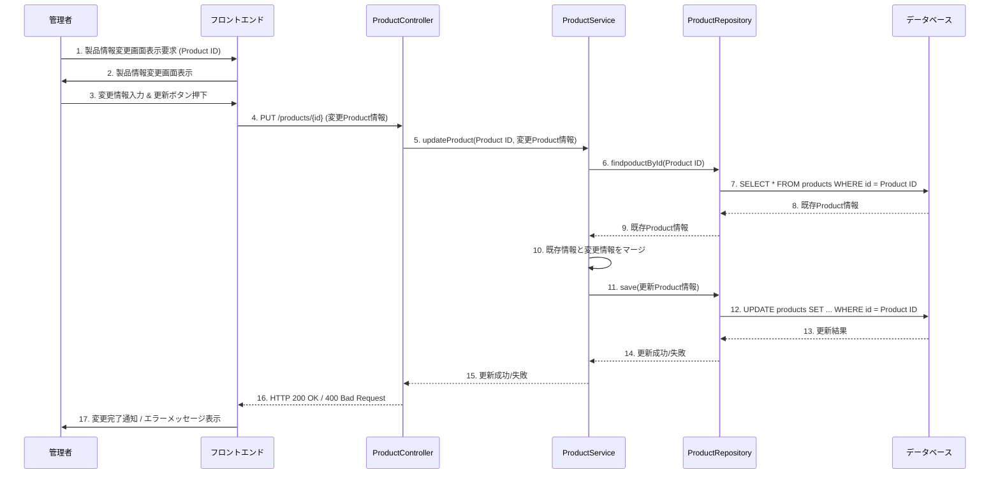
```mermaid
sequenceDiagram
    participant Admin as 管理者
    participant FE as フロントエンド
    participant PC as ProductController
    participant PS as ProductService
    participant PR as ProductRepository
    participant DB as データベース
 
    Admin->>FE: 1. 製品情報変更画面表示要求 (Product ID)
    FE->>Admin: 2. 製品情報変更画面表示
    Admin->>FE: 3. 変更情報入力 & 更新ボタン押下
    FE->>PC: 4.  PUT /products/{id} (変更Product情報)
    PC->>PS: 5. updateProduct(Product ID, 変更Product情報)
    PS->>PR: 6. findpoductById(Product ID)
    PR->>DB: 7. SELECT * FROM products WHERE id = Product ID
    DB-->>PR: 8. 既存Product情報
    PR-->>PS: 9. 既存Product情報
    PS->>PS: 10. 既存情報と変更情報をマージ
    PS->>PR: 11. save(更新Product情報)
    PR->>DB: 12. UPDATE products SET ... WHERE id = Product ID
    DB-->>PR: 13. 更新結果
    PR-->>PS: 14. 更新成功/失敗
    PS-->>PC: 15. 更新成功/失敗
    PC-->>FE: 16. HTTP 200 OK / 400 Bad Request
    FE->>Admin: 17. 変更完了通知 / エラーメッセージ表示
```
---

## 4. クラス設計
本章では、「ECサイト構築プロジェクト」バックエンド（Spring Boot）アプリケーションのクラス構造について定義する。主要なパッケージ構成、クラス図、主要クラスの説明、およびデータ転送オブジェクト（DTO）の定義を示す。


### 4.1. 主要パッケージ構成
ソースコードの整理と保守性向上のため、以下のパッケージ構成を採用する。
ルートパッケージは com.example.ecsite とする。

```
com.example.ecsite
├── EcSiteApplication.java    // Spring Boot起動クラス
│
├── controller                 // REST APIエンドポイント
│   ├── ProductController.java
│   ├── CartController.java
│   ├── OrderController.java
│   ├── AuthController.java          // 会員登録・ログイン
│   └── AdminController.java         // 管理者画面API
│
├── service                    // ビジネスロジック
│   ├── ProductService.java
│   ├── CartService.java
│   ├── OrderService.java
│   ├── AuthService.java
│   └── AdminService.java
│
├── repository                 // Spring Data JPAインターフェース
│   ├── ProductRepository.java
│   ├── OrderRepository.java
│   ├── OrderDetailRepository.java
│   ├── UserRepository.java
│   └── AdminRepository.java
│
├── entity                     // JPAエンティティ
│   ├── Product.java
│   ├── Order.java
│   ├── OrderDetail.java
│   ├── User.java
│   └── Admin.java
│
├── dto                        // DTO (API入出力・レイヤー間転送)
│   ├── product
│   │   ├── ProductListItem.java
│   │   └── ProductDetail.java
│   ├── cart
│   │   ├── Cart.java
│   │   └── CartItem.java
│   ├── order
│   │   ├── OrderRequest.java
│   │   ├── OrderResponse.java
│   │   └── CustomerInfo.java
│   └── auth
│       ├── LoginRequest.java
│       ├── RegisterRequest.java
│       └── AuthResponse.java
│
├── exception                  // グローバル例外処理
│   └── GlobalExceptionHandler.java
│
└── config
    └── SecurityConfig.java    // 認証・セキュリティ設定
```


### 4.2. クラス図

#### 4.2.1. 商品関連クラス図

<div class="mermaid">
classDiagram

%% =========================
%% 商品関連
%% =========================
class ProductController {
    +ProductService productService
    +getAllProducts()
    +getProductById()
}
class ProductService {
    +ProductRepository productRepository
    +findAllProducts()
    +findProductById()
}
class ProductRepository {
    <<interface>>
    +findAll()
    +findById()
}
class Product {
    <<Entity>>
    +productId: Integer
    +name: String
    +description: String
    +price: Integer
    +stock: Integer
    +imageUrl: String
}
class ProductListItem {
    <<DTO>>
    +productId: Integer
    +name: String
    +price: Integer
    +imageUrl: String
}
class ProductDetail {
    <<DTO>>
    +productId: Integer
    +name: String
    +price: Integer
    +description: String
    +stock: Integer
    +imageUrl: String
}

ProductController --> ProductService
ProductService --> ProductRepository
ProductRepository --> Product
ProductService ..> ProductListItem
ProductService ..> ProductDetail
</div>

#### 4.2.2. カート関連クラス図 (セッション管理)

<div class="mermaid">
classDiagram
    class CartController {
        +ResponseEntity~Cart~ getCart(HttpSession)
        +ResponseEntity~Cart~ addItem(CartItemInfo, HttpSession)
        +ResponseEntity~Cart~ updateItem(String itemId, CartItemQuantityDto, HttpSession)
        +ResponseEntity~Cart~ removeItem(String itemId, HttpSession)
    }

    class CartService {
        +Cart getCartFromSession(HttpSession)
        +Cart addItemToCart(Integer productId, Integer quantity, HttpSession)
        +Cart updateItemQuantity(String itemId, Integer quantity, HttpSession)
        +Cart removeItemFromCart(String itemId, HttpSession)
        +void clearCart(HttpSession)
    }

    class Cart {
        <<DTO/Session Object>>
        +Map~String, CartItem~ items
        +int totalQuantity
        +int totalPrice
        +void getItem(Product product, int quantity)
        +void addItem(Product product, int quantity)
        +void updateQuantity(String itemId, int quantity)
        +void removeItem(String itemId)
        +void calculateTotals()
    }

    class CartItem {
        <<DTO/Session Object>>
        +String id
        +Integer productId
        +String name
        +Integer price
        +String imageUrl
        +int quantity
        +int subtotal
    }

    class CartItemInfo {
        <<DTO>>
        +Integer productId
        +Integer quantity
    }

    class CartItemQuantityDto {
        <<DTO>>
        +Integer quantity
    }

    CartController --> CartService : uses
    CartService --> ProductRepository : uses
    CartService ..> Cart : manages
    Cart "1" *-- "*" CartItem : contains
    CartController ..> Cart : returns
    CartController ..> CartItemInfo : receives
    CartController ..> CartItemQuantityDto : receives
</div>

#### 4.2.3. 注文関連クラス図 (非会員注文)
<div class="mermaid">
classDiagram
    class OrderController {
    +OrderService orderService
    +placeOrder()
}
class OrderService {
    +OrderRepository orderRepository
    +OrderDetailRepository orderDetailRepository
    +ProductRepository productRepository
    +placeOrder()
}
class OrderRepository {
    <<interface>>
    +save()
}
class OrderDetailRepository {
    <<interface>>
    +saveAll()
}
class Order {
    <<Entity>>
    +orderId: Integer
    +orderDate: LocalDateTime
    +totalAmount: Integer
    +status: String
}
class OrderDetail {
    <<Entity>>
    +orderDetailId: Integer
    +product: Product
    +price: Integer
    +quantity: Integer
}
class OrderRequest {
    <<DTO>>
    +customerInfo: CustomerInfo
    +cartItems: List~CartItem~
}
class OrderResponse {
    <<DTO>>
    +orderId: Integer
    +orderDate: LocalDateTime
}
class CustomerInfo {
    <<DTO>>
    +name: String
    +address: String
    +phone: String
    +email: String
}

OrderController --> OrderService
OrderService --> OrderRepository
OrderService --> OrderDetailRepository
OrderService --> ProductRepository
Order --> OrderDetail
OrderDetail --> Product
OrderController ..> OrderRequest
OrderController ..> OrderResponse

</div>

#### 4.2.4. 認証（会員登録・ログイン）関連クラス図
<div class="mermaid">
classDiagram
    class AuthController {
        +ResponseEntity~AuthResponse~ login(LoginRequest)
        +ResponseEntity~AuthResponse~ register(RegisterRequest)
    }

    class AuthService {
        +AuthResponse registerUser(RegisterRequest): AuthResponse
        +AuthResponse loginUser(LoginRequest): AuthResponse
    }

    class UserRepository {
        <<interface>>
        +Optional~User~ findByEmail(String email)
        +boolean existsByEmail(String email)
        +User save(User user)
    }

    class User {
        <<Entity>>
        +String email "ユーザーID（ログインID）"
        +String name
        +String password
        +String address
    }

    class LoginRequest {
        <<DTO>>
        +String email
        +String password
    }

    class RegisterRequest {
        <<DTO>>
        +String name
        +String email
        +String password
        +String address
    }

    class AuthResponse {
        <<DTO>>
        +String userId "email"
        +String name
    }

    AuthController --> AuthService : uses
    AuthService --> UserRepository : uses
    UserRepository *-- User : manages
    AuthController ..> LoginRequest : receives
    AuthController ..> RegisterRequest : receives
    AuthController ..> AuthResponse : returns
</div>

### 4.3. 主要クラス説明
 - Controller:
   - ProductController, CartController, OrderController, AuthController を用意しREST APIエンドポイントを提供。
   - @RestController, @RequestMapping, @PostMapping, @GetMapping 等を使用。

 - Service:
   - ビジネスロジック（商品検索、カート管理、注文処理、認証管理）を集約。
   - @Service としてSpring管理対象とし、トランザクション管理は必要に応じて @Transactional で対応。

 - Repository:
   - JpaRepository を継承し、DBアクセスを抽象化。

 - Entity:
   - @Entity, @Id, @GeneratedValue, @Column でテーブルカラムにマッピング。
   - 商品、注文、注文詳細、ユーザー、管理者の5テーブルを想定。

- DTO:
  - レイヤー間・API入出力で使用。
  - 入力バリデーションは @Valid + DTO にアノテーション付与で対応予定。

#### 補足
**今後のAPI仕様書作成時:**
 - /api/products, /api/cart, /api/orders, /api/auth/register, /api/auth/login などのRESTエンドポイントを整理可能とする。

- ResponseEntity によりHTTPステータスコード・ヘッダ・ボディ返却を適切に管理。

**ログイン・認証管理:**
 - Spring Securityでセッション認証またはJWT化を検討（初期はセッションで開始可能）。

**管理者機能:**
 - 商品管理（CRUD）、在庫更新、注文ステータス更新を管理用APIで実装予定。

### 4.4.　Service層・Repository層主要クラス・メソッド定義
#### 4.4.1. ProductService
| 項目           | 内容                                 |
| ------------ | ---------------------------------- |
| クラス名         | `ProductService`                   |
| 役割           | 商品一覧・詳細取得のビジネスロジックを担当              |
| 関連Repository | `ProductRepository`                |
| 関連DTO        | `ProductListItem`, `ProductDetail` |

**主なメソッド**
| メソッド名                                | 引数   | 戻り値                     | 概要            |
| ------------------------------------ | ---- | ----------------------- | ------------- |
| `findAllProducts()`                  | なし   | `List<ProductListItem>` | 商品一覧を取得しDTO変換 |
| `findProductById(Integer productId)` | 商品ID | `ProductDetail`         | 商品詳細取得しDTO変換  |


#### 4.4.2.　CartService
| 項目           | 内容                   |
| ------------ | -------------------- |
| クラス名         | `CartService`        |
| 役割           | セッション管理によるカート管理機能を担当 |
| 関連Repository | `ProductRepository`  |
| 関連DTO        | `Cart`, `CartItem`   |

**主なメソッド**
| メソッド名                                                                  | 引数                | 戻り値    | 概要            |
| ---------------------------------------------------------------------- | ----------------- | ------ | ------------- |
| `getCart(HttpSession session)`                                         | セッション             | `Cart` | セッションからカートを取得 |
| `addItemToCart(Integer productId, int quantity, HttpSession session)`  | 商品ID, 数量, セッション   | `Cart` | カートへ商品を追加     |
| `updateItemQuantity(String itemId, int quantity, HttpSession session)` | カート内ID, 数量, セッション | `Cart` | カート内商品の数量変更   |
| `removeItemFromCart(String itemId, HttpSession session)`               | カート内ID, セッション     | `Cart` | カートから商品削除     |


#### 4.4.3. OrderService
| 項目           | 内容                                                              |
| ------------ | --------------------------------------------------------------- |
| クラス名         | `OrderService`                                                  |
| 役割           | 注文処理（非会員含む）、在庫更新、注文明細登録                                         |
| 関連Repository | `OrderRepository`, `OrderDetailRepository`, `ProductRepository` |
| 関連DTO        | `OrderRequest`, `OrderResponse`                                 |

**主なメソッド**
| メソッド名                                         | 引数           | 戻り値             | 概要             |
| --------------------------------------------- | ------------ | --------------- | -------------- |
| `placeOrder(Cart cart, OrderRequest request)` | カート, 注文リクエスト | `OrderResponse` | 注文確定、在庫更新、DB登録 |


#### 4.4.4. Repositoryインターフェース
##### 4.4.4.1. ProductRepository
```java
@Repository
public interface ProductRepository extends JpaRepository<Product, Integer> {

    List<Product> findAll();

    Optional<Product> findById(Integer productId);
}
```

##### 4.4.4.2. OrderRepository
```java
@Repository
public interface OrderRepository extends JpaRepository<Order, Integer> {

    Order save(Order order);
}
```

##### 4.4.4.3. OrderDetailRepository
```java
@Repository
public interface OrderDetailRepository extends JpaRepository<OrderDetail, Integer> {

    List<OrderDetail> saveAll(List<OrderDetail> orderDetails);
}
```
---

## 5. 画面詳細・UI

###　5.1. トップページ

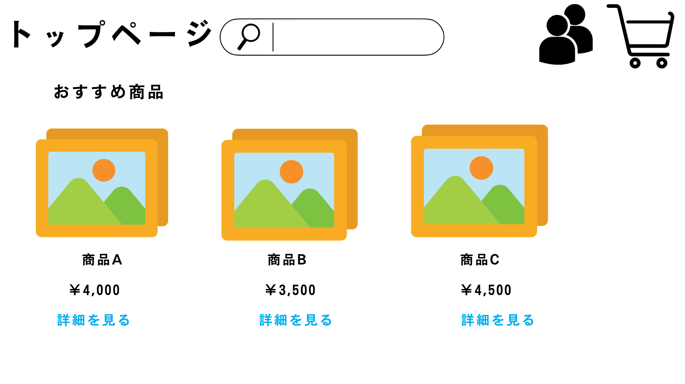


| ロゴ                | テキストまたは画像（例：「ShopLogo」）   | クリックでトップページに遷移する。ブランド認知やホームへの導線として機能。         |
|-------------------|---------------------------|-----------------------------------------------|
| 検索バー              | テキスト入力フォーム                | 商品名やキーワードを入力して検索。Enterキーまたは虫眼鏡アイコンで検索結果画面に遷移。 |
| カートアイコン           | アイコン（🛒など）                | クリックでカート画面に遷移。商品追加時に件数バッジが表示されることがある。         |
| 商品カード             | 画像、商品名、価格、詳細リンクを含むコンポーネント | 複数表示され、詳細リンクを押すと商品詳細画面に遷移。                    |
| ナビゲーションメニュー（カテゴリ） | リンク付きリスト（カテゴリ名）           | カテゴリ名をクリックすると該当カテゴリの商品一覧画面に遷移。                |
 
### 5.2. 商品一覧表示

---
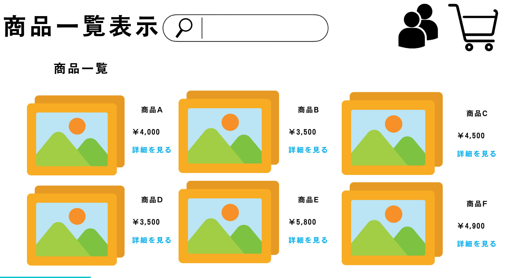

---
 
| 画面名        | 項目                     | 備考                      |
|------------|------------------------|-------------------------|
| F02 商品一覧表示 | 商品カード（画像、商品名、価格、詳細リンク） | 複数の商品を一覧表示。クリックで詳細画面へ遷移 |
| F02 商品一覧表示 | 絞り込みメニュー               | カテゴリや価格帯などで商品を絞り込む      |
| F02 商品一覧表示 | 並び替えメニュー               | 価格順や人気順などで並び替え          |
| F02 商品一覧表示 | ページネーション               | 複数ページの商品を切り替え表示         |
 
### 5.3.  商品詳細表示

---
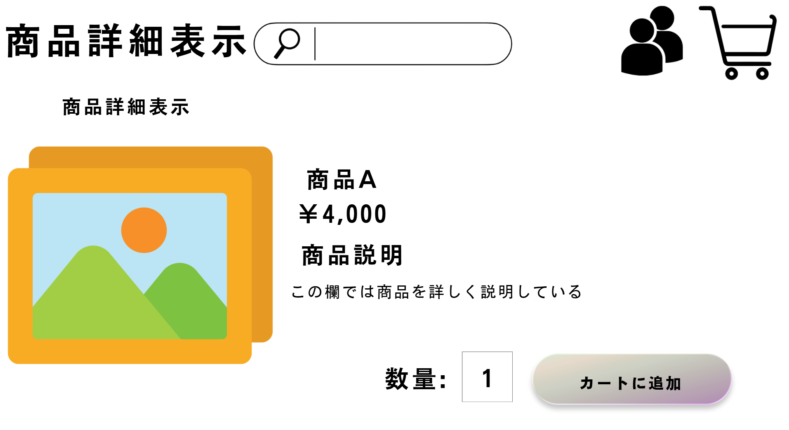

---
 
| 画面名        | 項目        | 備考             |
|------------|-----------|----------------|
| F03 商品詳細表示 | 商品画像      | 商品の写真を表示       |
| F03 商品詳細表示 | 商品名       | 商品タイトルを表示      |
| F03 商品詳細表示 | 商品説明      | 商品の詳細情報を表示     |
| F03 商品詳細表示 | 価格        | 商品の販売価格を表示     |
| F03 商品詳細表示 | 数量選択フォーム  | 購入する数量を指定      |
| F03 商品詳細表示 | カートに追加ボタン | クリックで商品をカートに追加 |
 
| 項目 | バリデーションルール      | エラーメッセージ                                  |
|----|-----------------|-------------------------------------------|
| 数量 | 必須、整数、1以上、在庫数以下 | 数量を入力してください／数量は1以上の整数で入力してください／在庫数を超えています |
 
 
### 5.4.  カート画面

---
 
  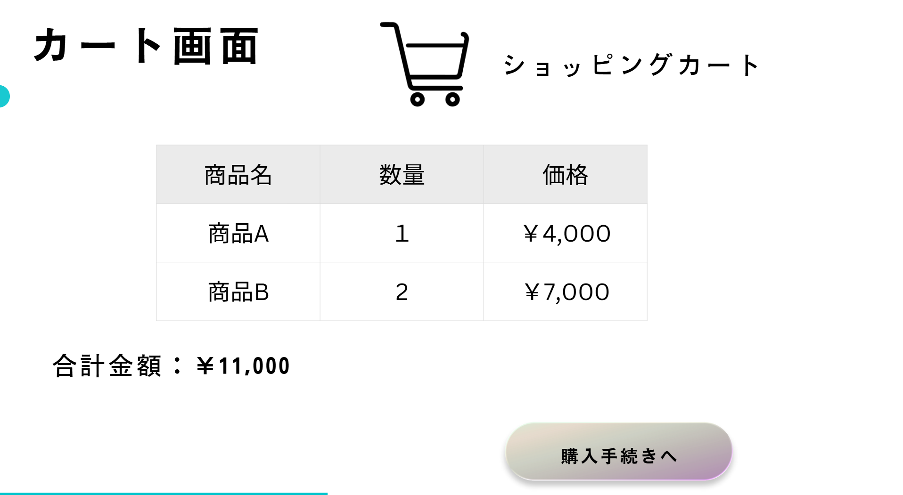

  ---
 
| 画面名            | 項目          | 備考                 |
|----------------|-------------|--------------------|
| F05 カート表示・編集機能 | 商品一覧（カート内）  | 商品名、価格、数量、削除ボタンを表示 |
| F05 カート表示・編集機能 | 数量変更フォーム    | カート内商品の数量を変更可能     |
| F05 カート表示・編集機能 | 合計金額表示      | カート内商品の合計金額を表示     |
| F05 カート表示・編集機能 | 購入手続きへ進むボタン | 注文情報入力画面へ遷移        |
 
| 項目 | バリデーションルール      | エラーメッセージ                                  |
|----|-----------------|-------------------------------------------|
| 数量 | 必須、整数、1以上、在庫数以下 | 数量を入力してください／数量は1以上の整数で入力してください／在庫数を超えています |
### 5.5.  注文画面

---


---
 
| 画面名               | 項目            | 備考                  |
|-------------------|---------------|---------------------|
| F06 注文情報入力機能（非会員） | 氏名入力フォーム      | 注文者の氏名を入力           |
| F06 注文情報入力機能（非会員） | メールアドレス入力フォーム | 注文者のメールアドレスを入力      |
| F06 注文情報入力機能（非会員） | 電話番号入力フォーム    | 注文者の電話番号を入力         |
| F06 注文情報入力機能（非会員） | 住所入力フォーム      | 配送先住所を入力            |
| F06 注文情報入力機能（非会員） | 支払い方法選択       | クレジットカードなどの支払い方法を選択 |
| F06 注文情報入力機能（非会員） | 確認画面へ進むボタン    | 注文内容確認画面へ遷移         |
 
| 項目      | バリデーションルール            | エラーメッセージ                                              |
|---------|-----------------------|-------------------------------------------------------|
| 氏名      | 必須、全角文字のみ、最大50文字      | 氏名を入力してください／氏名は全角文字で入力してください／氏名は50文字以内で入力してください       |  
| メールアドレス | 必須、メール形式（xxx@yyy.zzz） | メールアドレスを入力してください／メールアドレスの形式が正しくありません                  |  |
| 電話番号    | 必須、数字のみ、10〜11桁        | 電話番号を入力してください／電話番号は数字のみで入力してください／電話番号は10〜11桁で入力してください |  
| 住所      | 必須、最大100文字            | 住所を入力してください／住所は100文字以内で入力してください                       |  
| 支払い方法   | 必須、選択肢から選択            | 支払い方法を選択してください                                        
### 5.6. 注文確認画面

---
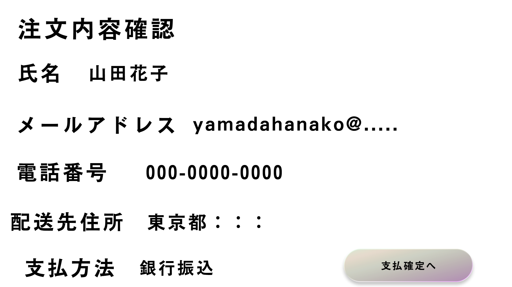

---
 
 
| 画面名               | 項目         | 備考                 |
|-------------------|------------|--------------------|
| F07 注文内容確認機能 | 注文者情報表示    | 氏名、メール、住所、支払い方法を表示 |
| F07 注文内容確認機能 | 注文商品一覧表示   | 商品名、数量、価格を表示       |
| F07 注文内容確認機能 | 合計金額表示     | 注文商品の合計金額を表示       |
| F07 注文内容確認機能| 注文を確定するボタン | 注文確定処理画面へ遷移        |
 
### 5.7. 注文完了画面

---
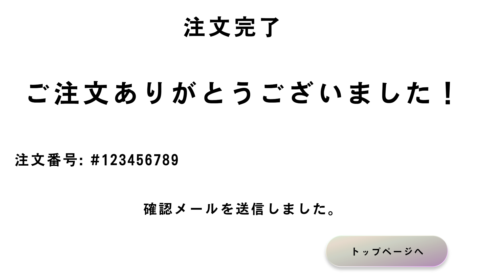

---
 
| 画面名             | 項目           | 備考         |
|-----------------|--------------|------------|
| F08 注文確定処理 | 注文完了メッセージ    | 注文完了の案内を表示 |
| F08 注文確定処理 | 注文番号表示       | 注文番号を表示    |
| F08 注文確定処理 | トップページへ戻るリンク | トップページへ遷移  |
 
 
### 5.8.　会員登録画面

---
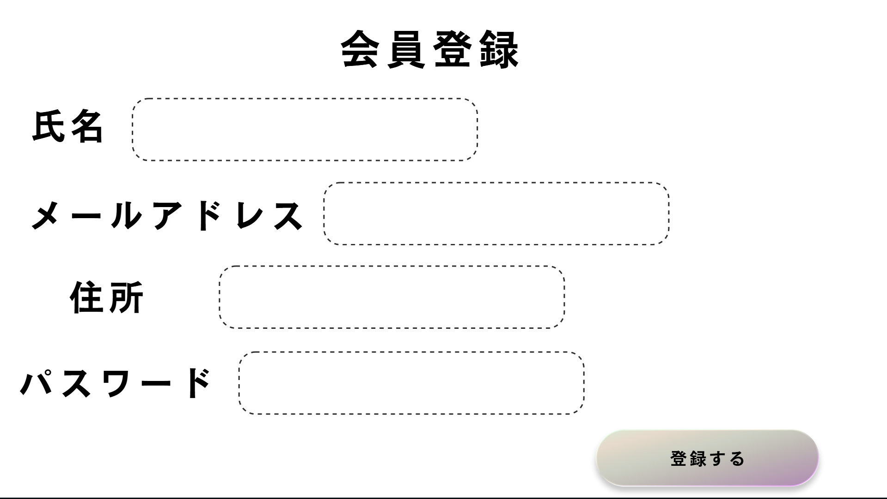

---
 
| 画面名        | 項目            | 備考             |
|------------|---------------|----------------|
| G07 会員登録画面 | 氏名入力フォーム      | 会員の氏名を入力       |
| G07 会員登録画面 | メールアドレス入力フォーム | 会員のメールアドレスを入力  |
| G07 会員登録画面 | 住所入力フォーム      | 会員の住所を入力       |
| G07 会員登録画面 | パスワード入力フォーム   | ログイン用のパスワードを設定 |
| G07 会員登録画面 | 登録するボタン       | マイページへ遷移       |


| 項目      | バリデーションルール            | エラーメッセージ                                              |  
|---------|-----------------------|-------------------------------------------------------|
| 氏名      | 必須、全角文字のみ、最大50文字         | 氏名を入力してください／氏名は全角文字で入力してください／氏名は50文字以内で入力してください           |
| メールアドレス | 必須、メール形式、重複不可            | メールアドレスを入力してください／メールアドレスの形式が正しくありません／このメールアドレスは既に登録されています |
| 住所      | 必須、最大100文字               | 住所を入力してください／住所は100文字以内で入力してください                           |
| パスワード   | 必須、半角英数字、8〜20文字、英字・数字を含む | パスワードを入力してください／パスワードは8〜20文字で入力してください／英字と数字を含めてください        |
### 5.9.　会員ログイン画面
---
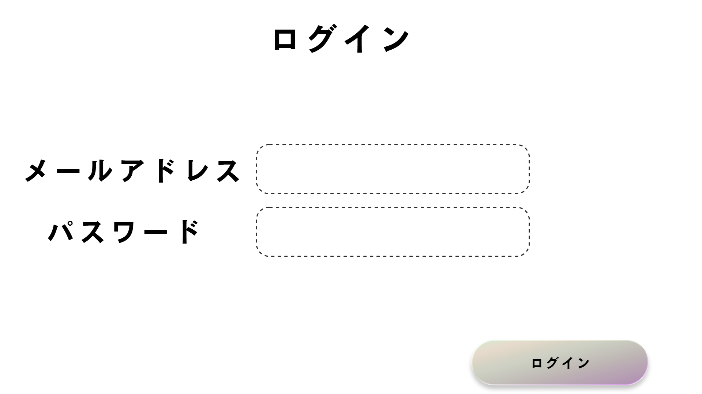

---

| 画面名        | 項目            | 備考              |
|------------|---------------|-----------------|
| G08 ログイン画面 | メールアドレス入力フォーム | 登録済みのメールアドレスを入力 |
| G08 ログイン画面 | パスワード入力フォーム   | 登録済みのパスワードを入力   |
| G08 ログイン画面 | ログインボタン       | マイページへ遷移        |

| 項目      | バリデーションルール            | エラーメッセージ                                              |  
|---------|-----------------------|-------------------------------------------------------|
| メールアドレス | 必須、メール形式  | メールアドレスを入力してください／メールアドレスの形式が正しくありません |
| パスワード   | 必須、8〜20文字 | パスワードを入力してください／パスワードは8〜20文字で入力してください |
### 5.10.　マイページ画面
 ---
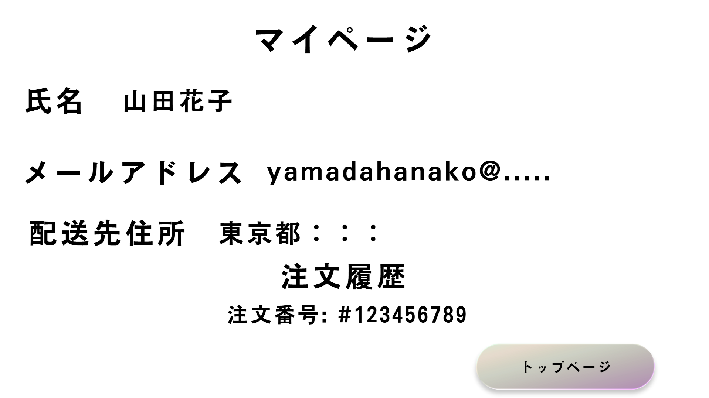

---
 
| 画面名       | 項目       | 備考              |
|-----------|----------|-----------------|
| G09 マイページ | 会員情報表示   | 氏名、メールアドレスなどを表示 |
| G09 マイページ | 注文履歴一覧   | 過去の注文履歴を表示      |
| G09 マイページ | ログアウトリンク | ログアウト処理を実行      |

### 5.11. 検索画面
---
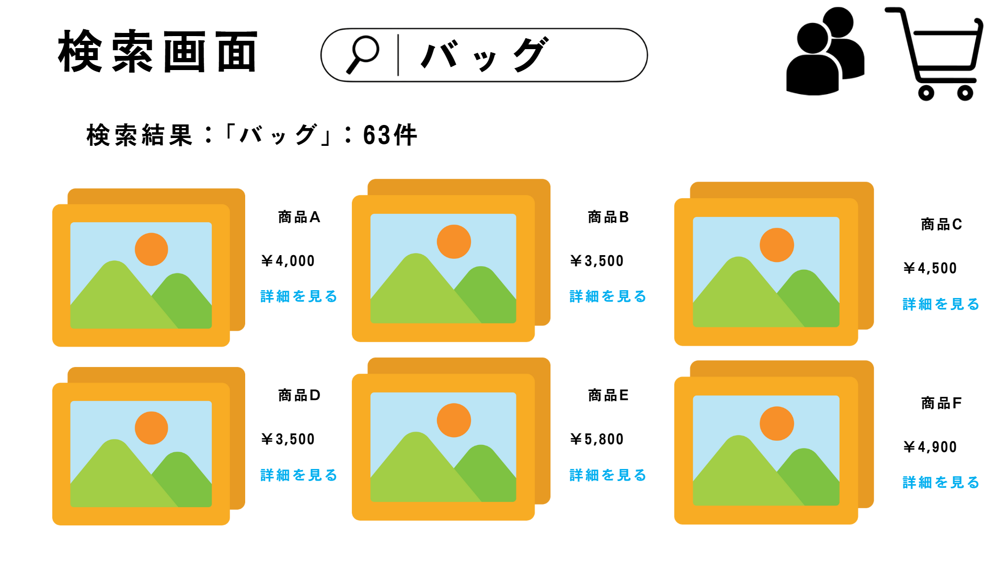

---
 
| 画面名        | 項目                     | 備考           |
|------------|------------------------|--------------|
| G10 検索結果画面 | 検索キーワード表示              | 検索したキーワードを表示 |
| G10 検索結果画面 | 商品カード（画像、商品名、価格、詳細リンク） | 検索結果の商品を一覧表示 |
| G10 検索結果画面 | ページネーション               | 検索結果のページ切り替え |
### 5.12. 管理者ログイン画面
---
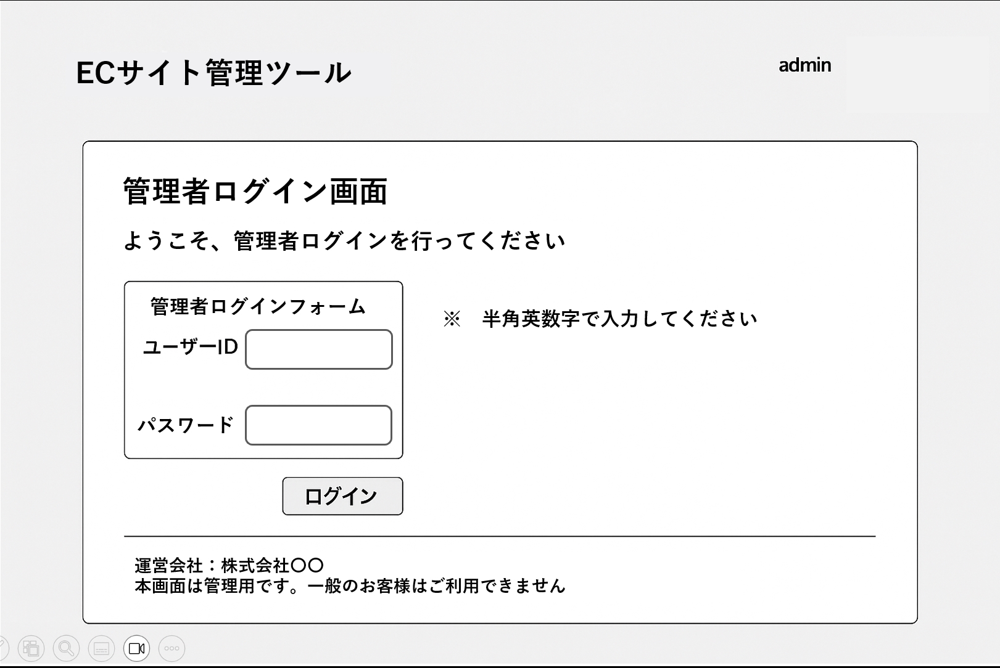

---

| 項目      | UI要素   | 備考                             |
|---------|--------|--------------------------------|
| ユーザーID  | テキスト入力 | 必須、形式チェックあり                    |
| パスワード   | テキスト入力 | 必須、入力した文字は＊で表示                 |
| ログインボタン | ボタン    | 入力が有効な場合のみ押下可能、成功時管理メニュートップに移動 |

| 項目      | バリデーションルール            | エラーメッセージ例                      |
|---------|-----------------------|--------------------------------|
| ユーザーID  | 必須・半角英数字のみ            | ユーザーIDを入力してください、半角英数字で入力してください |
| パスワード   | 必須・半角英数字のみ            | パスワードを入力してください、半角英数字で入力してください  |
| ログインボタン | 入力値すべてが有効なときのみ押下可能にする | ログインID、パスワードが間違っています           |

### 5.13. 管理メニュー画面（管理トップ）
---
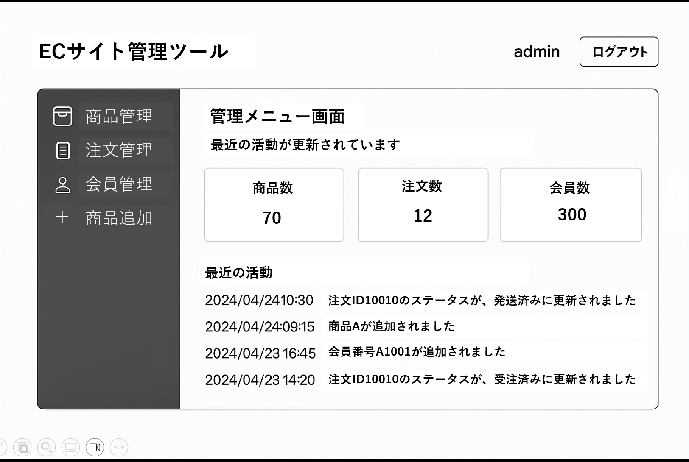

---

| 項目       | UI要素 | 備考        |
|----------|------|-----------|
| ログアウトボタン | ボタン  | ログイン画面に戻る |
| 商品管理ボタン  | ボタン  | 商品管理画面に移動 |
| 注文管理ボタン  | ボタン  | 注文管理画面に移動 |
|  会員管理ボタン | ボタン  | 会員管理画面に移動 |
| 商品追加ボタン  | ボタン  | 商品追加画面に移動 |

### 5.14. 商品一覧画面（管理）
---
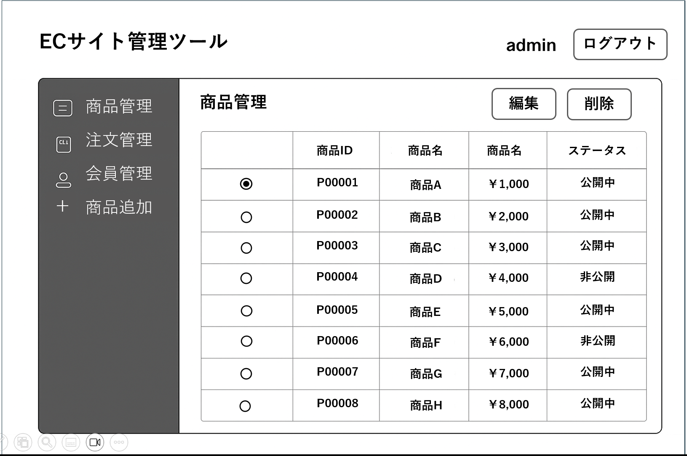

---

| 項目       | UI要素   | 備考                |
|----------|--------|-------------------|
| ログアウトボタン | ボタン    | ログイン画面に戻る         |
| 商品管理ボタン  | ボタン    | 商品管理画面に移動         |
| 注文管理ボタン  | ボタン    | 注文管理画面に移動         |
| 会員管理ボタン  | ボタン    | 会員管理画面に移動         |
| 商品追加ボタン  | ボタン    | 商品追加画面に移動         |
| 編集ボタン    | ボタン    | 選択されている商品の編集画面に移動 |
| 削除ボタン    | ボタン    | 選択されている商品の削除画面に移動 |
| 商品選択ボタン  | ラジオボタン | 相互排他的な選択可能        |

| 項目    | バリデーションルール                 | エラーメッセージ例         |
|-------|----------------------------|-------------------|
| 編集ボタン | 商品が未選択のまま押されたら、画面遷移をブロックする | 商品を選択してから操作してください |
| 削除ボタン | 商品が未選択のまま押されたら、画面遷移をブロックする | 商品を選択してから操作してください |

### 5.15. 商品編集画面
---
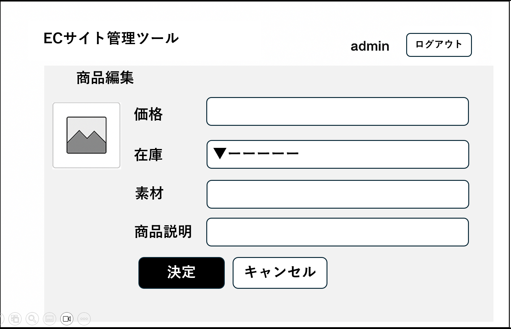

---

| 項目       | UI要素  | 備考                                 |
|----------|-------|------------------------------------|
| ログアウトボタン | ボタン   | ログイン画面に戻る                          |
| 写真追加     | ボタン   | ファイルを開き、PCから写真ファイルを追加              |
| 価格入力     | テキスト  | 必須、形式チェックあり                        |
| 在庫入力     | プルダウン | 必須、あり・なしの選択                        |
| 素材入力     | テキスト  | 必須、形式チェックあり                        |
| 商品説明入力   | テキスト  | 必須、形式チェックあり                        |
| 決定ボタン    | ボタン   | 入力が有効な場合のみ押下可能、成功時のみ商品管理メニュートップに移動 |
| キャンセルボタン | ボタン   | 商品管理メニューに移動                        |

| 項目       | バリデーションルール             | エラーメッセージ例                          |
|----------|------------------------|------------------------------------|
| 写真追加     | 画像形式チェック、最大ファイルサイズチェック | 画像ファイルはJPEG/PNG/GIF形式で2MB以内にしてください |
| 価格入力     | 必須、正の整数                | 価格を入力してください、有効な数値を入力してください         |
| 在庫入力     | 必須、プルダウンから選択           | 在庫情報を選択してください                      |
| 素材入力     | 必須、任意の文字               | 素材情報を入力してください                      |
| 商品説明入力   | 必須、任意の文字               | 商品説明を入力してください                      |
| 決定ボタン    | 入力値すべてが有効なときのみ押下可能にする  | 情報を入力してください                        |
| キャンセルボタン | 押下時に確認ダイアログ表示（任意）      | ー                                  |

### 5.16. 商品削除画面

---
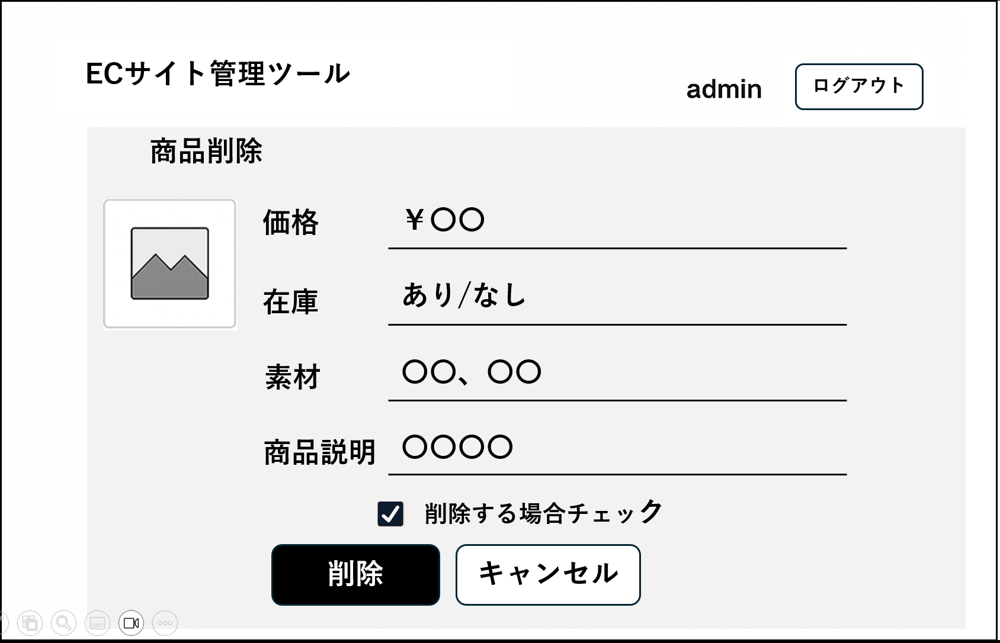

---

| 項目         | UI要素     | 備考                                  |
|------------|----------|-------------------------------------|
| ログアウトボタン   | ボタン      | ログイン画面に戻る                           |
| 削除前チェックボタン | チェックボックス | 削除前の確認                              |
| 削除ボタン      | ボタン      | チェックされている場合のみ有効、成功時のみ商品管理メニュートップに移動 |
| キャンセルボタン   | ボタン      | 商品管理メニューに移動                         |

| 項目       | バリデーションルール            | エラーメッセージ例         |
|----------|-----------------------|-------------------|
| 削除ボタン    | 入力値すべてが有効なときのみ押下可能にする | チェックボックスを入力してください |
| キャンセルボタン | 押下時に確認ダイアログ表示（任意）     | ー                 |

### 5.17. 商品新規追加画面
---
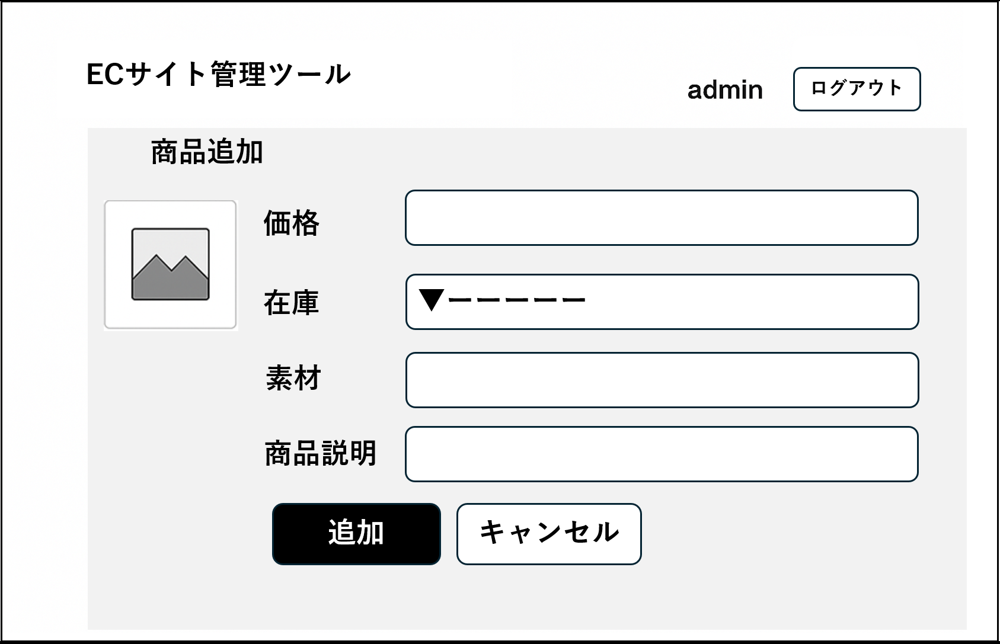

---

| 項目       | UI要素  | 備考                                 |
|----------|-------|------------------------------------|
| ログアウトボタン | ボタン   | ログイン画面に戻る                          |
| 写真追加     | ボタン   | ファイルを開き、PCから写真ファイルを追加              |
| 価格入力     | テキスト  | 必須、形式チェックあり                        |
| 在庫入力     | プルダウン | 必須、あり・なしの選択                        |
| 素材入力     | テキスト  | 必須、形式チェックあり                        |
| 商品説明入力   | テキスト  | 必須、形式チェックあり                        |
| 追加ボタン    | ボタン   | 入力が有効な場合のみ押下可能、成功時のみ商品管理メニュートップに移動 |
| キャンセルボタン | ボタン   | 商品管理メニューに移動                        |

| 項目       | バリデーションルール             | エラーメッセージ例                          |
|----------|------------------------|------------------------------------|
| 写真追加     | 画像形式チェック、最大ファイルサイズチェック | 画像ファイルはJPEG/PNG/GIF形式で2MB以内にしてください |
| 価格入力     | 必須、正の整数                | 価格を入力してください、有効な数値を入力してください         |
| 在庫入力     | 必須、プルダウンから選択           | 在庫情報を選択してください                      |
| 素材入力     | 必須、任意の文字               | 素材情報を入力してください                      |
| 商品説明入力   | 必須、任意の文字               | 商品説明を入力してください                      |
| 追加ボタン    | 入力値すべてが有効なときのみ押下可能にする  | 情報を入力してください                        |
| キャンセルボタン | 押下時に確認ダイアログ表示（任意）      | ー                                  |

### 5.18. 注文一覧画面
---
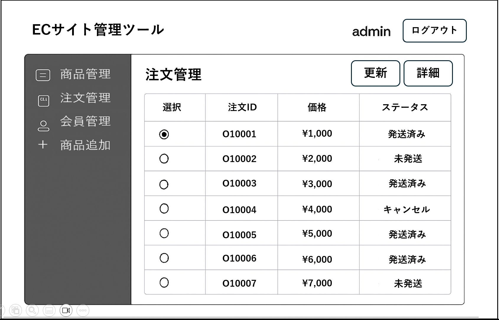

---

項目	UI要素	備考
| 項目       | UI要素   | 備考                |
|----------|--------|-------------------|
| ログアウトボタン | ボタン    | ログイン画面に戻る         |
| 商品管理ボタン  | ボタン    | 商品管理画面に移動         |
| 注文管理ボタン  | ボタン    | 注文管理画面に移動         |
| 会員管理ボタン  | ボタン    | 会員管理画面に移動         |
| 更新ボタン    | ボタン    | 選択されている注文の更新画面に移動 |
| 詳細ボタン    | ボタン    | 選択されている商品の詳細画面に移動 |
| 注文選択ボタン  | ラジオボタン | 相互排他的な選択可能        |

| 項目    | バリデーションルール                 | エラーメッセージ例         |
|-------|----------------------------|-------------------|
| 更新ボタン | 注文が未選択のまま押されたら、画面遷移をブロックする | 注文を選択してから操作してください |
| 詳細ボタン | 注文が未選択のまま押されたら、画面遷移をブロックする | 注文を選択してから操作してください |

### 5.19. 注文詳細確認画面
---
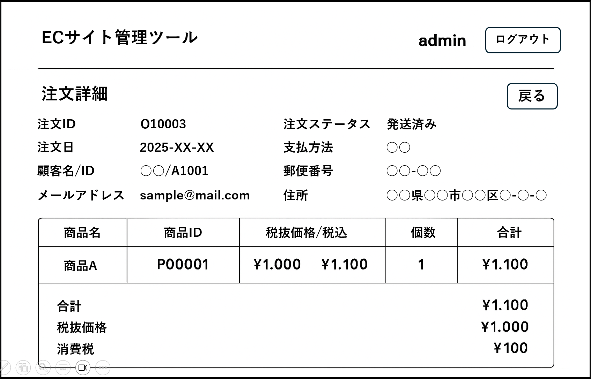

---

| 項目       | UI要素 | 備考        |
|----------|------|-----------|
| ログアウトボタン | ボタン  | ログイン画面に戻る |
| 戻る       | ボタン  | 注文管理画面に移動 |

### 5.20 注文ステータス更新画面
---
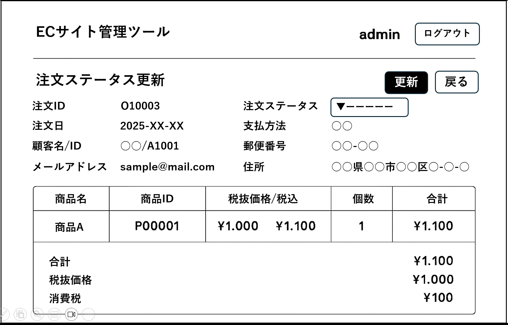

---

| 項目       | UI要素  | 備考                |
|----------|-------|-------------------|
| ログアウトボタン | ボタン   | ログイン画面に戻る         |
| 戻る       | ボタン   | 注文管理画面に移動         |
| 注文ステータス  | プルダウン | 発送済み・未発送などの選択     |
| 更新ボタン    | ボタン   | 選択されている注文の更新画面に移動 |

| 項目      | バリデーションルール                    | エラーメッセージ例            |
|---------|-------------------------------|----------------------|
| 注文ステータス | 必須、プルダウンから選択                  | 注文ステータス情報を選択してください   |
| 更新ボタン   | ステータスが未選択のまま押されたら、画面遷移をブロックする | ステータスを選択してから操作してください |

### 5.21 会員一覧画面
---
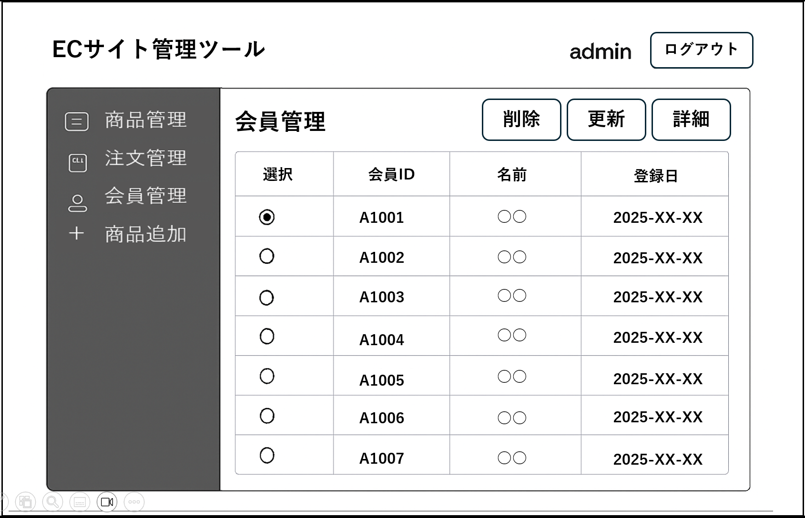

---

| 項目       | UI要素   | 備考                |
|----------|--------|-------------------|
| ログアウトボタン | ボタン    | ログイン画面に戻る         |
| 商品管理ボタン  | ボタン    | 商品管理画面に移動         |
| 注文管理ボタン  | ボタン    | 注文管理画面に移動         |
| 会員管理ボタン  | ボタン    | 会員管理画面に移動         |
| 削除ボタン    | ボタン    | 選択されている注文の削除画面に移動 |
| 更新ボタン    | ボタン    | 選択されている商品の更新画面に移動 |
| 詳細ボタン    | ボタン    | 選択されている商品の詳細画面に移動 |
| 会員選択ボタン  | ラジオボタン | 相互排他的な選択可能        |

| 項目    | バリデーションルール                 | エラーメッセージ例         |
|-------|----------------------------|-------------------|
| 削除ボタン | 会員が未選択のまま押されたら、画面遷移をブロックする | 会員を選択してから操作してください |
| 更新ボタン | 会員が未選択のまま押されたら、画面遷移をブロックする | 会員を選択してから操作してください |
| 詳細ボタン | 会員が未選択のまま押されたら、画面遷移をブロックする | 会員を選択してから操作してください |

### 5.22. 会員詳細確認画面
---
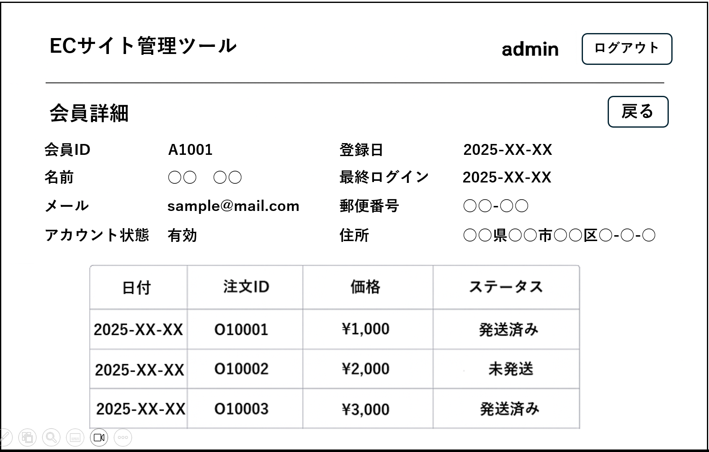

---
| 項目       | UI要素 | 備考        |
|----------|------|-----------|
| ログアウトボタン | ボタン  | ログイン画面に戻る |
| 戻るボタン    | ボタン  | 会員管理画面に戻る |

### 5.23. 会員削除画面
---
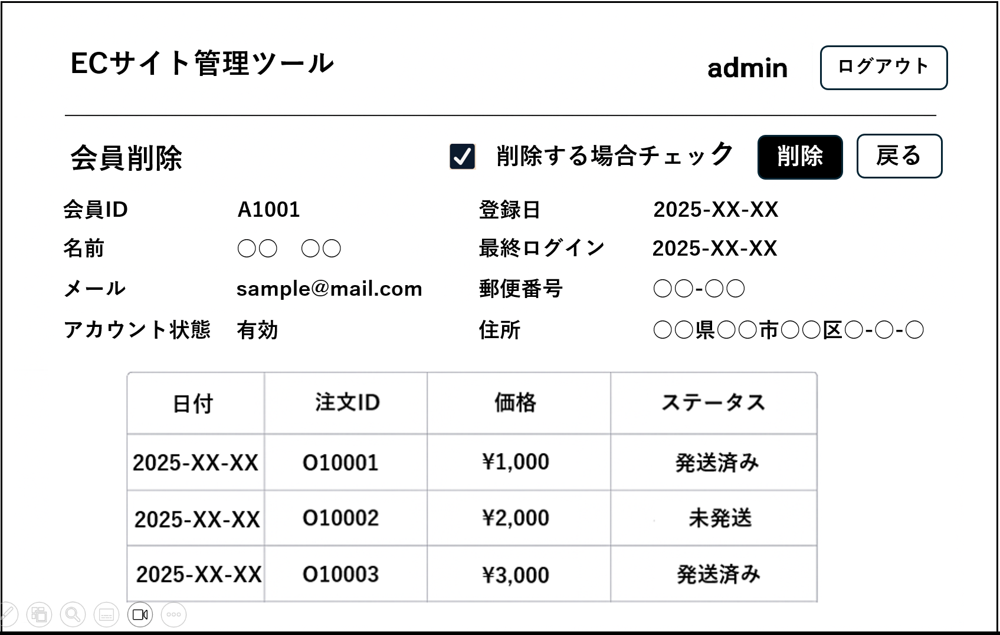

---

| 項目         | UI要素     | 備考                                  |
|------------|----------|-------------------------------------|
| ログアウトボタン   | ボタン      | ログイン画面に戻る                           |
| 戻るボタン      | ボタン      | 会員管理画面に戻る                           |
| 削除前チェックボタン | チェックボックス | 削除前の確認                              |
| 削除ボタン      | ボタン      | チェックされている場合のみ有効、成功時のみ会員管理メニュートップに移動 |

| 項目         | バリデーションルール            | エラーメッセージ例         |
|------------|-----------------------|-------------------|
| 削除前チェックボタン | 入力値すべてが有効なときのみ押下可能にする | チェックボックスを入力してください |
| 削除ボタン      | 押下時に確認ダイアログ表示（任意）     | ー                 |

### 5.24. 会員編集画面
---
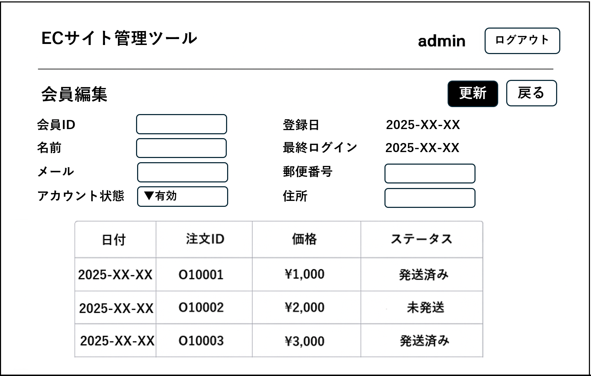

---

| 項目        | UI要素  | 備考                            |
|-----------|-------|-------------------------------|
| ログアウトボタン  | ボタン   | ログイン画面に戻る                     |
| 会員ID入力    | テキスト  | 必須、形式チェックあり                   |
| 名前入力      | テキスト  | 必須                            |
| メールアドレス入力 | テキスト  | 必須、形式チェックあり                   |
| アカウント状態   | プルダウン | 必須、有効・無効                      |
| 郵便番号入力    | テキスト  | 必須、形式チェックあり                   |
| 住所入力      | テキスト  | 必須                            |
| 更新ボタン     | ボタン   | 可能な場合のみ有効、成功時のみ会員管理メニュートップに移動 |
| 戻るボタン     | ボタン   | 会員管理画面に戻る                     |

| 項目        | バリデーションルール            | エラーメッセージ例        |
|-----------|-----------------------|------------------|
| 会員ID入力    | 必須                    | 会員IDを入力してください    |
| 名前入力      | 必須、任意の文字              | 名前を入力してください      |
| メールアドレス入力 | 必須、任意の文字              | メールアドレスを入力してください |
| アカウント状態   | 必須、プルダウンから選択          | 会員情報を入力してください    |
| 郵便番号入力    | 必須、半角英数字              | 情報を入力してください      |
| 住所入力      | 必須、任意の文字              | 住所を入力してください      |
| 更新ボタン     | 入力値すべてが有効なときのみ押下可能にする | すべての情報を入力してください  |

---

## 6. DTO定義
### 6.1. 顧客関連DTO 

- **商品関連DTO**　

```java
// 商品一覧用
public class ProductListItem {
    private Integer productId;
    private String name;
    private Integer price;
    private String imageUrl;
    // getter, setter, constructor
}
 
// 商品詳細用
public class ProductDetail {
    private Integer productId;
    private String name;
    private Integer price;
    private String description;
    private Integer stock;
    private String imageUrl;
    // getter, setter, constructor
}
```
 
- **カート関連DTO**
 
```java
// カート全体 (セッション格納/APIレスポンス用)
public class Cart {
    private Map<String, CartItem> items = new LinkedHashMap<>();
    private int totalQuantity;
    private int totalPrice;
    // メソッド: addItem, updateQuantity, removeItem, calculateTotals など
    // getter, setter, constructor
}
 
// カート内商品 (セッション格納/APIレスポンス用)
public class CartItem {
    private String id;
    private Integer productId;
    private String name;
    private Integer price;
    private String imageUrl;
    private int quantity;
    private int subtotal;
    // getter, setter, constructor
}
 
// カート追加APIリクエスト用
public class CartItemInfo {
    @NotNull
    private Integer productId;
    @NotNull @Min(1)
    private Integer quantity;
    // getter, setter
}
 
// カート数量更新APIリクエスト用
public class CartItemQuantityDto {
    @NotNull @Min(1)
    private Integer quantity;
    // getter, setter
}
 
```
 
- **注文関連DTO**
 
```java
// 注文APIリクエスト用
public class OrderRequest {
    @Valid
    @NotNull
    private CustomerInfo customerInfo;
    // getter, setter
}
 
// 注文APIリクエスト内の顧客情報用 (非会員用)
public class CustomerInfo {
    @NotBlank
    private String name;
    @NotBlank @Email
    private String email;
    @NotBlank
    private String address;
    @NotBlank
    private String phoneNumber;
    // getter, setter
}
 
// 注文APIレスポンス用
public class OrderResponse {
    private Integer orderId;
    private LocalDateTime orderDate;
    // getter, setter, constructor
}
 
```
 
- **会員関連DTO**
 
```java
// 会員登録リクエスト用
public class RegisterRequest {
    @NotBlank
    private String name;
    @NotBlank @Email
    private String email;
    @NotBlank
    private String address;
    @NotBlank @Size(min = 8, max = 20)
    private String password;
    // getter, setter
}
 
// 会員情報レスポンス用（マイページ表示）
public class MemberInfo {
    private String name;
    private String email;
    private String address;
    // getter, setter, constructor
}
 


### 6.2 管理者関連DTO

- **ログイン関連 DTO**
```java
// ログイン用リクエスト (APIリクエスト用)
public class LoginRequest {
    private String loginId;
    private String password;
    // getter, setter, constructor
}
```

```java
// 認証レスポンス (APIレスポンス用)
public class AuthResponse {
    private String userId; 
    private String password;

    // getter, setter, constructor
}
```

- **商品関連 DTO**
```java
// 商品追加用リクエスト (APIレスポンス・リクエスト共用)
public class ProductCreateRequest {
    private String name;
    private Integer price;
    private String stock;      
    private String material;
    private String description;
    private String imageUrl;  

    // getter, setter, constructor
}
```

- **注文関連 DTO**

```java
// 会員情報 (APIレスポンス・リクエスト共用)
public class MemberDTO {
    private String memberId;        
    private String name;            
    private String email;          
    private String accountStatus;   
    private String postalCode;      
    private String address;         

    // getter, setter, constructor
}

```

- **会員関連 DTO**

```java
// 会員情報レスポンス用 (APIレスポンス・リクエスト共用)
public class MemberResponse {
    private String memberId;       
    private String name;           
    private String email;          
    private String accountStatus;  
    private String postalCode;     
    private String address;        

    // getter, setter, constructor
}
```
---

## 7. 物理テーブル定義書
### 7.1. Users
会員ユーザーの基本情報（ログイン用）を管理するテーブル

| 項目名          | データ型  | 主キー| 外部キー|NOT NULL|一意制約| 備考              |
| ------------ | ------------ | --- | ---- | -------- | ---- | --------------- |
| user\_id     | INT          | ○   |      | ○        |  ○   | ユーザーID          |
| name         | VARCHAR(100) |     |      | ○        |      | 氏名              |
| email        | VARCHAR(255) |     |      | ○        | ○    | メールアドレス（ログインID） |
| password     | VARCHAR(255) |     |      | ○        |      | パスワード           |
| address      | TEXT         |     |      |          |      | 住所              |
| create\_time | DATETIME     |     |      | ○        |      | 登録日時（自動）        |


### 7.2. Orders
ユーザーの注文情報を管理するテーブル

| 項目名              | データ型        | 主キー | 外部キー      | NOT NULL | 一意制約 | 備考       |
| ---------------- | ----------- | --- | --------- | -------- | ---- | -------- |
| order\_id        | INT         | ○   |           | ○        |    ○ | 注文ID     |
| user\_id         | INT         |     | ○（→users） | ○        |      | ユーザーID   |
| order\_date      | DATETIME    |     |           | ○        |      | 注文日時（自動） |
| shipping\_adress | TEXT        |     |           | ○        |      | 配送先住所    |
| paymant\_method  | VARCHAR(50) |     |           |          |      | 支払い方法    |


### 7.3. Order_items
1件の注文に含まれる商品ごとの詳細情報を管理するテーブル

| 項目名             | データ型 | 主キー | 外部キー         | NOT NULL | 一意制約 | 備考     |
| --------------- | ---- | --- | ------------ | -------- | ---- | ------ |
| order\_item\_id | INT  | ○   |              | ○       | ○    | 注文明細ID |
| order\_id       | INT  |     | ○（→orders）   | ○        |      | 注文ID   |
| product\_id     | INT  |     | ○（→products） | ○        |      | 商品ID   |
| quantity        | INT  |     |              | ○        |      | 注文数量   |
| total\_amount   | INT  |     |              | ○        |      | 合計金額   |


### 7.4. Owner
システムの管理者情報（商品編集や会員管理）を管理するテーブル

| 項目名       | データ型         | 主キー | 外部キー | NOT NULL | 一意制約 | 備考      |
| --------- | ------------ | --- | ---- | -------- | ---- | ------- |
| owner\_id | INT          | ○   |      | ○        | ○    | 管理者ID   |
| username  | VARCHAR(100) |     |      | ○        | ○    | 管理者ユーザ名 |
| password  | VARCHAR(255) |     |      | ○        |      | パスワード   |


### 7.5. Category
商品カテゴリを管理するテーブル

| 項目名            | データ型         | 主キー | 外部キー | NOT NULL | 一意制約 | 備考     |
| -------------- | ------------ | --- | ---- | -------- | ---- | ------ |
| category\_id   | INT          | ○   |      | ○        |  ○    | カテゴリID |
| category\_name | VARCHAR(100) |     |      | ○        |      | カテゴリ名  |


### 7.6. Products
販売する商品の情報を管理するテーブル

| 項目名           | データ型         | 主キー | 外部キー         | NOT NULL | 一意制約 | 備考       |
| ------------- | ------------ | --- | ------------ | -------- | ---- | -------- |
| product\_id   | INT          | ○   |              | ○        |  ○    | 商品ID     |
| name          | VARCHAR(100) |     |              | ○        |      | 商品名      |
| description   | TEXT         |     |              |          |      | 商品説明     |
| price         | INT          |     |              | ○        |      | 商品価格     |
| stock\_status | BOOLEAN      |     |              | ○        |      | 在庫ステータス  |
| image\_url    | VARCHAR(255) |     |              |          |      | 商品画像URL  |
| category\_id  | INT          |     | ○（→category） |          |      | 商品カテゴリID |


### 7.7. cart
カート情報（更新日時含む）を管理するテーブル

| 項目名          | データ型     | 主キー | 外部キー      | NOT NULL | 一意制約 | 備考                |
| ------------ | -------- | --- | --------- | -------- | ---- | ----------------- |
| cart\_id     | INT      | ○   |           | ○        |   ○  | カートID             |
| user\_id     | INT      |     | ○（→users） | ○        | ○    | ユーザーID（1ユーザー1カート） |
| update\_time | DATETIME |     |           | ○        |      | カート更新日時           |


### 7.8. Cart_item
カートに追加された商品の明細を管理するテーブル

| 項目名            | データ型 | 主キー | 外部キー         | NOT NULL | 一意制約 | 備考      |
| -------------- | ---- | --- | ------------ | -------- | ---- | ------- |
| cart\_item\_id | INT  | ○   |              | ○        |  ○   | カート内容ID |
| cart\_id       | INT  |     | ○（→cart）     | ○        |      | カートID   |
| product\_id    | INT  |     | ○（→products） | ○        |      | 商品ID    |
| quantity       | INT  |     |              | ○        |      | 商品数量    |

---


## 8. 非機能要件 対応方針

### 8.1. 性能

#### レスポンス速度 
 - 各画面の表示は3秒以内を目標とする。商品一覧ページ（画像あり）でも5秒以内を厳守。

#### 同時アクセス数 
 - 同時接続ユーザー数は通常時で最大50人、セール・キャンペーン時には200人程度を想定。

#### データベース応答性 
 - 一般的な検索・登録・更新処理は1秒以内で完了することを目指す。

#### 対応策
  - 1画面の表示件数を最大20件に制限
  - 大きな画面は適宜縮小し読み込み負荷を軽減
  - 商品・ユーザーにインデックスを付与


### 8.2. セキュリティ

#### 通信の暗号化  
  - 本番確認や外部アクセスを行う場合は必ず「HTTPS」（SSL/TLS）を利用

#### パスワード管理 
  - パスワードのハッシュ化は今回見送り

#### CSRF / XSS / SQLインジェクション対策 
  - 上記対策は今回見送り

#### 管理画面のアクセス制限
  - IP制限、ID・パスワード認証の二重チェックを導入予定
  - URLを直接入力しても403エラーを返す

#### 不正アクセス（URL直接入力）対策
  - 権限を持たないユーザーが他ユーザー用画面に直接URLを入力してアクセスすることを禁止する。 


### 8.3. 可用性

#### 稼働時間 
  - 稼働率99.5%以上を目標とする。

#### バックアップ
  - 今回は見送り

#### 障害対応
  - エラーログを確認し、問題が起きた時原因を特定しやすいようにする

#### フェールオーバー  
  - 高度な自動切り替えは行わず、単一サーバ構成


### 8.4. システム環境

#### 利用環境
 
- **クライアント:**
  - 顧客：PC・スマートフォン・タブレット端末のWebブラウザ（Google Chrome、の最新バージョン）
  - 管理者：PC（Windows 10/11）＋Google Chromeを想定
 
- **サーバー:** クラウド環境（AWSを想定）
 
- **ネットワーク:** 公開インターネットを介したHTTPS接続（SSL証明書適用）

本システムの開発にあたり、以下の技術を使用することを前提とする。
 - **言語**: (JAVA)
 -   **フレームワーク**: (Spring Boot)
 -   **データベース**: (クラウド環境のマネージドサービス利用)
-   **フロントエンド**: HTML5, CSS3, JavaScript(ES6)
-   **Webサーバー**: (AWS)
-   **その他ライブラリ**: (必要に応じて協議の上、決定)


### 8.5. その他（保守性、運用性、拡張性など）

#### 保守性
  - ソースコードはGitHubでバージョン管理し、mainブランチは常に安定状態を保つ。
  - コードはコメント・ドキュメント含めて可読性を重視した実装とする。

#### 運用性
  - 管理画面から主要情報の登録・編集が可能（商品、カテゴリ、会員情報など）
  - エラーログは管理者がダウンロード・閲覧できる仕組みを用意（検討中のためスコープ外）

#### 拡張性
  - 今後の機能追加（決済機能、レビュー機能など）を想定し、モジュール分割を最低限行う
  - 商品カテゴリ・属性の柔軟な追加を可能にするデータ設計。

---

## 9. 運用・保守設計の概要

### 9.1. ログ設計方針
####　ログの目的
本システムにおけるログは、以下の目的で記録・管理する。
 - 障害発生時の原因調査および復旧対応の迅速化
 - 不正アクセスや不正操作の検知および監査対応
 - 利用状況の把握によるサービス改善のための分析基盤
 - 運用保守時の変更・操作履歴の追跡

####  ログの詳細設定

#### アクセスログ

- **目的**: ユーザーのアクセス状況を監視する。不正アクセスを検出するため。
- **出力内容**:  
  - IPアドレス  
  - ユーザーID（認証済みの場合）  
  - アクセスしたURL  
  - HTTPステータスコード（200、404など）  
  - リクエストのタイムスタンプ  
- **出力先**: アプリケーションサーバのログファイル
- **出力タイミング**: リクエストが処理されるたびに即時に出力。 
- **ログレベル**:  
  - **INFO**: 通常のユーザーアクセス（例：リソースへのアクセス、ページ遷移）  
  - **ERROR**: 不正アクセスやリソースへのアクセス失敗（例：404エラー）

#### アプリケーションログ

- **目的**: システムのエラーや例外が発生した際、原因調査や問題解決のために記録。
- **出力内容**:  
  - タイムスタンプ  
  - エラーメッセージ  
  - スタックトレース（例外が発生した場合）  
  - ユーザーID（必要に応じて）  
- **出力先**: アプリケーションサーバのログファイル
- **出力タイミング**: アプリケーション内でエラーや例外が発生した際に即時に出力。  
- **ログレベル**:  
  - **ERROR**: アプリケーションエラー（例：データベース接続失敗、NullPointerException）  
  - **WARN**: 予期しない動作（例：非推奨機能の使用）  
  - **INFO**: 正常な動作ログ（例：正常に処理が完了した場合の確認）

#### 管理操作ログ

- **目的**: 管理者による操作履歴を記録し、後で監査や分析を行うため。
- **出力内容**:  
  - ユーザーID（管理者）  
  - 操作内容（商品登録、在庫更新など）  
  - 操作日時  
  - 操作対象（商品名など）  
  - 操作結果（成功、失敗）  
- **出力先**: 管理者用の専用ログファイル 
- **出力タイミング**: 管理者が操作を行った直後に出力。  
- **ログレベル**:  
  - **INFO**: 通常の管理操作（商品登録、在庫更新）  
  - **ERROR**: 操作失敗（商品登録失敗、データベース更新エラー）

#### セキュリティログ

- **目的**: 認証に失敗した場合や不正アクセスがあった場合に警告を記録し、セキュリティ監視を行うため。
- **出力内容**:  
  - IPアドレス  
  - ユーザーID（認証失敗時）  
  - 失敗した操作（ログイン試行、権限不足など）  
  - タイムスタンプ  
- **出力先**: セキュリティ専用のログ管理システム  
- **出力タイミング**: 認証失敗や不正アクセスの試行が行われた直後に出力。  
- **ログレベル**:  
  - **WARN**: 認証失敗（例：ログイン試行失敗）  
  - **ERROR**: 不正アクセス（例：権限なしで管理画面アクセス試行）

#### 保存期間
 - **アプリケーションログ、アクセスログ**: 90日間保存（バックアップ含む）
- **操作ログ**: 1年間保存（必要に応じて延長可能）

#### 閲覧・出力方法
- 管理画面からテキストをダウンロードし確認可能にする。


### 9.2. 監視設計方針

- **監視対象**
  - Webアプリケーション：死活監視（HTTP 200応答）、レスポンス時間監視
  - インフラ（クラウドサーバ）：CPU、メモリ、ディスク使用率
  - データベース：接続数、クエリエラー、ストレージ容量
  - バックアップの実行成否
  - ログイン試行の異常増加（セキュリティ監視）

- **監視ツール**
  - 今後、AWS CloudWatch、または外部SaaS監視サービス（例：UptimeRobot、Datadog、Sentry等）を活用することを予定しているが今回の開発では見送る。

- **通知方法**
  - 異常検知時にメール／Slack等に自動通知
  - 死活監視の失敗は5分以内にアラート通知

- **対応方針**
  - 監視アラートのレベル分け（Info / Warning / Critical）
  - 重大障害（Critical）については、即時対応・影響調査・復旧報告を実施


## 10. 制約事項・前提条件
 
### 10.1. 使用技術スタック
 
本システムの開発にあたり、以下の技術を使用することを前提とする。
 
-   **言語**: (JAVA)
-   **フレームワーク**: (Spring Boot)
-   **データベース**: (クラウド環境のマネージドサービス利用)
-   **フロントエンド**: HTML5, CSS3, JavaScript(ES6)
-   **Webサーバー**: (AWS)
-   **その他ライブラリ**: (必要に応じて協議の上、決定)
 
### 10.2. インフラ環境
 
-   **サーバーOS**: (windows10/11)
-   **実行環境**: (Google Crome)
-   **稼働場所**: AWS (EC2/RDSなどのマネージドサービスを想定)
-   **ネットワーク**: 公開インターネットを介したHTTPS接続（SSL証明書適用）。管理画面はログイン制限付き。
 
### 10.3. 開発・運用ルール
 
-   **バージョン管理**: Gitを使用し、プロジェクト標準のリポジトリで管理する。
-   **コーディング規約**: プロジェクト標準のコーディング規約を定め、必要に応じて静的解析ツールを導入する。
-   **テスト**: 単体テスト、結合テスト、システムテストを実施する。
-   **デプロイ**: デプロイ手順を確立する。
-   **商品情報の登録・更新**: 社内管理者が管理画面から実施。初期登録は一部支援。
-   **注文受付・確認**: 管理画面での確認と手動での発送準備。注文通知はメール受信。
-   **在庫表示**: 簡易的な「在庫あり／なし」表示とし、詳細な在庫数管理は行わない。更新は手動。
-   **ユーザー教育**: サイト運用開始前に、社内担当者（田中氏中心）向けに操作説明会を実施。
 
### 10.4. スコープ外
 
-   実際のAPI仕様の細部（例：RESTエンドポイントやリクエスト/レスポンスのJSON構造詳細）
-   単体テスト、結合テストの項目一覧やテストケース詳細
-   詳細な運用保守手順書、障害対応手順書
-   クレジットカード決済機能
-   レビュー投稿機能
-   複雑な在庫管理機能（詳細な在庫数管理、自動引き落としなど）
-   売上管理機能
-   問い合わせフォーム機能（運用体制整備後に検討）
-   監視ツールの導入
- 　IP制限違反
- 　不正アクセスの試行記録
-   バックアップ機能
- 　不正アクセス対策（SQLインジェクション等）
- 　パスワードハッシュ化
- 　ログの保存・管理　

### 10.5. その他前提条件
 
-   システムはWebアプリケーションとして開発し、主に公開インターネットを介して利用される。
-   クライアントのWebブラウザは、Google Chromeの最新安定版を対象とする。
-   スマートフォンからの閲覧・購入が円滑に行えるよう、レスポンシブデザインを採用する。
-   初期商品データ移行用のCSVファイルは、指定されたフォーマットで提供されるものとする。

---

## 11. （付録）用語集・略語リスト
 
(プロジェクト内で使用される専門用語や略語を定義。)
 
-   **ECサイト**: Electronic Commerce Site (電子商取引サイト)
-   **AWS**: Amazon Web Services
-   **HTTPS**: Hypertext Transfer Protocol Secure
-   **SSL/TLS**: Secure Sockets Layer / Transport Layer Security (HTTPS通信で使用される暗号化プロトコル)
-   **UI**: User Interface
-   **UX**: User Experience
-   **CSV**: Comma Separated Values
-   **DB**: Database
-   **CSRF**: Cross-Site Request Forgery (クロスサイトリクエストフォージェリ)
-   **XSS**: Cross-Site Scripting (クロスサイトスクリプティング)
-   **SKU**: Stock Keeping Unit (最小管理単位)
-   **MoSCoW分析**: Must have, Should have, Could have, Won't have (要件の優先順位付け手法)
